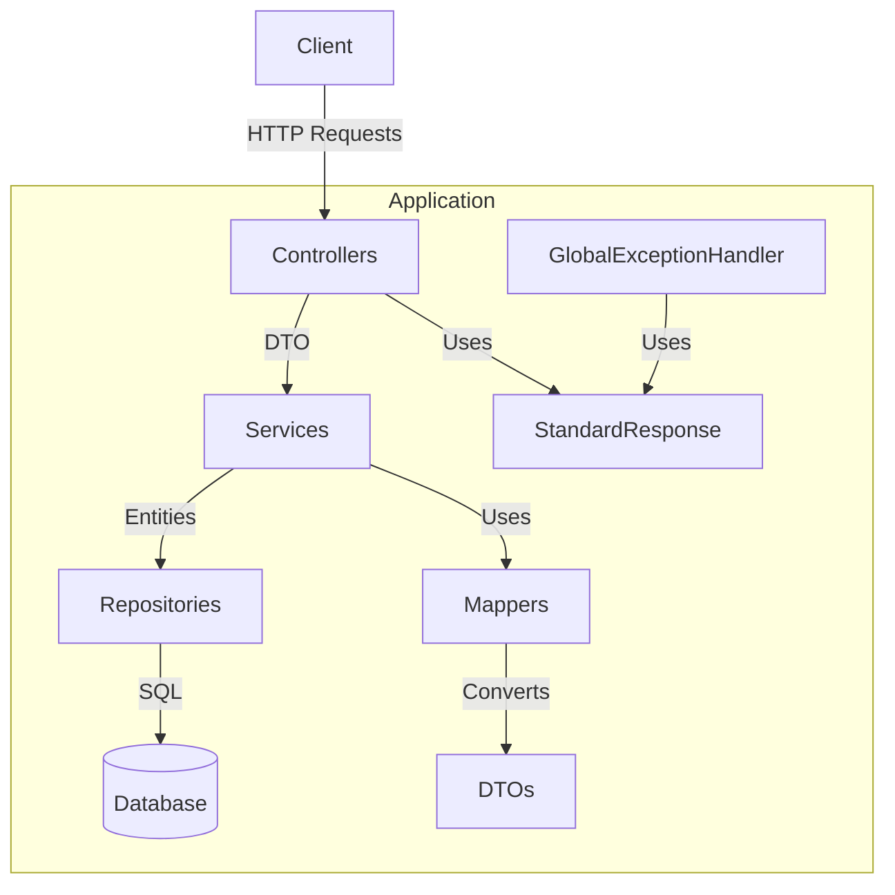
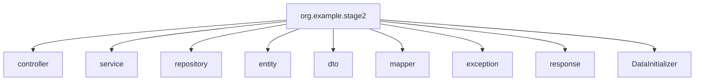
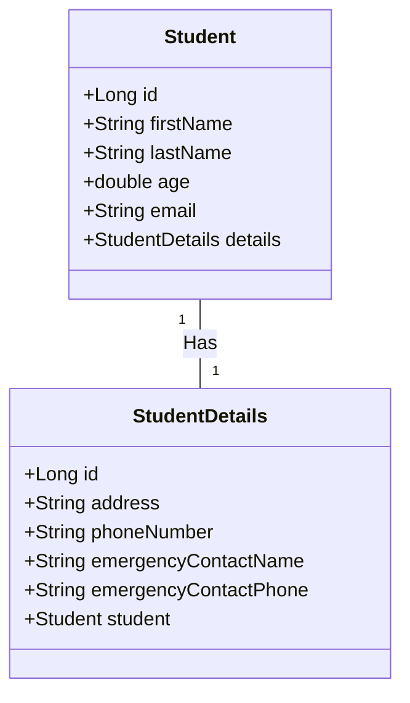
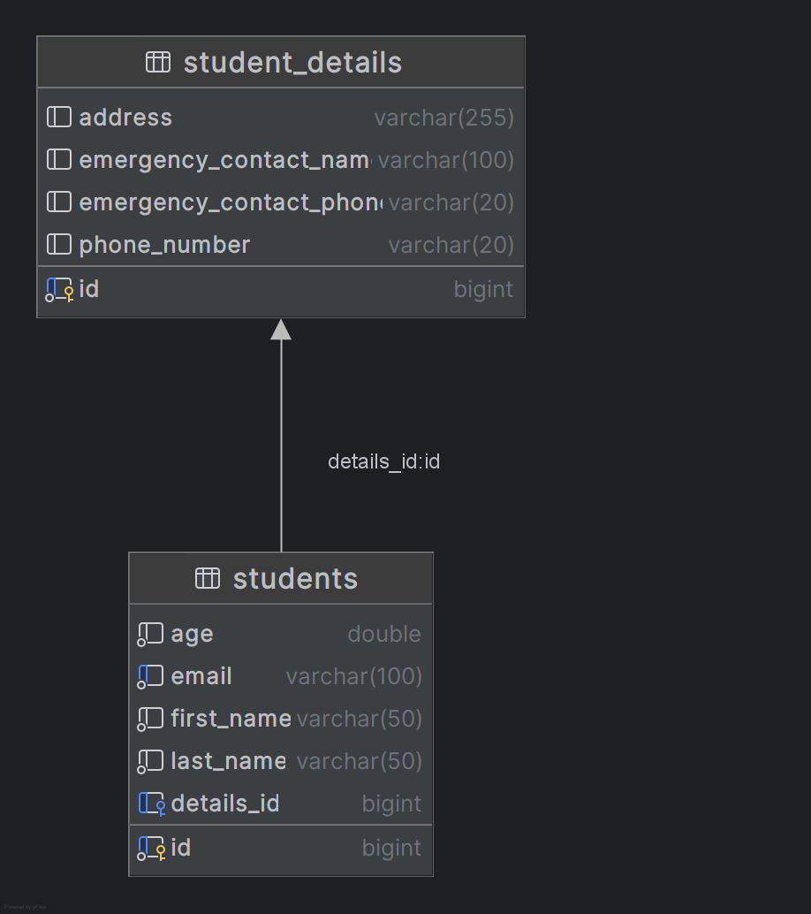
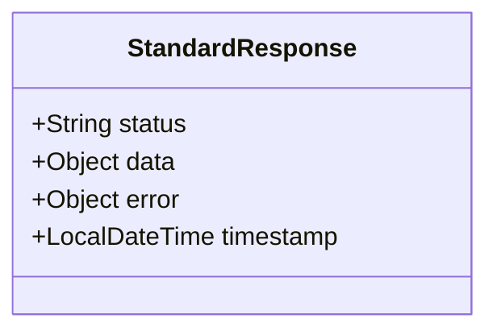

<div dir="rtl">

# מדריך מקיף - מערכת ניהול סטודנטים - שלב 2: יחסי One-to-One 

## תוכן עניינים

1. [מבוא](#מבוא)
2. [ארכיטקטורת המערכת](#ארכיטקטורת-המערכת)
3. [מודל הנתונים ויחסי One-to-One](#מודל-הנתונים-ויחסי-one-to-one)
4. [השינויים העיקריים משלב 1 לשלב 2](#השינויים-העיקריים-משלב-1-לשלב-2)
5. [בעיית רשומות יתומות ביחסי One-to-One ופתרונה](#בעיית-רשומות-יתומות-ביחסי-one-to-one-ופתרונה)
6. [דגשים טכניים ועקרונות מרכזיים](#דגשים-טכניים-ועקרונות-מרכזיים)
7. [תזרימי בקשות במערכת](#תזרימי-בקשות-במערכת)
8. [הוראות התקנה והרצה](#הוראות-התקנה-והרצה)
9. [בדיקת המערכת](#בדיקת-המערכת)

## מבוא

מסמך זה מתאר את שלב 2 של פיתוח מערכת ניהול סטודנטים, המתמקד בהרחבת המערכת משלב 1 על ידי הוספת יחס One-to-One בין ישויות באמצעות Spring Data JPA.

בשלב הקודם (שלב 1) מימשנו ישות Student בסיסית עם פעולות CRUD, ובשלב זה הרחבנו את המערכת להכיל ישות StudentDetails המקושרת לסטודנט ביחס של אחד-לאחד, תוך שדרוג מנגנון התגובות של ה-API.

### מה המערכת מאפשרת

1. **ניהול מידע בסיסי של סטודנטים** - שם, שם משפחה, גיל, דוא"ל
2. **ניהול מידע מורחב של סטודנטים** - כתובת, מספר טלפון, איש קשר לחירום
3. **API מלא לביצוע פעולות CRUD** על הנתונים
4. **ולידציה** של קלט המשתמש עם דגש על שדות מיוחדים (מספרי טלפון)
5. **טיפול בשגיאות** באמצעות מנגנון מרכזי עם פורמט אחיד

## ארכיטקטורת המערכת

### ארכיטקטורה כללית

המערכת בנויה בארכיטקטורת שכבות (Layered Architecture) קלאסית לפי מיטב המסורת של Spring:



### שכבות המערכת

1. **Controllers**: שכבת הממשק החיצוני של המערכת המטפלת בבקשות HTTP ומחזירה תגובות HTTP עם StandardResponse.
2. **Services**: שכבת הלוגיקה העסקית של המערכת.
3. **Repositories**: שכבת הגישה למסד הנתונים.
4. **Entities**: המודל של הנתונים במערכת.
5. **DTOs**: אובייקטים להעברת נתונים בין השכבות השונות.
6. **Mappers**: ממירים בין Entities ל-DTOs.
7. **Exceptions**: טיפול בשגיאות ייחודיות למערכת.
8. **Response**: שכבת StandardResponse לפורמט תגובה אחיד.

### מבנה הפרויקט



## מודל הנתונים ויחסי One-to-One

מודל הנתונים של המערכת מורכב משתי ישויות עיקריות עם יחס One-to-One ביניהן:





### יחסים

**Student-StudentDetails**: יחס One-to-One. כל סטודנט יכול להיות בעל סט פרטים אחד, וכל סט פרטים שייך לסטודנט אחד.

### מודל התגובה האחיד (StandardResponse)



## השינויים העיקריים משלב 1 לשלב 2

### 1. הוספת ישות חדשה: StudentDetails

יצרנו ישות חדשה שמכילה פרטים מורחבים של סטודנט:

</div>

<div dir="ltr">

```java
@Entity
@Table(name = "student_details")
@Data
@NoArgsConstructor
@AllArgsConstructor
@ToString(exclude = "student")
public class StudentDetails {
    @Id
    @GeneratedValue(strategy = GenerationType.IDENTITY)
    private Long id;
    
    @Size(max = 255, message = "Address must be less than 255 characters")
    private String address;
    
    @Pattern(regexp = "^\\+?(972|0)([23459]\\d{7}|5\\d{8})$",
            message = "Phone number must be a valid Israeli phone number")
    private String phoneNumber;
    
    @Size(max = 100, message = "Emergency contact name must be less than 100 characters")
    private String emergencyContactName;
    
    @Pattern(regexp = "^\\+?(972|0)([23459]\\d{7}|5\\d{8})$",
            message = "Emergency contact phone must be a valid Israeli phone number")
    private String emergencyContactPhone;
    
    @OneToOne(mappedBy = "details")
    private Student student;
}
```

</div>

<div dir="rtl">

### 2. עדכון ישות Student לתמיכה ביחס One-to-One

הוספנו קשר One-to-One לישות Student, כאשר Student הוא הצד ה"בעלים" (owner) של הקשר:

</div>

<div dir="ltr">

```java
@Entity
@Table(name = "students")
@Data
@NoArgsConstructor
@AllArgsConstructor
@ToString(exclude = "details")
public class Student {
   // שדות קיימים...

   @OneToOne(cascade = CascadeType.ALL, fetch = FetchType.LAZY, orphanRemoval = true)
   @JoinColumn(name = "details_id")
   private StudentDetails details;
}
```

</div>

<div dir="rtl">

### 3. יצירת DTO חדש: StudentDetailsDto

יצרנו כיתת DTO חדשה להעברת פרטי הסטודנט המורחבים:

</div>

<div dir="ltr">

```java
@Data
@NoArgsConstructor
@AllArgsConstructor
public class StudentDetailsDto {
    private Long id;
    private Long studentId; // שדה חדש לחיבור קל יותר לסטודנט
    
    @Size(max = 255, message = "Address must be less than 255 characters")
    private String address;
    
    @Pattern(regexp = "^\\+?(972|0)([23459]\\d{7}|5\\d{8})$",
            message = "Phone number must be a valid Israeli phone number")
    private String phoneNumber;
    
    @Size(max = 100, message = "Emergency contact name must be less than 100 characters")
    private String emergencyContactName;
    
    @Pattern(regexp = "^\\+?(972|0)([23459]\\d{7}|5\\d{8})$",
            message = "Emergency contact phone must be a valid Israeli phone number")
    private String emergencyContactPhone;
}
```

</div>

<div dir="rtl">

### 4. עדכון StudentDto לתמיכה בפרטים המורחבים

הרחבנו את StudentDto כדי לכלול את StudentDetailsDto:

</div>

<div dir="ltr">

```java
@Data
@NoArgsConstructor
@AllArgsConstructor
public class StudentDto {
   private Long id;

   @NotBlank(message = "First name is required")
   @Size(min = 2, max = 50, message = "First name must be between 2 and 50 characters")
   private String firstName;

   @NotBlank(message = "Last name is required")
   @Size(min = 2, max = 50, message = "Last name must be between 2 and 50 characters")
   private String lastName;

   @Min(value = 0, message = "Age must be a positive number")
   private double age;
   
   @NotBlank(message = "Email is required")
   @Email(message = "Email should be valid")
   private String email;

   @Valid  // לוודא שבדיקות התקפות מתבצעות גם עבור האובייקט המקונן
   private StudentDetailsDto details;
}
```
</div>

<div dir="rtl">

### 5. יצירת Repository חדש: StudentDetailsRepository

הוספנו ממשק Repository חדש לטיפול בישות StudentDetails:

</div>

<div dir="ltr">

```java
@Repository
public interface StudentDetailsRepository extends JpaRepository<StudentDetails, Long> {
    // אפשר להוסיף כאן שאילתות מותאמות אישית לפי הצורך
}
```
</div>

<div dir="rtl">

### 6. יצירת שירות וממשק חדשים: StudentDetailsService

יצרנו שירות ייעודי לטיפול בפרטי הסטודנט:

</div>

<div dir="ltr">

```java
public interface StudentDetailsService {
   StudentDetails getStudentDetailsByStudentId(Long studentId);
   StudentDetailsDto getStudentDetailsDtoByStudentId(Long studentId);
   
   // תוספת חדשה לתמיכה בשינויים משדרוג יחסים
   StudentDetailsDto validateAndCreateStudentDetails(Long studentId, Long originalStudentId, StudentDetailsDto detailsDto);
   StudentDetailsDto validateAndUpdateStudentDetails(Long studentId, Long originalStudentId, StudentDetailsDto detailsDto);
   
   void deleteStudentDetails(Long studentId);
}
```

</div>

<div dir="rtl">

### 7. יצירת בקר חדש: StudentDetailsController

הוספנו בקר RESTful חדש לניהול פרטי סטודנט:

</div>

<div dir="ltr">

```java
@RestController
@RequestMapping("/students/{studentId}/details")
public class StudentDetailsController {
    private final StudentDetailsService studentDetailsService;

    @Autowired
    public StudentDetailsController(StudentDetailsService studentDetailsService) {
        this.studentDetailsService = studentDetailsService;
    }

    @GetMapping
    public StandardResponse getStudentDetails(@PathVariable Long studentId) {
        StudentDetailsDto detailsDto = studentDetailsService.getStudentDetailsDtoByStudentId(studentId);
        return new StandardResponse("success", detailsDto, null);
    }

    @PostMapping
    public ResponseEntity<StandardResponse> createStudentDetails(
            @PathVariable Long studentId,
            @Valid @RequestBody StudentDetailsDto detailsDto) {
        
        // Save the original studentId from request body (if any)
        Long originalStudentId = detailsDto.getStudentId();
        
        // Set the studentId from the path parameter
        detailsDto.setStudentId(studentId);
        
        // Pass both values to the service for validation
        StudentDetailsDto createdDto = studentDetailsService.validateAndCreateStudentDetails(
                studentId, originalStudentId, detailsDto);
        
        // Build the location URI for the created resource
        URI location = ServletUriComponentsBuilder
                .fromCurrentRequest()
                .build()
                .toUri();
        
        StandardResponse response = new StandardResponse("success", createdDto, null);
        return ResponseEntity.created(location).body(response);
    }

    @PutMapping
    public StandardResponse updateStudentDetails(
            @PathVariable Long studentId,
            @Valid @RequestBody StudentDetailsDto detailsDto) {

        // Save the original studentId from request body (if any)
        Long originalStudentId = detailsDto.getStudentId();
        
        // Set the studentId from the path parameter
        detailsDto.setStudentId(studentId);
        
        // Pass both values to the service for validation
        StudentDetailsDto updatedDto = studentDetailsService.validateAndUpdateStudentDetails(
                studentId, originalStudentId, detailsDto);
        
        return new StandardResponse("success", updatedDto, null);
    }

    @DeleteMapping
    @ResponseStatus(HttpStatus.NO_CONTENT) 
    public void deleteStudentDetails(@PathVariable Long studentId) {
        studentDetailsService.deleteStudentDetails(studentId);
    }
}
```


</div>

<div dir="rtl">

## מנגנון StandardResponse

מנגנון ה-StandardResponse מספק מבנה אחיד לכל התגובות מהשרת, הן במקרי הצלחה והן במקרי שגיאה:

### יתרונות המנגנון

1. **אחידות תגובות** - כל התגובות מגיעות בפורמט זהה, הן במקרי הצלחה והן במקרי שגיאה
2. **מידע עשיר יותר** - כל תגובה כוללת חותמת זמן ומידע סטטוס
3. **פשטות לצד הלקוח** - מפתחי צד לקוח יכולים לטפל בצורה אחידה בכל סוגי התגובות
4. **ניהול שגיאות משופר** - מסייע במיפוי שגיאות לפורמט אחיד וברור

### מבנה התגובה האחיד

</div>

```json
{
  "status": "success/error",
  "data": { ... },
  "error": null/{ ... },
  "timestamp": "2023-08-06T14:32:45.123"
}
```

<div dir="rtl">


#### 2. GlobalExceptionHandler עם מנגנון StandardResponse

עדכנו את מנגנון טיפול השגיאות לשימוש ב-StandardResponse:

</div>

<div dir="ltr">

```java
@ControllerAdvice
public class GlobalExceptionHandler {

    @ExceptionHandler(NotExists.class)
    public ResponseEntity<StandardResponse> handleNotExists(NotExists ex, WebRequest request) {
        Map<String, String> details = new HashMap<>();
        details.put("type", "Resource Not Found");
        details.put("message", ex.getMessage());
        
        StandardResponse response = new StandardResponse("error", null, details);
        return new ResponseEntity<>(response, HttpStatus.NOT_FOUND);
    }

    @ExceptionHandler(AlreadyExists.class)
    public ResponseEntity<StandardResponse> handleAlreadyExists(AlreadyExists ex, WebRequest request) {
        Map<String, String> details = new HashMap<>();
        details.put("type", "Resource Conflict");
        details.put("message", ex.getMessage());
        
        StandardResponse response = new StandardResponse("error", null, details);
        return new ResponseEntity<>(response, HttpStatus.CONFLICT);
    }

    @ExceptionHandler(StudentIdAndIdMismatch.class)
    public ResponseEntity<StandardResponse> handleIdMismatch(StudentIdAndIdMismatch ex, WebRequest request) {
        Map<String, String> details = new HashMap<>();
        details.put("type", "ID Mismatch");
        details.put("message", ex.getMessage());
        
        StandardResponse response = new StandardResponse("error", null, details);
        return new ResponseEntity<>(response, HttpStatus.BAD_REQUEST);
    }

    // הוספת טיפול בשגיאה חדשה לבעיית אי-התאמת מזהי סטודנט בפרטים
    @ExceptionHandler(InvalidRequestException.class)
    public ResponseEntity<StandardResponse> handleInvalidRequest(InvalidRequestException ex, WebRequest request) {
        Map<String, String> details = new HashMap<>();
        details.put("type", "Invalid Request");
        details.put("message", ex.getMessage());
        
        StandardResponse response = new StandardResponse("error", null, details);
        return new ResponseEntity<>(response, HttpStatus.BAD_REQUEST);
    }

    @ExceptionHandler(MethodArgumentNotValidException.class)
    public ResponseEntity<StandardResponse> handleValidationExceptions(MethodArgumentNotValidException ex, WebRequest request) {
        Map<String, String> errors = new HashMap<>();

        ex.getBindingResult().getFieldErrors().forEach(error ->
                errors.put(error.getField(), error.getDefaultMessage())
        );

        Map<String, Object> details = new HashMap<>();
        details.put("type", "Validation Failed");
        details.put("fields", errors);
        
        StandardResponse response = new StandardResponse("error", null, details);
        return new ResponseEntity<>(response, HttpStatus.BAD_REQUEST);
    }

    @ExceptionHandler(Exception.class)
    public ResponseEntity<StandardResponse> handleGenericException(Exception ex, WebRequest request) {
        Map<String, String> details = new HashMap<>();
        details.put("type", "Internal Server Error");
        details.put("message", ex.getMessage());
        
        StandardResponse response = new StandardResponse("error", null, details);
        return new ResponseEntity<>(response, HttpStatus.INTERNAL_SERVER_ERROR);
    }
}
```

</div>

<div dir="rtl">

## בעיית רשומות יתומות ביחסי One-to-One ופתרונה

בהגדרה הנוכחית של יחסי הגומלין בין הישויות `Student` ו-`StudentDetails` קיימת בעיה פוטנציאלית:

**אין מניעה של רשומות יתומות (orphaned records)** - מצב בו יכולים להיווצר רשומות `StudentDetails` שאינן משויכות לסטודנט כלשהו.

### הקוד הבעייתי:

</div>

<div dir="ltr">

```java
// בישות Student
@OneToOne(cascade = CascadeType.ALL, fetch = FetchType.LAZY)
@JoinColumn(name = "details_id")
private StudentDetails details;

// בישות StudentDetails
@OneToOne(mappedBy = "details")
private Student student;
```

</div>

<div dir="rtl">

הבעייתיות בהגדרה זו:
1. היעדר מנגנון `orphanRemoval` שיטפל ברשומות שהופכות ליתומות
2. אין חסימה ברמת המודל ליצירת רשומות `StudentDetails` ללא שיוך לסטודנט
3. בעת הסרת הקשר בין הישויות, רשומת `StudentDetails` תישאר בבסיס הנתונים

### הפתרון שיושם

#### 1. הוספת orphanRemoval=true ליחס One-to-One בישות Student:

</div>

<div dir="ltr">

```java
@OneToOne(cascade = CascadeType.ALL, fetch = FetchType.LAZY, orphanRemoval = true)
@JoinColumn(name = "details_id")
private StudentDetails details;
```

</div>

<div dir="rtl">

#### 2. הוספת studentId לתוך StudentDetailsDto:

</div>

<div dir="ltr">

```java
@Data
public class StudentDetailsDto {
    private Long id;
    private Long studentId; // חובה לספק
    // שאר השדות כמו קודם
}
```

</div>

<div dir="rtl">

#### 3. יצירת מנגנון ולידציה בשירות StudentDetailsService:

</div>

<div dir="ltr">

```java
@Override
public StudentDetailsDto validateAndCreateStudentDetails(
        Long studentId, Long originalStudentId, StudentDetailsDto detailsDto) {
    
    // אם נשלח studentId בגוף הבקשה, וודא שהוא תואם לזה שבנתיב
    if (originalStudentId != null && !originalStudentId.equals(studentId)) {
        throw new InvalidRequestException("Student ID in the path (" + studentId + 
                ") does not match Student ID in the request body (" + originalStudentId + ")");
    }
    
    // בדוק שהסטודנט קיים
    Student student = studentRepository.findById(studentId)
            .orElseThrow(() -> new NotExists("Student with id " + studentId + " does not exist"));
    
    // בדוק שאין כבר פרטי סטודנט קשורים
    if (student.getDetails() != null) {
        throw new AlreadyExists("Student with id " + studentId + " already has details");
    }
    
    // יצירת פרטי סטודנט
    StudentDetails details = studentMapper.toEntity(detailsDto);
    
    // קישור דו-כיווני
    details.setStudent(student);
    student.setDetails(details);
    
    // שמירה
    studentRepository.save(student);
    
    return studentMapper.toDto(details);
}
```

</div>

<div dir="rtl">

#### 4. הוספת מגבלה ייחודית בבסיס הנתונים למניעת פרטי סטודנט כפולים:

</div>

<div dir="ltr">

```java
@Entity
@Table(name = "student_details",
       uniqueConstraints = @UniqueConstraint(columnNames = {"student_id"}))
public class StudentDetails {
    // ...
}
```

</div>

<div dir="rtl">

#### 5. שיפור מעטפת הרישום ב-Controller:

</div>

<div dir="ltr">

```java
@PostMapping
public ResponseEntity<StandardResponse> createStudentDetails(
        @PathVariable Long studentId,
        @Valid @RequestBody StudentDetailsDto detailsDto) {
    
    // שמירת studentId המקורי מגוף הבקשה
    Long originalStudentId = detailsDto.getStudentId();
    
    // הגדרת studentId מפרמטר הנתיב
    detailsDto.setStudentId(studentId);
    
    // העברת שני הערכים לשירות לוולידציה
    StudentDetailsDto createdDto = studentDetailsService.validateAndCreateStudentDetails(
            studentId, originalStudentId, detailsDto);
    
    // בניית URI למשאב שנוצר
    URI location = ServletUriComponentsBuilder
            .fromCurrentRequest()
            .build()
            .toUri();
    
    StandardResponse response = new StandardResponse("success", createdDto, null);
    return ResponseEntity.created(location).body(response);
}
```

</div>

<div dir="rtl">

## דגשים טכניים ועקרונות מרכזיים

### 1. יחס דו-כיווני (Bidirectional Relationship)

יישמנו יחס דו-כיווני בין Student ל-StudentDetails, מה שמאפשר:
- גישה לפרטים מתוך הסטודנט: `student.getDetails()`
- גישה לסטודנט מתוך הפרטים: `details.getStudent()`

### 2. ניהול המחזור חיים (Lifecycle Management)

השתמשנו ב-`CascadeType.ALL` עם `orphanRemoval = true` ביחס One-to-One:
- שמירת סטודנט תשמור גם את פרטיו
- מחיקת סטודנט תמחק גם את פרטיו
- ניתוק הקשר בין סטודנט לפרטיו יגרום למחיקת הפרטים

### 3. ייעול טעינת נתונים (FetchType.LAZY)

השתמשנו ב-`FetchType.LAZY` כדי שפרטי הסטודנט יטענו רק כאשר יש בהם צורך ממשי, מה שמשפר את ביצועי המערכת.

### 4. API בעל אחריות יחידה (Single Responsibility)

יצרנו בקר נפרד לפרטי הסטודנט עם נקודות קצה ייעודיות, מה שמאפשר:
- הפרדת אחריות ברורה
- API נקי ואינטואיטיבי
- גמישות בשימוש: אפשר לנהל את הפרטים בנפרד מהסטודנט

### 5. תגובות אחידות (StandardResponse)

יישמנו פורמט אחיד לכל התגובות מהמערכת:
- אותו מבנה JSON לכל סוגי התגובות
- הפרדה ברורה בין תגובות הצלחה ותגובות שגיאה
- מידע עשיר יותר (חותמת זמן, פרטי שגיאה מובנים)

### 6. מיפוי נכון בין DTO לישויות

יצרנו מנגנון מיפוי מסודר באמצעות Mapper:
- המרה בין Entity ל-DTO וחזרה
- טיפול ביחסים דו-כיווניים בזמן ההמרה
- עדכון ישויות קיימות מ-DTO

### 7. ולידציות מתקדמות

הוספנו ולידציות מתקדמות:
- ולידציה של מספרי טלפון ישראליים באמצעות ביטויים רגולריים
- ולידציה של יחסים (וידוא התאמה בין מזהי סטודנט)
- בדיקות ייחודיות (מניעת כפילויות)

## תזרימי בקשות במערכת

להלן תיאור תזרימי בקשות מרכזיים במערכת עם מנגנון StandardResponse:

```mermaid
sequenceDiagram
    participant Client
    participant Controller as StudentController
    participant Service as StudentService
    participant Repo as StudentRepository
    participant DB as Database
    participant ExHandler as GlobalExceptionHandler
    
    rect rgb(2, 63, 0)
    note right of Client: תרחיש הצלחה - קבלת כל הסטודנטים
    Client->>+Controller: GET /students
    Controller->>+Service: getAllStudents()
    Service->>+Repo: findAll()
    Repo->>+DB: SELECT * FROM students
    DB-->>-Repo: ResultSet
    Repo-->>-Service: List<Student>
    Service-->>-Controller: List<Student>
    Controller->>Controller: יצירת StandardResponse
    Controller-->>ResHandler: StandardResponse
    ResHandler-->>Client: StandardResponse<br>(status: success, data: [students])
    deactivate Controller
    end
    
    rect rgb(61, 9, 0)
    note right of Client: תרחיש שגיאה - סטודנט לא קיים
    Client->>+Controller: GET /students/999
    Controller->>+Service: getStudentById(999)
    Service->>+Repo: findById(999)
    Repo->>+DB: SELECT * FROM students WHERE id=999
    DB-->>-Repo: Empty ResultSet
    Repo-->>-Service: Optional.empty()
    Service--xExHandler: זריקת NotExists
    ExHandler->>ExHandler: יצירת StandardResponse שגיאה
    ExHandler-->>ResHandler: StandardResponse (status: error)
    ResHandler-->>Client: StandardResponse<br>(status: error, error: {...})
    deactivate Controller
    end
    
    rect rgb(61, 71, 0)
    note right of Client: תרחיש הצלחה - עדכון פרטי סטודנט
    Client->>+Controller: PUT /students/1/details
    Controller->>Controller: בדיקת @Valid
    Controller->>+Service: validateAndUpdateStudentDetails(1, originalId, detailsDto)
    Service->>+Repo: findById(1)
    Repo->>+DB: SELECT * FROM students WHERE id=1
    DB-->>-Repo: Student
    Repo-->>-Service: Student
    Service->>Service: עדכון פרטי הסטודנט
    Service->>+Repo: save(student)
    Repo->>+DB: UPDATE student_details SET ...
    DB-->>-Repo: OK
    Repo-->>-Service: Student
    Service->>Service: המרה ל-DTO
    Service-->>-Controller: StudentDetailsDto
    Controller->>Controller: יצירת StandardResponse
    Controller-->>ResHandler: StandardResponse
    ResHandler-->>Client: StandardResponse<br>(status: success, data: detailsDto)
    deactivate Controller
    end
```



## הוראות התקנה והרצה

1. **הגדרת בסיס נתונים**:
    - וודא שיש לך MySQL מותקן
    - צור בסיס נתונים בשם `stage2_db`

2. **הגדרת קובץ application.properties**:

</div>

<div dir="ltr">

```properties
spring.application.name=Stage2
# DataSource Configuration
spring.datasource.url=jdbc:mysql://localhost:3306/stage2_db?createDatabaseIfNotExist=true
spring.datasource.username=root
spring.datasource.password=admin
spring.datasource.driver-class-name=com.mysql.cj.jdbc.Driver

# JPA Configuration
spring.jpa.hibernate.ddl-auto=update
spring.jpa.show-sql=true
spring.jpa.properties.hibernate.format_sql=true
spring.jpa.properties.hibernate.dialect=org.hibernate.dialect.MySQL8Dialect
```

</div>

<div dir="rtl">

3. **בניית והפעלת הפרויקט**:
    - בצע `mvn clean install` או הפעל את הפרויקט מה-IDE שלך

## בדיקת המערכת

להלן מספר בקשות HTTP לבדיקת המערכת:

### קבלת כל הסטודנטים

</div>

<div dir="ltr">

```http
GET http://localhost:8080/students
Accept: application/json
```

</div>

<div dir="rtl">

תגובה צפויה:

</div>

<div dir="ltr">

```json
{
  "status": "success",
  "data": [
    {
      "id": 1,
      "firstName": "John",
      "lastName": "Doe",
      "age": 21.5,
      "email": "john.doe@example.com",
      "details": {
        "id": 1,
        "studentId": 1,
        "address": "123 Main St",
        "phoneNumber": "+972541234567",
        "emergencyContactName": "Mary Doe",
        "emergencyContactPhone": "+972541234568"
      }
    },
    {
      "id": 2,
      "firstName": "Jane",
      "lastName": "Smith",
      "age": 22.3,
      "email": "jane.smith@example.com",
      "details": null
    }
  ],
  "error": null,
  "timestamp": "2023-08-06T14:32:45.123"
}
```

</div>

<div dir="rtl">

### עדכון פרטי סטודנט

</div>

<div dir="ltr">

```http
PUT http://localhost:8080/students/1/details
Content-Type: application/json

{
  "address": "456 New Address",
  "phoneNumber": "+972541111111",
  "emergencyContactName": "Updated Contact",
  "emergencyContactPhone": "+972542222222"
}
```

</div>

<div dir="rtl">

תגובה צפויה:

</div>

<div dir="ltr">

```json
{
  "status": "success",
  "data": {
    "id": 1,
    "studentId": 1,
    "address": "456 New Address",
    "phoneNumber": "+972541111111",
    "emergencyContactName": "Updated Contact",
    "emergencyContactPhone": "+972542222222"
  },
  "error": null,
  "timestamp": "2023-08-06T14:35:12.987"
}
```

</div>

<div dir="rtl">

### שגיאת ולידציה בעדכון פרטים

</div>

<div dir="ltr">

```http
PUT http://localhost:8080/students/1/details
Content-Type: application/json

{
  "address": "456 New Address",
  "phoneNumber": "invalid-phone",
  "emergencyContactName": "Updated Contact",
  "emergencyContactPhone": "+972542222222"
}
```

</div>

<div dir="rtl">

תגובה צפויה:

</div>

<div dir="ltr">

```json
{
  "status": "error",
  "data": null,
  "error": {
    "type": "Validation Failed",
    "fields": {
      "phoneNumber": "Phone number must be a valid Israeli phone number"
    }
  },
  "timestamp": "2023-08-06T14:38:22.456"
}
```

</div>

<div dir="rtl">

בשלב 2 של הפרויקט הרחבנו את מערכת ניהול הסטודנטים כדי לכלול:

1. **יחס One-to-One** בין Student ל-StudentDetails
2. **מנגנון StandardResponse** לפורמט אחיד של תגובות API
3. **פתרון לבעיית רשומות יתומות** ביחסי One-to-One
4. **ולידציות מתקדמות** לפרטי סטודנט

השדרוגים הללו הפכו את המערכת למקצועית יותר, עם תמיכה ביחסים בין ישויות, פורמט תגובות משופר, ומנגנוני אבטחת מידע מתקדמים.

</div>