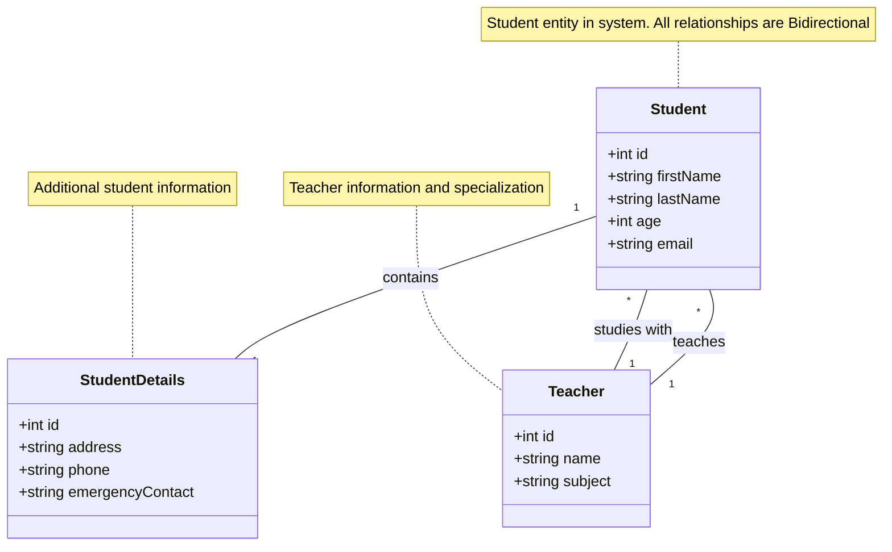
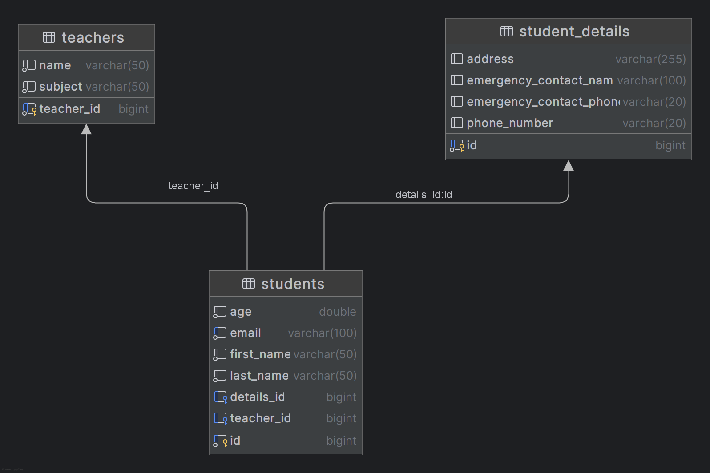

<div dir="rtl">

# ניתוח מערכת ניהול סטודנטים ומורים

## תוכן עניינים
1. [סקירה כללית](#סקירה-כללית)
2. [ארכיטקטורת המערכת](#ארכיטקטורת-המערכת)
3. [מודל הנתונים](#מודל-הנתונים)
4. [יחסי One-to-Many](#יחסי-one-to-many)
5. [StandardResponse ומנגנון תגובות אחיד](#standardresponse-ומנגנון-תגובות-אחיד)
6. [טיפול בשגיאות](#טיפול-בשגיאות)
7. [דוגמאות שאילתות HTTP עיקריות](#דוגמאות-שאילתות-http-עיקריות)
8. [תיקוף נתונים](#תיקוף-נתונים)
9. [סיכום](#סיכום)

## סקירה כללית

מערכת ניהול הסטודנטים והמורים היא אפליקציית Spring Boot המממשת REST API לניהול מידע אקדמי. המערכת מאפשרת ניהול סטודנטים, מורים, פרטי סטודנטים והקשרים ביניהם, עם דגש על יחסי One-to-Many בין מורים לסטודנטים.


# ארכיטקטורת המערכת

המערכת בנויה בארכיטקטורת שכבות (Layered Architecture) המאפשרת הפרדה ברורה בין רכיבים, גמישות בתחזוקה והרחבה, וחלוקת אחריות ברורה. כל שכבה מספקת שירותים לשכבה שמעליה ומשתמשת בשירותים של השכבה שמתחתיה.

## שכבות המערכת

### 🌐 Controllers
אחראים על קבלת בקשות HTTP, עיבוד פרמטרים, והחזרת תשובות במבנה אחיד.

* **`StudentController`** - ניהול פעולות על סטודנטים
* **`StudentDetailsController`** - ניהול פרטים מורחבים של סטודנטים
* **`TeacherController`** - ניהול פעולות על מורים

### ⚙️ Services
מכילים את הלוגיקה העסקית של המערכת ומקשרים בין ה-Controllers לבין ה-Repositories.

* **`StudentService`** ו-**`StudentServiceImpl`**
* **`StudentDetailsService`** ו-**`StudentDetailsServiceImpl`**
* **`TeacherService`** ו-**`TeacherServiceImpl`**

### 💾 Repositories
אחראים על גישה למסד הנתונים, מבצעים שאילתות ועדכונים.

* **`StudentRepository`**
* **`StudentDetailsRepository`**
* **`TeacherRepository`**

### 📋 Entities
מגדירים את מודל הנתונים ומייצגים את הטבלאות במסד הנתונים.

* **`Student`**
* **`StudentDetails`**
* **`Teacher`**

### 📦 DTOs (Data Transfer Objects)
משמשים להעברת נתונים בין שכבות המערכת, מונעים חשיפת מודל הנתונים המלא.

* **`StudentDto`**
* **`StudentDetailsDto`**
* **`TeacherDto`**
* **`TeacherBasicDto`** - גרסה מצומצמת של פרטי המורה

### 📤 Responses
מגדירים מבנה תגובה אחיד לכל הבקשות במערכת.

* **`StandardResponse`** - מבנה תשובה אחיד
* **`GlobalResponseHandler`** - עיבוד תשובות גלובלי

### ⚠️ Exceptions
מגדירים חריגים ספציפיים למערכת ומנגנון טיפול בשגיאות.

* **`NotExists`** - ישות מבוקשת לא קיימת
* **`AlreadyExists`** - ישות כבר קיימת (במקרה של יצירה)
* **`StudentIdAndIdMismatch`** - חוסר התאמה בין מזהים
* **`InvalidRequestException`** - בקשה לא תקינה
* **`GlobalExceptionHandler`** - טיפול מרכזי בחריגים

## יתרונות הארכיטקטורה

* **הפרדת אחריות** - כל שכבה אחראית על היבט ספציפי של המערכת
* **גמישות לשינויים** - ניתן להחליף שכבה מבלי להשפיע על שכבות אחרות
* **תחזוקתיות** - קל יותר לאתר ולתקן באגים
* **בדיקתיות** - ניתן לבדוק כל שכבה בנפרד
* **מודולריות** - קל להוסיף פונקציונליות חדשה


## מודל הנתונים

המערכת מבוססת על שלוש ישויות עיקריות המקושרות ביניהן באמצעות יחסים מוגדרים.

## ישויות המערכת

### 🧑‍🎓 Student
מייצג את פרטי הסטודנט הבסיסיים במערכת.

| שדה | תיאור |
|------|---------|
| `id` | מזהה ייחודי של הסטודנט |
| `firstName` | שם פרטי |
| `lastName` | שם משפחה |
| `age` | גיל |
| `email` | כתובת דוא"ל |

### 📋 StudentDetails
מכיל מידע מורחב ומשלים על הסטודנט.

| שדה | תיאור |
|------|---------|
| `id` | מזהה ייחודי של פרטי הסטודנט |
| `address` | כתובת מגורים מלאה |
| `phone` | מספר טלפון |
| `emergencyContact` | פרטי איש קשר לשעת חירום |

### 👨‍🏫 Teacher
מייצג את המורה האחראי בתהליך הלימודי.

| שדה | תיאור |
|------|---------|
| `id` | מזהה ייחודי של המורה |
| `name` | שם מלא |
| `subject` | תחום התמחות/מקצוע הוראה |

## יחסים בין הישויות

<div dir="ltr">




</div>

<div dir="rtl">

### קשרים מוגדרים:
* **Student ↔ StudentDetails**: קשר חד-חד (One-to-One)
* **Student ↔ Teacher**: קשר רבים-לאחד (Many-to-One) - מורה יכול ללמד מספר סטודנטים

## יחסי One-to-Many

המערכת מיישמת יחסי One-to-Many בין מורים לסטודנטים באופן בי-דירקציונלי:

</div>

<div dir="ltr">

```java
// בישות Teacher
@OneToMany(mappedBy = "teacher", cascade = CascadeType.ALL)
@ToString.Exclude
private List<Student> students = new ArrayList<>();

// מתודות עזר לניהול היחס
public void addStudent(Student student) {
    students.add(student);
    student.setTeacher(this);
}

public void removeStudent(Student student) {
    students.remove(student);
    student.setTeacher(null);
}

// בישות Student
@ManyToOne
@JoinColumn(name = "teacher_id")
@ToString.Exclude
private Teacher teacher;
```

<div dir="rtl">

ניהול היחסים מתבצע בזהירות בשכבת השירות:

</div>

<div dir="ltr">

```java
// הקצאת מורה לסטודנט
@Override
@Transactional
public StudentDto assignTeacherToStudent(Long studentId, Long teacherId) {
    Student student = studentRepository.findById(studentId)
            .orElseThrow(() -> new NotExists("Student with id " + studentId + " does not exist"));
    
    Teacher teacher = teacherRepository.findById(teacherId)
            .orElseThrow(() -> new NotExists("Teacher with id " + teacherId + " does not exist"));
    
    // אם לסטודנט כבר יש מורה, מסירים אותו מהמורה הקודם
    if (student.getTeacher() != null) {
        if (student.getTeacher().getId().equals(teacherId)) {
            throw new AlreadyExists("Student is already assigned to this teacher");
        }
        student.getTeacher().removeStudent(student);
    }
    
    // הקצאה למורה החדש
    teacher.addStudent(student);
    
    Student updated = studentRepository.save(student);
    return studentMapper.toDto(updated);
}
```

<div dir="rtl">

## StandardResponse ומנגנון תגובות אחיד

המערכת מיישמת מבנה תגובה אחיד באמצעות `StandardResponse`

המערכת מבטיחה שכל התגובות מהשרת יהיו ב-`StandardResponse` באמצעות `GlobalResponseHandler`


## טיפול בשגיאות

המערכת כוללת מנגנון טיפול בשגיאות מקיף באמצעות `GlobalExceptionHandler`


## דוגמאות שאילתות HTTP עיקריות

### קבלת כל הסטודנטים


</div>

<div dir="ltr">

```http
GET /students HTTP/1.1
Host: localhost:8080
Accept: application/json
```

```json
{
  "status": "success",
  "data": [
    {
      "id": 1,
      "firstName": "משה",
      "lastName": "כהן",
      "age": 21.5,
      "email": "moshe.cohen@example.com",
      "details": {
        "id": 1,
        "address": "הרצל 123, תל אביב",
        "phoneNumber": "+972541234567",
        "emergencyContactName": "שרה כהן",
        "emergencyContactPhone": "+972541234568"
      },
      "teacher": {
        "id": 1,
        "name": "דוד כהן",
        "subject": "מתמטיקה"
      }
    }
  ],
  "error": null,
  "timestamp": "2023-07-25T14:30:15.123"
}
```

<div dir="rtl">

### הוספת סטודנט חדש

</div>

<div dir="ltr">

```http
POST /students HTTP/1.1
Host: localhost:8080
Content-Type: application/json
Accept: application/json

{
  "firstName": "רון",
  "lastName": "ישראלי",
  "age": 20.5,
  "email": "ron.israeli@example.com",
  "details": {
    "address": "דיזנגוף 100, תל אביב",
    "phoneNumber": "+972541234599",
    "emergencyContactName": "מרים ישראלי",
    "emergencyContactPhone": "+972541234600"
  }
}
```

```json
{
  "status": "success",
  "data": {
    "id": 6,
    "firstName": "רון",
    "lastName": "ישראלי",
    "age": 20.5,
    "email": "ron.israeli@example.com",
    "details": {
      "id": 6,
      "address": "דיזנגוף 100, תל אביב",
      "phoneNumber": "+972541234599",
      "emergencyContactName": "מרים ישראלי",
      "emergencyContactPhone": "+972541234600"
    },
    "teacher": null
  },
  "error": null,
  "timestamp": "2023-07-25T14:32:45.789"
}
```

</div>

<div dir="rtl">

### הקצאת מורה לסטודנט

</div>

```http
POST /students/5/teacher/2 HTTP/1.1
Host: localhost:8080
Accept: application/json
```

<div dir="ltr">

```json
{
  "status": "success",
  "data": {
    "id": 5,
    "firstName": "אמיר",
    "lastName": "דהן",
    "age": 22.8,
    "email": "amit.dahan@example.com",
    "details": null,
    "teacher": {
      "id": 2,
      "name": "שרה לוי",
      "subject": "פיזיקה"
    }
  },
  "error": null,
  "timestamp": "2023-07-25T14:34:12.456"
}
```


<div dir="rtl">

### דוגמא לשגיאה - ניסיון להקצות מורה לסטודנט שאינו קיים

</div>

<div dir="ltr">

```http
POST /students/999/teacher/1 HTTP/1.1
Host: localhost:8080
Accept: application/json
```

```json
{
  "status": "error",
  "data": null,
  "error": {
    "type": "Resource Not Found",
    "message": "Student with id 999 does not exist"
  },
  "timestamp": "2023-07-25T14:35:20.123"
}
```

<div dir="rtl">

## תיקוף נתונים

המערכת משתמשת באנוטציות Jakarta Validation לתיקוף נתונים:

### StudentDto

</div>

<div dir="ltr">

```java
@Data
@NoArgsConstructor
@AllArgsConstructor
public class StudentDto {
    private Long id;

    @NotBlank(message = "First name is required")
    @Size(min = 2, max = 50, message = "First name must be between 2 and 50 characters")
    private String firstName;

    @NotBlank(message = "Last name is required")
    @Size(min = 2, max = 50, message = "Last name must be between 2 and 50 characters")
    private String lastName;

    @Min(value = 0, message = "Age must be a positive number")
    private double age;

    @NotBlank(message = "Email is required")
    @Email(message = "Email should be valid")
    private String email;

    // Making sure to validate the nested object
    @Valid
    private StudentDetailsDto details;
    
    // Reference to teacher
    private TeacherBasicDto teacher;
}
```

<div dir="rtl">

### StudentDetailsDto

</div>

<div dir="ltr">

```java
@Data
@NoArgsConstructor
@AllArgsConstructor
public class StudentDetailsDto {
    private Long id;
    
    private Long studentId;

    @Size(max = 255, message = "Address must be less than 255 characters")
    private String address;

    @Pattern(regexp = "^\\+?(972|0)([23459]\\d{7}|5\\d{8})$",
            message = "Phone number must be a valid Israeli phone number (e.g., +972541234567 or 0541234567)")
    private String phoneNumber;

    @Size(max = 100, message = "Emergency contact name must be less than 100 characters")
    private String emergencyContactName;

    @Pattern(regexp = "^\\+?(972|0)([23459]\\d{7}|5\\d{8})$",
            message = "Emergency contact phone must be a valid Israeli phone number (e.g., +972541234567 or 0541234567)")
    private String emergencyContactPhone;
}
```

<div dir="rtl">

### TeacherDto

</div>

<div dir="ltr">

```java
@Data
@NoArgsConstructor
@AllArgsConstructor
public class TeacherDto {
    private Long id;

    @NotBlank(message = "Name is required")
    @Size(min = 2, max = 50, message = "Name must be between 2 and 50 characters")
    private String name;

    @NotBlank(message = "Subject is required")
    @Size(min = 2, max = 50, message = "Subject must be between 2 and 50 characters")
    private String subject;
    
    // List of student IDs taught by this teacher
    private List<Long> studentIds = new ArrayList<>();
}
```

<div dir="rtl">

מערכת ניהול הסטודנטים והמורים מיישמת עקרונות ארכיטקטורת Spring Boot מודרנית, עם:

1. **הפרדת אחריות** בין שכבות המערכת השונות
2. **מבנה תגובה אחיד** באמצעות StandardResponse
3. **טיפול בשגיאות מקיף** עם GlobalExceptionHandler
4. **ניהול יחסי One-to-Many** בין מורים לסטודנטים
5. **תיקוף נתונים** באמצעות Jakarta Validation
6. **REST API** מקיף לניהול מידע אקדמי

המערכת מדגימה יישום נכון של הפרקטיקות המומלצות בפיתוח Spring Boot, עם דגש על תחזוקתיות, גמישות, ובטיחות נתונים.

</div>