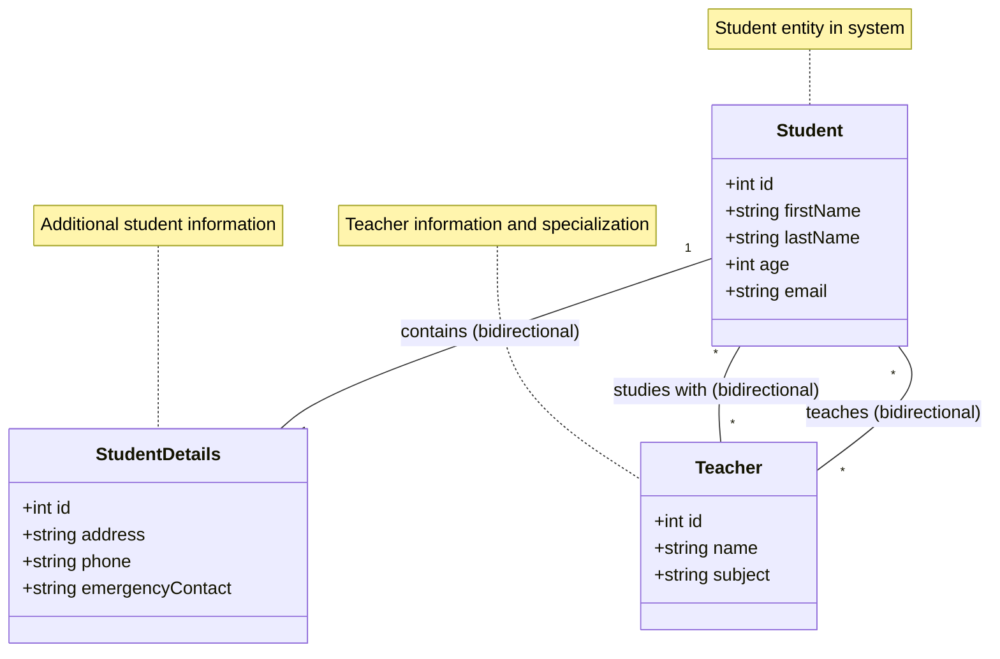
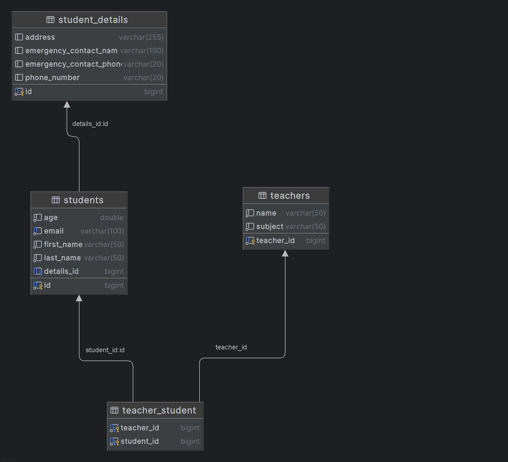

<div dir="rtl">

# ניתוח מערכת ניהול סטודנטים ומורים - שלב 4

## תוכן עניינים
1. [סקירה כללית](#סקירה-כללית)
2. [ארכיטקטורת המערכת](#ארכיטקטורת-המערכת)
3. [מודל הנתונים](#מודל-הנתונים)
4. [יחסי Many-to-Many](#יחסי-many-to-many)
5. [StandardResponse ומנגנון תגובות אחיד](#standardresponse-ומנגנון-תגובות-אחיד)
6. [טיפול בשגיאות](#טיפול-בשגיאות)
7. [דוגמאות שאילתות HTTP עיקריות](#דוגמאות-שאילתות-http-עיקריות)
8. [תיקוף נתונים](#תיקוף-נתונים)
9. [סיכום](#סיכום)

## סקירה כללית

מערכת ניהול הסטודנטים והמורים בשלב 4 היא אפליקציית Spring Boot המממשת REST API לניהול מידע אקדמי. בשלב זה המערכת הורחבה לתמוך ביחסי Many-to-Many בין מורים לסטודנטים, כך שסטודנט יכול ללמוד אצל מספר מורים וכל מורה יכול ללמד מספר סטודנטים.

# ארכיטקטורת המערכת

המערכת מיישמת ארכיטקטורת שכבות (Layered Architecture) המפרידה בין התפקודים השונים ומאפשרת תחזוקה, הרחבה ובדיקה קלות יותר.

## שכבות המערכת

### 🌐 Controllers
**תפקיד**: קבלת בקשות HTTP והחזרת תשובות במבנה אחיד
* `StudentController` - ניהול בקשות הקשורות לסטודנטים
* `StudentDetailsController` - ניהול בקשות הקשורות לפרטים נוספים של סטודנטים
* `TeacherController` - ניהול בקשות הקשורות למורים

### ⚙️ Services
**תפקיד**: הכלת הלוגיקה העסקית של המערכת
* `StudentService` ו-`StudentServiceImpl` - טיפול בלוגיקה העסקית של סטודנטים
* `StudentDetailsService` ו-`StudentDetailsServiceImpl` - טיפול בלוגיקה של פרטי סטודנטים
* `TeacherService` ו-`TeacherServiceImpl` - טיפול בלוגיקה העסקית של מורים

### 💾 Repositories
**תפקיד**: גישה למסד הנתונים
* `StudentRepository` - גישה לנתוני סטודנטים
* `StudentDetailsRepository` - גישה לפרטים נוספים של סטודנטים
* `TeacherRepository` - גישה לנתוני מורים

### 📋 Entities
**תפקיד**: הגדרת מודל הנתונים
* `Student` - ישות המייצגת סטודנט
* `StudentDetails` - ישות המייצגת פרטים נוספים של סטודנט
* `Teacher` - ישות המייצגת מורה

### 📦 DTOs
**תפקיד**: העברת נתונים בין שכבות המערכת
* `StudentDto` - מבנה להעברת נתוני סטודנט
* `StudentDetailsDto` - מבנה להעברת פרטים נוספים של סטודנט
* `TeacherDto` - מבנה להעברת נתוני מורה מלאים
* `TeacherBasicDto` - מבנה להעברת נתוני מורה בסיסיים

### 📤 Responses
**תפקיד**: הגדרת מבנה תגובה אחיד
* `StandardResponse` - מבנה סטנדרטי לתשובות
* `GlobalResponseHandler` - מטפל גלובלי בתשובות

### ⚠️ Exceptions
**תפקיד**: הגדרת חריגים ספציפיים ומנגנון טיפול בשגיאות
* `NotExists` - חריג למקרה שישות לא קיימת
* `AlreadyExists` - חריג למקרה שישות כבר קיימת
* `StudentIdAndIdMismatch` - חריג למקרה של אי התאמה במזהים
* `InvalidRequestException` - חריג לבקשה לא תקינה
* `GlobalExceptionHandler` - מטפל גלובלי בחריגים

## יתרונות הארכיטקטורה
* **מודולריות** - הפרדה ברורה בין רכיבים
* **תחזוקתיות** - קל יותר לשנות ולתחזק כל שכבה בנפרד
* **בדיקתיות** - ניתן לבדוק כל שכבה באופן עצמאי
* **הרחבה** - ניתן להוסיף פונקציונליות חדשה בקלות
* **הפרדת אחריות** - כל שכבה אחראית על היבט ספציפי של המערכת


# מודל הנתונים

מודל הנתונים של המערכת מבוסס על שלוש ישויות עיקריות המקושרות ביניהן ביחסים מוגדרים.

## ישויות המערכת

### 🧑‍🎓 Student
**תיאור**: מכיל את המידע הבסיסי של הסטודנט במערכת.

| שדה | סוג | תיאור |
|------|------|---------|
| `id` | int | מזהה ייחודי של הסטודנט |
| `firstName` | string | שם פרטי |
| `lastName` | string | שם משפחה |
| `age` | int | גיל |
| `email` | string | כתובת דוא"ל |

### 📋 StudentDetails
**תיאור**: מכיל מידע מורחב ומשלים על הסטודנט.

| שדה | סוג | תיאור |
|------|------|---------|
| `id` | int | מזהה ייחודי של פרטי הסטודנט |
| `address` | string | כתובת מגורים מלאה |
| `phone` | string | מספר טלפון |
| `emergencyContact` | string | פרטי איש קשר לשעת חירום |

### 👨‍🏫 Teacher
**תיאור**: מייצג את המורה במערכת.

| שדה | סוג | תיאור |
|------|------|---------|
| `id` | int | מזהה ייחודי של המורה |
| `name` | string | שם מלא |
| `subject` | string | תחום התמחות/מקצוע הוראה |


## יחסים בין הישויות

</div>







<div dir="rtl">

### Student ↔ StudentDetails
**סוג יחס**: חד-חד (One-to-One)  
**תיאור**: לכל סטודנט יש בדיוק סט אחד של פרטים נוספים, ולכל סט פרטים יש בדיוק סטודנט אחד.

### Student ↔ Teacher
**סוג יחס**: רבים-לרבים (Many-to-Many)  
**תיאור**: סטודנט יכול ללמוד אצל מספר מורים, ומורה יכול ללמד מספר סטודנטים.  
**מימוש**: יחס רבים-לרבים מחייב טבלת קישור במסד הנתונים.

## יתרונות המודל

* **שלמות נתונים**: הפרדה לוגית בין סוגי מידע שונים
* **גמישות**: מאפשר הרחבה עתידית של כל ישות בנפרד
* **ביצועים**: מבנה התומך בשאילתות יעילות
* **תאימות לדרישות עסקיות**: תומך בתהליכים העסקיים של מערכת חינוכית


## יחסי Many-to-Many

בשלב 4, המערכת מיישמת יחסי Many-to-Many בין מורים לסטודנטים, כך שסטודנט יכול ללמוד אצל מספר מורים וכל מורה יכול ללמד מספר סטודנטים:

</div>

<div dir="ltr">

```java
// Student Entity
@ManyToMany(mappedBy = "students")
private Set<Teacher> teachers = new HashSet<>();

// Teacher Entity
@ManyToMany
@JoinTable(
    name = "teacher_student",
    joinColumns = @JoinColumn(name = "teacher_id"),
    inverseJoinColumns = @JoinColumn(name = "student_id")
)
@ToString.Exclude
private Set<Student> students = new HashSet<>();
```

</div>

<div dir="rtl">

ניהול היחסים מתבצע בזהירות בשכבת השירות:

</div>

<div dir="ltr">

```java
// StudentServiceImpl - Assigning a teacher to a student
@Override
@Transactional
public StudentDto assignTeacherToStudent(Long studentId, Long teacherId, String notes) {
    Student student = studentRepository.findById(studentId)
            .orElseThrow(() -> new NotExists("Student with id " + studentId + " does not exist"));

    Teacher teacher = teacherRepository.findById(teacherId)
            .orElseThrow(() -> new NotExists("Teacher with id " + teacherId + " does not exist"));

    // Check if already assigned
    if (student.getTeachers().contains(teacher)) {
        throw new AlreadyExists("Teacher is already assigned to this student");
    }

    // Assign teacher to student
    student.getTeachers().add(teacher);
    teacher.getStudents().add(student);
    
    studentRepository.save(student);

    return studentMapper.toDto(student);
}
```

```java
// TeacherServiceImpl - Updating teacher with students
@Override
@Transactional
public TeacherDto updateTeacher(Long id, TeacherDto teacherDto) {
    Teacher teacher = teacherRepository.findById(id)
            .orElseThrow(() -> new NotExists("Teacher with id " + id + " does not exist"));

    teacherMapper.updateEntityFromDto(teacher, teacherDto);

    if (teacherDto.getStudentIds() != null) {
        // Get current students
        Set<Student> currentStudents = teacher.getStudents();
        
        // Get new students from IDs
        Set<Student> newStudents = teacherDto.getStudentIds().stream()
                .map(studentId -> studentRepository.findById(studentId)
                        .orElseThrow(() -> new NotExists("Student with id " + studentId + " not found")))
                .collect(Collectors.toSet());
        
        // Remove teacher from students that are no longer associated
        for (Student student : currentStudents) {
            if (!newStudents.contains(student)) {
                student.getTeachers().remove(teacher);
            }
        }
        
        // Add teacher to new students
        for (Student student : newStudents) {
            if (!currentStudents.contains(student)) {
                student.getTeachers().add(teacher);
            }
        }
        
        // Update the teacher's students
        teacher.setStudents(newStudents);
    }

    Teacher updatedTeacher = teacherRepository.save(teacher);
    return teacherMapper.toDto(updatedTeacher);
}
```

</div>

<div dir="rtl">

## StandardResponse ומנגנון תגובות אחיד

המערכת מיישמת מבנה תגובה אחיד באמצעות `StandardResponse`. כל בקר מחזיר תגובות במבנה אחיד:

</div>

<div dir="ltr">

```java
@GetMapping("/{id}")
public StandardResponse getStudentById(@PathVariable Long id) {
    StudentDto studentDto = studentService.getStudentDtoById(id);
    return new StandardResponse("success", studentDto, null);
}

@PostMapping()
public ResponseEntity<StandardResponse> addStudent(@Valid @RequestBody StudentDto studentDto) {
    StudentDto addedDto = studentService.addStudentAndReturnDto(studentDto);

    URI location = ServletUriComponentsBuilder
            .fromCurrentRequest()
            .path("/{id}")
            .buildAndExpand(addedDto.getId())
            .toUri();

    StandardResponse response = new StandardResponse("success", addedDto, null);
    return ResponseEntity.created(location).body(response);
}
```

</div>

<div dir="rtl">

## טיפול בשגיאות

המערכת כוללת מנגנון טיפול בשגיאות מקיף באמצעות `GlobalExceptionHandler`:

</div>

<div dir="ltr">

```java
@ControllerAdvice
public class GlobalExceptionHandler {

    /**
     * takes care of the exception when a resource is not found, 404 Not Found
     */
    @ExceptionHandler(NotExists.class)
    public ResponseEntity<StandardResponse> handleNotExists(NotExists ex, WebRequest request) {
        Map<String, String> details = new HashMap<>();
        details.put("type", "Resource Not Found");
        details.put("message", ex.getMessage());
        
        StandardResponse response = new StandardResponse("error", null, details);
        return new ResponseEntity<>(response, HttpStatus.NOT_FOUND);
    }

    /**
     * takes care of the exception when a resource already exists, 409 Conflict
     */
    @ExceptionHandler(AlreadyExists.class)
    public ResponseEntity<StandardResponse> handleAlreadyExists(AlreadyExists ex, WebRequest request) {
        Map<String, String> details = new HashMap<>();
        details.put("type", "Resource Conflict");
        details.put("message", ex.getMessage());
        
        StandardResponse response = new StandardResponse("error", null, details);
        return new ResponseEntity<>(response, HttpStatus.CONFLICT);
    }

    // Additional exception handlers...
}
```

</div>

<div dir="rtl">

## דוגמאות שאילתות HTTP עיקריות

### קבלת התלמידים של מורה

</div>

<div dir="ltr">

```http
GET /teachers/1 HTTP/1.1
Host: localhost:8080
Accept: application/json
```

```json
{
  "status": "success",
  "data": {
    "id": 1,
    "name": "David Cohen",
    "subject": "Mathematics",
    "studentIds": [1, 2]
  },
  "error": null,
  "timestamp": "2023-07-25T14:30:15.123"
}
```

</div>

<div dir="rtl">

### קבלת המורים של תלמיד

</div>

<div dir="ltr">

```http
GET /students/1/teachers HTTP/1.1
Host: localhost:8080
Accept: application/json
```

```json
{
  "status": "success",
  "data": [
    {
      "id": 1,
      "name": "David Cohen",
      "subject": "Mathematics"
    },
    {
      "id": 2,
      "name": "Sarah Levy",
      "subject": "Physics"
    }
  ],
  "error": null,
  "timestamp": "2023-07-25T14:32:45.789"
}
```

</div>

<div dir="rtl">

### הקצאת מורה לתלמיד

</div>

<div dir="ltr">

```http
POST /students/3/teachers/2 HTTP/1.1
Host: localhost:8080
Accept: application/json
```

```json
{
  "status": "success",
  "data": {
    "id": 3,
    "firstName": "Noam",
    "lastName": "Mizrachi",
    "age": 20.7,
    "email": "noam.mizrachi@example.com",
    "details": {
      "id": 3,
      "address": "78 Weizmann St, Haifa",
      "phoneNumber": "+972531234567",
      "emergencyContactName": "Ruth Mizrachi",
      "emergencyContactPhone": "+972531234568"
    }
  },
  "error": null,
  "timestamp": "2023-07-25T14:34:12.456"
}
```

</div>

<div dir="rtl">

### דוגמה לשגיאה - ניסיון להקצות מורה שכבר מוקצה לתלמיד

</div>

<div dir="ltr">

```http
POST /students/1/teachers/1 HTTP/1.1
Host: localhost:8080
Accept: application/json
```

```json
{
  "status": "error",
  "data": null,
  "error": {
    "type": "Resource Conflict",
    "message": "Teacher is already assigned to this student"
  },
  "timestamp": "2023-07-25T14:35:20.123"
}
```

</div>

<div dir="rtl">

## תיקוף נתונים

המערכת משתמשת באנוטציות Jakarta Validation לתיקוף נתונים:

### StudentDto

</div>

<div dir="ltr">

```java
@Data
@NoArgsConstructor
@AllArgsConstructor
public class StudentDto {
    private Long id;

    @NotBlank(message = "First name is required")
    @Size(min = 2, max = 50, message = "First name must be between 2 and 50 characters")
    private String firstName;

    @NotBlank(message = "Last name is required")
    @Size(min = 2, max = 50, message = "Last name must be between 2 and 50 characters")
    private String lastName;

    @Min(value = 0, message = "Age must be a positive number")
    private double age;

    @NotBlank(message = "Email is required")
    @Email(message = "Email should be valid")
    private String email;

    // Making sure to validate the nested object
    @Valid
    private StudentDetailsDto details;
}
```

</div>

<div dir="rtl">

### StudentDetailsDto

</div>

<div dir="ltr">

```java
@Data
@NoArgsConstructor
@AllArgsConstructor
public class StudentDetailsDto {
    private Long id;
    private Long studentId;

    @Size(max = 255, message = "Address must be less than 255 characters")
    private String address;

    // regex: for Israeli phone numbers
    @Pattern(regexp = "^\\+?(972|0)([23459]\\d{7}|5\\d{8})$",
            message = "Phone number must be a valid Israeli phone number (e.g., +972541234567 or 0541234567)")
    private String phoneNumber;

    @Size(max = 100, message = "Emergency contact name must be less than 100 characters")
    private String emergencyContactName;

    // regex: for Israeli phone numbers
    @Pattern(regexp = "^\\+?(972|0)([23459]\\d{7}|5\\d{8})$",
            message = "Emergency contact phone must be a valid Israeli phone number (e.g., +972541234567 or 0541234567)")
    private String emergencyContactPhone;
}
```

</div>

<div dir="rtl">

## מבנה נתונים - מעבר ליחסי Many-to-Many

המעבר מיחסי One-to-Many ליחסי Many-to-Many בין מורים לסטודנטים מאפשר יותר גמישות במערכת:

1. **במודל הקודם (One-to-Many)**:
    - כל סטודנט שייך למורה אחד בלבד
    - כל מורה יכול ללמד מספר סטודנטים
    - היחס היה מיוצג על ידי שדה `teacher` בישות `Student`

2. **במודל הנוכחי (Many-to-Many)**:
    - כל סטודנט יכול ללמוד אצל מספר מורים
    - כל מורה יכול ללמד מספר סטודנטים
    - היחס מיוצג על ידי:
        - `Set<Teacher> teachers` בישות `Student`
        - `Set<Student> students` בישות `Teacher`
        - טבלת קשר `teacher_student` במסד הנתונים

היתרונות של המודל החדש:
- מייצג טוב יותר את המציאות האקדמית, בה סטודנטים לומדים אצל מספר מורים
- מאפשר גמישות בניהול הקשרים בין סטודנטים למורים
- תומך בתרחישים מורכבים יותר של ניהול מידע אקדמי

## יצירת נתוני דוגמה

המערכת כוללת `DataInitializer` שמאתחל את מסד הנתונים עם נתוני דוגמה של סטודנטים, מורים והקשרים ביניהם:

</div>

<div dir="ltr">

```java
@Component
public class DataInitializer implements CommandLineRunner {
    @Override
    @Transactional
    public void run(String... args) {
        // Check if there are already records in the database
        if (teacherRepository.count() == 0) {
            // Create teachers and students
            // ...
            
            // Assign students to teachers
            mathTeacher.getStudents().add(moshe);
            mathTeacher.getStudents().add(yael);
            moshe.getTeachers().add(mathTeacher);
            yael.getTeachers().add(mathTeacher);
            
            physicsTeacher.getStudents().add(moshe);
            physicsTeacher.getStudents().add(noam);
            moshe.getTeachers().add(physicsTeacher);
            noam.getTeachers().add(physicsTeacher);
            
            englishTeacher.getStudents().add(yael);
            englishTeacher.getStudents().add(noam);
            yael.getTeachers().add(englishTeacher);
            noam.getTeachers().add(englishTeacher);
            
            // Save entities
            // ...
        }
    }
}
```

</div>

<div dir="rtl">

## סיכום

מערכת ניהול הסטודנטים והמורים בשלב 4 מיישמת עקרונות ארכיטקטורת Spring Boot מודרנית, עם:

1. **מעבר ליחסי Many-to-Many** בין מורים לסטודנטים
2. **הפרדת אחריות** בין שכבות המערכת השונות
3. **מבנה תגובה אחיד** באמצעות StandardResponse
4. **טיפול בשגיאות מקיף** עם GlobalExceptionHandler
5. **תיקוף נתונים** באמצעות Jakarta Validation
6. **REST API** מקיף לניהול מידע אקדמי

המערכת מדגימה יישום נכון של הפרקטיקות המומלצות בפיתוח Spring Boot, עם דגש על תחזוקתיות, גמישות, ובטיחות נתונים.

</div>