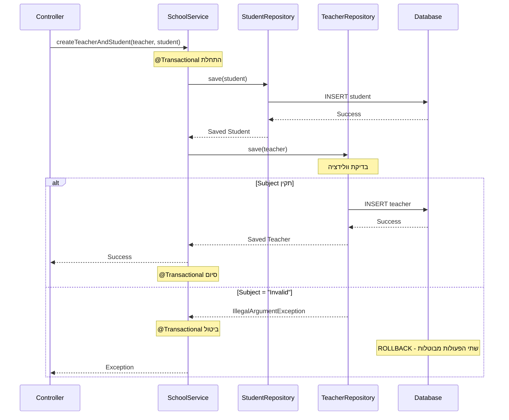
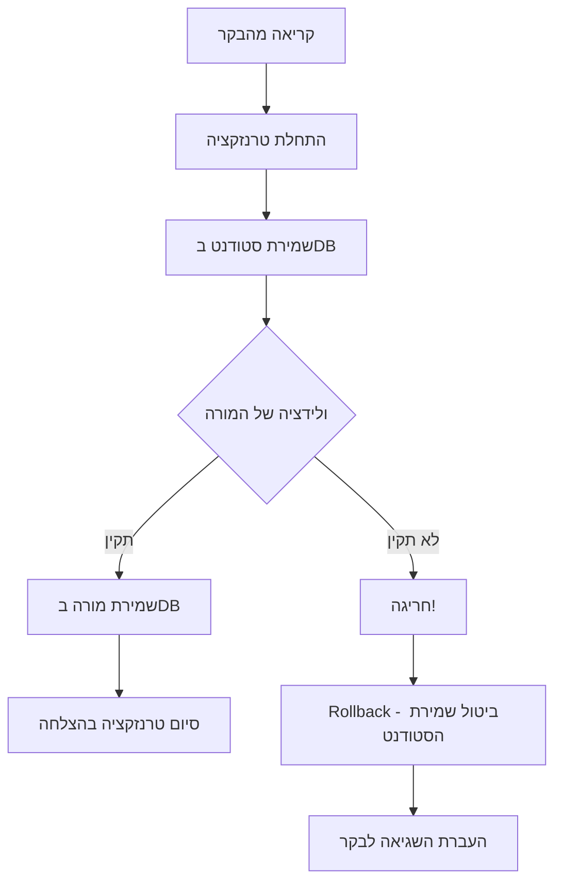

# דוגמת קוד: טרנזקציות ב-Spring Boot

<div dir="rtl">

## מימוש טרנזקציות עם Student ו-Teacher

להלן דוגמת קוד פשוטה המדגימה שימוש בטרנזקציות בספרינג בוט לטיפול בשתי ישויות - `Student` ו-`Teacher`. הקוד מדגים כיצד טרנזקציה אחת יכולה לכלול פעולות על שתי ישויות שונות, וכיצד מנגנון ה-rollback האוטומטי של ספרינג מבטיח עקביות נתונים.

</div>

## Entity Classes

```java
// Entity classes
@Entity
@Data
@NoArgsConstructor
@AllArgsConstructor
public class Student {
    @Id
    @GeneratedValue(strategy = GenerationType.IDENTITY)
    private Long id;
    private String name;
    private String email;
}

@Entity
@Data
@NoArgsConstructor
@AllArgsConstructor
public class Teacher {
    @Id
    @GeneratedValue(strategy = GenerationType.IDENTITY)
    private Long id;
    private String name;
    private String subject;
    
    // וולידציה פשוטה שתגרום לשגיאה במקרים מסוימים
    @PrePersist
    @PreUpdate
    public void validate() {
        if (subject != null && subject.equals("Invalid")) {
            throw new IllegalArgumentException("Invalid subject specified");
        }
    }
}
```
<div dir="rtl">

## Repositories

</div>

```java
// Repositories
public interface StudentRepository extends JpaRepository<Student, Long> {
}

public interface TeacherRepository extends JpaRepository<Teacher, Long> {
}
```

<div dir="rtl">

## Service Layer

</div>

```java
// Service
@Service
public class SchoolService {
    
    private final StudentRepository studentRepository;
    private final TeacherRepository teacherRepository;
    
    @Autowired
    public SchoolService(StudentRepository studentRepository, TeacherRepository teacherRepository) {
        this.studentRepository = studentRepository;
        this.teacherRepository = teacherRepository;
    }
    
    /**
     * מתודה שיוצרת מורה וסטודנט בתוך אותה טרנזקציה.
     * אם יש שגיאה כלשהי, יתבצע רולבק אוטומטי של שתי הפעולות.
     */
    @Transactional
    public void createTeacherAndStudent(Teacher teacher, Student student) {
        // שמירת הסטודנט
        studentRepository.save(student);
        
        // שמירת המורה - במידה והמורה מכיל subject="Invalid", תיזרק שגיאה
        // וגם שמירת הסטודנט תבוטל
        teacherRepository.save(teacher);
    }
    
    /**
     * דוגמה לטרנזקציה נוספת המבצעת עדכון לשתי ישויות
     */
    @Transactional
    public void updateTeacherAndStudent(Long teacherId, Long studentId, 
                                        String newTeacherName, String newStudentName) {
        
        // מציאת והעדכון הסטודנט
        Student student = studentRepository.findById(studentId)
                .orElseThrow(() -> new RuntimeException("Student not found"));
        student.setName(newStudentName);
        studentRepository.save(student);
        
        // מציאת והעדכון המורה
        Teacher teacher = teacherRepository.findById(teacherId)
                .orElseThrow(() -> new RuntimeException("Teacher not found"));
        teacher.setName(newTeacherName);
        teacherRepository.save(teacher);
        
        // אופציה לסימולציית שגיאה
        if (newTeacherName != null && newTeacherName.contains("error")) {
            throw new RuntimeException("Error updating teacher");
        }
    }
}
```

<div dir="rtl">

## Controller

</div>

```java
// Controller
@RestController
@RequestMapping("/api/school")
public class SchoolController {
    
    private final SchoolService schoolService;
    
    @Autowired
    public SchoolController(SchoolService schoolService) {
        this.schoolService = schoolService;
    }
    
    @PostMapping("/create")
    public ResponseEntity<String> createTeacherAndStudent(@RequestBody CreateRequest request) {
        try {
            Teacher teacher = new Teacher(null, request.getTeacherName(), request.getSubject());
            Student student = new Student(null, request.getStudentName(), request.getStudentEmail());
            
            schoolService.createTeacherAndStudent(teacher, student);
            return ResponseEntity.ok("Teacher and student created successfully");
        } catch (Exception e) {
            return ResponseEntity.badRequest().body("Failed: " + e.getMessage());
        }
    }
    
    @PutMapping("/update")
    public ResponseEntity<String> updateTeacherAndStudent(@RequestBody UpdateRequest request) {
        try {
            schoolService.updateTeacherAndStudent(
                    request.getTeacherId(), 
                    request.getStudentId(),
                    request.getNewTeacherName(),
                    request.getNewStudentName());
            return ResponseEntity.ok("Teacher and student updated successfully");
        } catch (Exception e) {
            return ResponseEntity.badRequest().body("Failed: " + e.getMessage());
        }
    }
}

// Request DTOs
@Data
class CreateRequest {
    private String teacherName;
    private String subject;
    private String studentName;
    private String studentEmail;
}

@Data
class UpdateRequest {
    private Long teacherId;
    private Long studentId;
    private String newTeacherName;
    private String newStudentName;
}
```

<div dir="rtl">

## הסבר מנגנון ה-Rollback

1. **Transactional@** - האנוטציה הזו משמשת לסימון מתודות שצריכות לרוץ בתוך טרנזקציה. אם לא צוין אחרת, ברירת המחדל היא שכל RuntimeException (או תת-מחלקה שלו) תגרום לרולבק.

2. **Automatic Rollback** - בדוגמה שלנו:
    * אם בעת יצירת המורה ה-subject הוא "Invalid", תיזרק שגיאת IllegalArgumentException
    * ספרינג אוטומטית תבטל את כל העסקה - כולל שמירת הסטודנט שכבר בוצעה
    * שני האובייקטים לא יישמרו בבסיס הנתונים

3. **סימולציית שגיאה** - ב-updateTeacherAndStudent יש סימולציה מפורשת של שגיאה:
    * אם שם המורה החדש מכיל את המילה "error", נזרקת שגיאה
    * למרות שהעדכונים כבר נשלחו ל-repository, הם יבוטלו בגלל ה-rollback

## איך לבדוק זאת

1. צור סטודנט ומורה תקינים:

</div>

```
POST /api/school/create
{
  "teacherName": "John Smith",
  "subject": "Math",
  "studentName": "Jane Doe",
  "studentEmail": "jane@example.com"
}
```

<div dir="rtl">

2. נסה ליצור סטודנט ומורה עם subject לא תקין:

</div>

```
POST /api/school/create
{
  "teacherName": "Alice Johnson",
  "subject": "Invalid",
  "studentName": "Bob Brown",
  "studentEmail": "bob@example.com"
}
```

<div dir="rtl">

במקרה זה, לא יישמר גם הסטודנט.

3. נסה לעדכן עם שגיאה מכוונת:

</div>

```
PUT /api/school/update
{
  "teacherId": 1,
  "studentId": 1,
  "newTeacherName": "error-trigger",
  "newStudentName": "New Name"
}
```

<div dir="rtl">

במקרה זה, שני העדכונים יבוטלו.

זוהי דוגמה פשוטה של שימוש בטרנזקציות בספרינג בוט להבטחת עקביות הנתונים כאשר מבצעים פעולות על מספר ישויות. ה-rollback מתבצע אוטומטית במקרה של כל חריגה שהיא RuntimeException או תת-מחלקה שלו.

# תרשים זרימת טרנזקציה מתוקן


## תרשים זרימת הטרנזקציה




בתרשים ניתן לראות את המהלך של טרנזקציה עם הסבר על:
1. התחלת הטרנזקציה כאשר הקריאה מגיעה לשירות המסומן עם `Transactional@`
2. שמירת הסטודנט - צעד שמצליח
3. ניסיון לשמירת המורה - עם שני תרחישים אפשריים:
    * במקרה של נתונים תקינים - הטרנזקציה מסתיימת בהצלחה
    * במקרה של שגיאת ולידציה - מתבצע רולבק לכל הפעולות בטרנזקציה, כולל שמירת הסטודנט

## תרשים חלופי עם פחות חיצים



תרשים זה ממחיש בצורה פשוטה יותר את זרימת הטרנזקציה והרולבק האוטומטי שמתבצע בעת חריגה.


## יתרונות ה-@Transactional בספרינג

1. **אטומיות (Atomicity)** - כל הפעולות בטרנזקציה מתבצעות או מבוטלות כיחידה אחת.
2. **פשטות** - ניהול עסקאות הופך קל ופשוט באמצעות אנוטציה אחת.
3. **הצהרתיות** - ניתן לציין במפורש את גבולות הטרנזקציה ואת מדיניות הרולבק.
4. **הפרדת אחריות** - לוגיקה עסקית מופרדת מניהול עסקאות.
5. **גמישות** - ניתן לקבוע מאפיינים שונים כמו propagation, isolation, timeout ועוד.

## הערות חשובות

1. שים לב כי @Transactional עובד רק על מתודות ציבוריות (public).
2. כאשר שיטה מחלקה אחת קוראת לשיטה @Transactional בתוך אותה מחלקה, האנוטציה לא תעבוד (לא יופעל proxy).
3. ניתן לקבוע באופן מפורש אילו חריגות יגרמו לרולבק באמצעות המאפיינים rollbackFor ו-noRollbackFor.

</div>