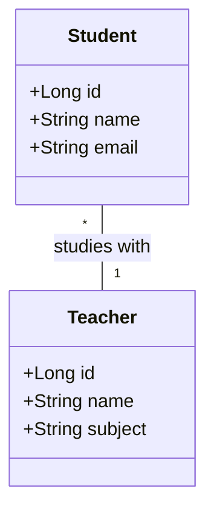
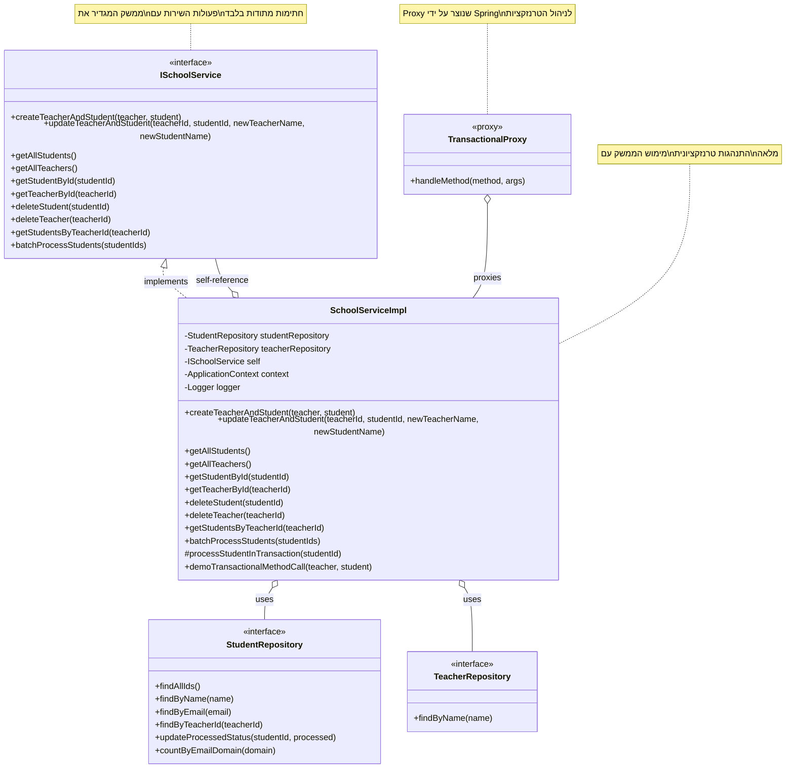
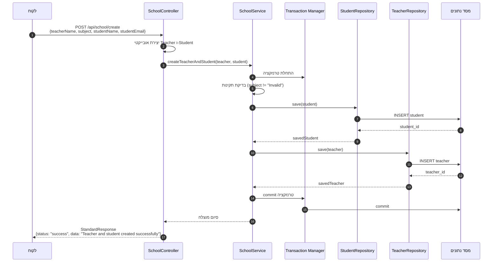
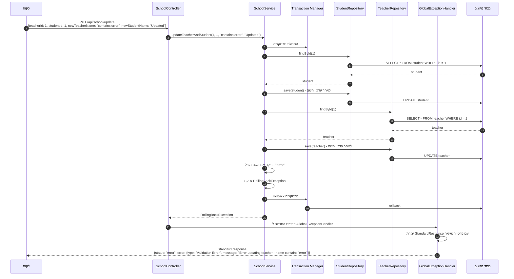

<div dir="rtl">

# ניהול טרנזקציות במערכת ניהול בית ספר

## מודל הנתונים

</div>



<div dir="rtl">

## שימוש ב-Transactional@

הפרויקט מדגים שימוש מתקדם באנוטציית `Transactional@` כדי להבטיח את שלמות הנתונים.

### מאפייני Transactional@ בפרויקט

</div>

```java
@Transactional(rollbackOn = Exception.class)
```

<div dir="rtl">

בפרויקט זה, האנוטציה `Transactional@` משמשת עם הפרמטרים הבאים:

* **rollbackOn**: מגדיר אילו סוגי חריגות יגרמו לביטול (rollback) של הטרנזקציה
   * בפרויקט מוגדר `Exception.class` - כל חריגה תגרום לביטול הטרנזקציה
   * זהו הרחבה מעבר לברירת המחדל, שמבטלת טרנזקציות רק על RuntimeException

### דוגמאות מהקוד

#### 1. יצירת מורה ותלמיד בטרנזקציה אחת

</div>

```java
@Transactional(rollbackOn = Exception.class)
public void createTeacherAndStudent(@Valid @NotNull Teacher teacher, @Valid @NotNull Student student) {
   logger.info("Starting transaction to create teacher and student");

   // Service-level validation
   if (teacher.getSubject() != null && teacher.getSubject().equals("Invalid")) {
      logger.warning("Invalid subject detected, throwing RollingBackException");
      throw new RollingBackException("Invalid subject at service level - RollingBackException");
   }

   // Save student first
   logger.info("Saving student: " + student.getName());
   Student savedStudent = studentRepository.save(student);

   // Then save teacher
   logger.info("Saving teacher: " + teacher.getName());
   Teacher savedTeacher = teacherRepository.save(teacher);

   logger.info("Successfully created teacher and student - transaction will be committed");
}
```

<div dir="rtl">

**התנהגות**:
- אם נזרקת חריגה בזמן שמירת התלמיד, הטרנזקציה תתבטל
- אם נזרקת חריגה בזמן שמירת המורה, הטרנזקציה תתבטל וגם שמירת התלמיד תתבטל
- השימוש ב-`Valid@` מבטיח תקינות של הנתונים ברמת ה-Bean Validation
- תיעוד מפורט באמצעות לוגים

#### 2. עדכון מורה ותלמיד בטרנזקציה אחת

</div>

```java
@Transactional(rollbackOn = {Exception.class})
public void updateTeacherAndStudent(@NotNull Long teacherId, @NotNull Long studentId,
                                    @NotNull String newTeacherName, @NotNull String newStudentName) {
    logger.info("Starting transaction to update teacher ID " + teacherId + 
                " and student ID " + studentId);
    
    // Find and update the student
    logger.info("Finding student with ID: " + studentId);
    Student student = studentRepository.findById(studentId)
            .orElseThrow(() -> new ResourceNotFoundException("Student with id " + studentId + " not found"));
    
    logger.info("Updating student name to: " + newStudentName);
    student.setName(newStudentName);
    studentRepository.save(student);

    // Find and update the teacher
    logger.info("Finding teacher with ID: " + teacherId);
    Teacher teacher = teacherRepository.findById(teacherId)
            .orElseThrow(() -> new ResourceNotFoundException("Teacher with id " + teacherId + " not found"));
    
    logger.info("Updating teacher name to: " + newTeacherName);
    teacher.setName(newTeacherName);
    teacherRepository.save(teacher);

    // Deliberate validation check to demonstrate rollback
    if (newTeacherName != null && newTeacherName.contains("error")) {
        logger.warning("Teacher name contains 'error', throwing RollingBackException");
        throw new RollingBackException("Error updating teacher - name contains 'error'");
    }
    
    logger.info("Successfully updated teacher and student - transaction will be committed");
}
```

<div dir="rtl">

**התנהגות**:
- אם התלמיד או המורה לא נמצאים, תיזרק `ResourceNotFoundException`
- אם שם המורה החדש מכיל "error", תיזרק `RollingBackException`
- בשני המקרים, הטרנזקציה תתבטל באופן מלא
- תיעוד מפורט באמצעות לוגים מאפשר מעקב אחר זרימת התהליך

## טיפול בחריגות

המערכת כוללת `GlobalExceptionHandler` שמטפל בחריגות ומחזיר תשובות במבנה אחיד:

</div>

```java
@ExceptionHandler(RollingBackException.class)
public ResponseEntity<StandardResponse> handleRollingBackException(RollingBackException ex, WebRequest request) {
    Map<String, String> details = new HashMap<>();
    details.put("type", "Validation Error");
    details.put("message", ex.getMessage());

    StandardResponse response = new StandardResponse("error", null, details);
    return new ResponseEntity<>(response, HttpStatus.BAD_REQUEST);
}
```

<div dir="rtl">

## זרימת הבקשה

1. בקשת HTTP מגיעה אל `SchoolController`
2. הבקר מעבד את הבקשה ומעביר אותה ל-`SchoolService`
3. השירות מבצע את הלוגיקה העסקית בתוך טרנזקציה
4. אם יש שגיאה, הטרנזקציה מתבטלת ונזרקת חריגה מתאימה
5. `GlobalExceptionHandler` מטפל בחריגה ומחזיר תשובה במבנה אחיד
6. אם אין שגיאה, מוחזרת תשובת הצלחה במבנה אחיד

## יתרונות השימוש ב-Transactional@

1. **שלמות נתונים**: כל הפעולות יושלמו בהצלחה או יתבטלו יחד
2. **פשטות קוד**: אין צורך בניהול טרנזקציות ידני
3. **גמישות**: ניתן להגדיר התנהגויות שונות לחריגות שונות
4. **קריאות**: הקוד מבטא את הכוונה העסקית בצורה ברורה

## אזהרות ודגשים

1. `@Transactional` אפקטיבית רק כשהמתודה נקראת מבחוץ (בגלל מנגנון Proxy)
2. ברירת המחדל היא לבטל טרנזקציה רק עבור חריגות לא בדוקות (RuntimeException)
3. `rollbackOn = Exception.class` מרחיב את ההתנהגות גם לחריגות בדוקות
4. יש להיזהר מטרנזקציות ארוכות מדי שעלולות לגרום לחסימת משאבים

## הרחבה על אזהרות ודגשים בשימוש ב-Transactional@



### 1. `@Transactional` אפקטיבית רק כשהמתודה נקראת מבחוץ (בגלל מנגנון Proxy)

כאשר מסמנים מתודה עם `@Transactional`, Spring יוצר "עטיפה" (proxy) סביב האובייקט של המחלקה. כאשר קריאה מגיעה מחוץ למחלקה (ממחלקה אחרת), הקריאה עוברת דרך העטיפה, שמתחילה את הטרנזקציה לפני ביצוע המתודה ומסיימת אותה אחרי.

הבעיה מתרחשת כאשר מתודה בתוך אותה מחלקה קוראת למתודה אחרת המסומנת כ-`@Transactional`. במקרה זה, הקריאה מתבצעת ישירות למתודה המקורית, ולא דרך העטיפה, ולכן מנגנון הטרנזקציה לא מופעל.

#### דוגמה לבעיה:

</div>

```java
/**
 * Example of a non-transactional method that calls a transactional method internally.
 * WARNING: This is a demonstration of a PROBLEMATIC PATTERN - the @Transactional
 * annotation on createTeacherAndStudent will NOT be effective when called this way!
 */
public void createEntitiesIncorrectly(Teacher teacher, Student student) {
    logger.warning("WARNING: This method demonstrates a common anti-pattern!");
    // PROBLEM: Direct internal call bypasses the proxy
    createTeacherAndStudent(teacher, student); // Transaction won't work!
}

@Transactional(rollbackOn = Exception.class)
public void createTeacherAndStudent(@Valid @NotNull Teacher teacher, @Valid @NotNull Student student) {
    // הלוגיקה של יצירת התלמיד והמורה
}
```

<div dir="rtl">

במקרה זה, הקריאה ל-`createTeacherAndStudent` מתוך `createEntitiesIncorrectly` לא תהיה בתוך טרנזקציה, למרות הסימון `Transactional@`.

#### פתרונות אפשריים:

1. **הזרקת המחלקה לעצמה וקריאה דרכה**:

</div>

```java
@Autowired
private SchoolService self;  // הזרקת אותה מחלקה לעצמה

/**
 * Example of correctly calling a transactional method from within the same class.
 * Solution 1: Using self-injection.
 */
public void createEntitiesCorrectly_Solution1(Teacher teacher, Student student) {
    // CORRECT: Call through the self-injected proxy
    self.createTeacherAndStudent(teacher, student); // Transaction works!
}
```

<div dir="rtl">

2. **שימוש ב-ApplicationContext לקבלת Bean**:

</div>

```java
@Autowired
private ApplicationContext context;

/**
 * Example of another correct way to call a transactional method from the same class.
 * Solution 2: Using ApplicationContext to get the bean.
 */
public void createEntitiesCorrectly_Solution2(Teacher teacher, Student student) {
    // CORRECT: Get the proxied instance from the Spring context
    SchoolService proxiedService = context.getBean(SchoolService.class);
    proxiedService.createTeacherAndStudent(teacher, student); // Transaction works!
}
```

<div dir="rtl">

3. **סימון המחלקה כולה כ-`Transactional@`**:

</div>

```java
@Service
@Validated
@Transactional // סימון ברמת המחלקה
public class SchoolService {
    // כל המתודות יהיו בטרנזקציה
}
```

<div dir="rtl">

### 2. ברירת המחדל היא לבטל טרנזקציה רק עבור חריגות לא בדוקות (RuntimeException)

Spring מבחין בין שני סוגי חריגות:

* **חריגות לא בדוקות (Unchecked Exceptions)**: יורשות מ-`RuntimeException`, למשל `NullPointerException`.
* **חריגות בדוקות (Checked Exceptions)**: יורשות ישירות מ-`Exception`, למשל `IOException`.

בברירת מחדל, Spring מבטל טרנזקציות רק עבור חריגות לא בדוקות, מתוך הנחה שחריגות בדוקות מייצגות מצבים צפויים שניתן להתמודד איתם.

#### דוגמה להבהרה:

</div>

```java
// ברירת מחדל
@Transactional
public void defaultMethod() throws IOException {
    if (condition) {
        throw new RuntimeException(); // הטרנזקציה תתבטל
    }
    if (otherCondition) {
        throw new IOException(); // הטרנזקציה תושלם - לא תתבטל!
    }
}
```

<div dir="rtl">

### 3. `rollbackOn = Exception.class` מרחיב את ההתנהגות גם לחריגות בדוקות

הוספת `rollbackOn = Exception.class` גורמת לכך שגם חריגות בדוקות יגרמו לביטול הטרנזקציה:

</div>

```java
@Transactional(rollbackOn = Exception.class)
public void enhancedMethod() throws IOException {
    if (condition) {
        throw new RuntimeException(); // הטרנזקציה תתבטל
    }
    if (otherCondition) {
        throw new IOException(); // הטרנזקציה תתבטל גם כן!
    }
}
```

<div dir="rtl">

זוהי הרחבה חשובה כאשר:
1. עובדים עם APIs שזורקים חריגות בדוקות
2. מטפלים בקישוריות למסד נתונים
3. מתממשקים למערכות חיצוניות

### 4. יש להיזהר מטרנזקציות ארוכות מדי שעלולות לגרום לחסימת משאבים

טרנזקציות ארוכות מדי עלולות לגרום לבעיות:

1. **חסימת שורות/טבלאות**: במהלך טרנזקציה, מסד הנתונים עשוי לנעול שורות או טבלאות שלמות.
2. **ניצול חיבורים**: טרנזקציות מחזיקות בחיבור למסד הנתונים.
3. **סיכון לדדלוק (Deadlock)**: טרנזקציות ארוכות מגדילות את הסיכוי להתנגשויות.
4. **בעיות ביצועים**: ביטול טרנזקציה ארוכה עלול להיות תהליך יקר מבחינת משאבים.

#### דוגמה לטרנזקציה בעייתית:

</div>

```java
/**
 * Example of a potentially problematic long-running transaction.
 * This method demonstrates an anti-pattern that should be avoided.
 */
@Transactional
public void dangerousLongTransaction() {
    // WARNING: This loads all students into memory and processes them in a single transaction
    // which could cause:
    // 1. Long-held database locks
    // 2. Excessive memory usage
    // 3. Increased risk of deadlocks
    // 4. Connection pool exhaustion
    
    logger.warning("Running a potentially dangerous long transaction");
    List<Student> allStudents = studentRepository.findAll();
    
    for (Student student : allStudents) {
        // Simulating time-consuming processing
        processStudentData(student);
        
        // Multiple database calls within the loop
        Teacher teacher = teacherRepository.findByName(student.getName());
        
        // More time-consuming processing
        processTeacherData(teacher);
        
        // Database updates
        student.setProcessed(true);
        studentRepository.save(student);
    }
}
```

<div dir="rtl">

#### פתרונות מומלצים:

1. **פיצול לטרנזקציות קטנות**:

</div>

```java
/**
 * Example of a safer approach by breaking up a long operation into smaller transactions.
 */
public void saferBatchProcessing() {
    logger.info("Starting batch processing with separate transactions");
    // Get IDs outside of transaction
    List<Long> studentIds = studentRepository.findAllIds();
    
    // Process each student in its own transaction
    for (Long id : studentIds) {
        try {
            processStudentInTransaction(id);
        } catch (Exception e) {
            // Log and continue with the next student
            logger.warning("Error processing student ID " + id + ": " + e.getMessage());
        }
    }
}

/**
 * Process a single student in its own transaction.
 * Using a separate transaction for each student prevents issues with long-running transactions.
 */
@Transactional(rollbackOn = Exception.class)
public void processStudentInTransaction(Long studentId) {
    Student student = studentRepository.findById(studentId)
            .orElseThrow(() -> new ResourceNotFoundException("Student with id " + studentId + " not found"));
    
    // Process the student
    processStudentData(student);
    
    // Update the student
    student.setProcessed(true);
    studentRepository.save(student);
}
```

<div dir="rtl">

2. **הוצאת פעולות לא-טרנזקציוניות מחוץ לטרנזקציה**:

</div>

```java
@Transactional
public void saveData(Data data) {
    repository.save(data);
}

public void completeProcess(Data data) {
    // טרנזקציה לשמירת נתונים
    saveData(data);
    
    // פעולות חיצוניות מחוץ לטרנזקציה
    notificationService.notify("Data processed");
    exportService.exportData(data);
}
```

<div dir="rtl">

## תהליכי פניות למערכת ובדיקתן

להלן הדגמה ויזואלית של תהליכי פנייה תקינה ולא תקינה למערכת, בהתאם לקוד הקיים, וכן דוגמאות לבדיקה באמצעות כלי HTTP Client של IntelliJ Ultimate.

### תהליך פנייה תקינה

</div>



<div dir="rtl">

### תהליך פנייה לא תקינה

</div>



<div dir="rtl">

## דוגמאות שאילתות HTTP עבור IntelliJ Ultimate

בעזרת הפלאגין HTTP Client של IntelliJ Ultimate, ניתן לבדוק את ה-API שלנו בצורה נוחה. להלן דוגמאות לשאילתות שאפשר לשמור בקובץ `.http`:

</div>

```http
### יצירת מורה ותלמיד חדשים (פנייה תקינה)
POST http://localhost:8080/api/school/create
Content-Type: application/json

{
  "teacherName": "אבי כהן",
  "subject": "מתמטיקה",
  "studentName": "דנה לוי",
  "studentEmail": "dana.levy@example.com"
}

### עדכון מורה ותלמיד - יכשל כי שם המורה מכיל "error"
PUT http://localhost:8080/api/school/update
Content-Type: application/json

{
  "teacherId": 1,
  "studentId": 1,
  "newTeacherName": "שם עם error בתוכו",
  "newStudentName": "דנה מעודכן"
}

### יצירת מורה עם subject לא תקין - יכשל
POST http://localhost:8080/api/school/create
Content-Type: application/json

{
  "teacherName": "מורה שגוי",
  "subject": "Invalid",
  "studentName": "תלמיד שגוי",
  "studentEmail": "error@example.com"
}

### בדיקת נקודת קצה ייעודית לבדיקת rollback
POST http://localhost:8080/api/school/test-rollback
Content-Type: application/json
```

<div dir="rtl">

## כיצד להשתמש בשאילתות ב-IntelliJ Ultimate:

1. צור קובץ חדש עם סיומת `.http` (למשל `school-api-test.http`)
2. העתק את השאילתות לתוך הקובץ
3. לחץ על האייקון ▶️ (Run) שמופיע ליד כל שאילתה כדי להריץ אותה
4. התוצאות יופיעו בחלונית ייעודית

### הסבר השאילתות:

#### שאילתה ראשונה - יצירת מורה ותלמיד (תקינה):
- שולחת בקשת POST לנתיב `/api/school/create`
- תוכן הבקשה כולל שם מורה, מקצוע, שם תלמיד ואימייל
- הבקשה צפויה להצליח ולהחזיר תשובת הצלחה

#### שאילתה שנייה - עדכון מורה ותלמיד (לא תקינה):
- שולחת בקשת PUT לנתיב `/api/school/update`
- תוכן הבקשה כולל ID של מורה ותלמיד ושמות חדשים
- הבקשה צפויה להיכשל כי שם המורה החדש מכיל את המילה "error"
- תתקבל שגיאת `RollingBackException` והטרנזקציה תתבטל

#### שאילתה שלישית - יצירת מורה עם מקצוע לא תקין:
- שולחת בקשת POST לנתיב `/api/school/create`
- תוכן הבקשה כולל subject עם הערך "Invalid"
- הבקשה צפויה להיכשל בגלל הבדיקה בקוד השירות
- תתקבל שגיאת `RollingBackException` והטרנזקציה תתבטל

#### שאילתה רביעית - בדיקת נקודת קצה ייעודית:
- שולחת בקשת POST לנתיב `/api/school/test-rollback`
- נקודת קצה זו מתוכננת במיוחד לבדיקת מנגנון ה-rollback
- הבקשה תמיד תיכשל ותחזיר שגיאה

### תגובות צפויות:

#### תגובה לבקשה תקינה:

</div>

```json
{
  "status": "success",
  "data": "Teacher and student created successfully",
  "error": null,
  "timestamp": "2025-04-30T14:30:45.123456"
}
```

<div dir="rtl">

#### תגובה לבקשה לא תקינה:

</div>

```json
{
  "status": "error",
  "data": null,
  "error": {
    "type": "Validation Error",
    "message": "Error updating teacher - name contains 'error'"
  },
  "timestamp": "2025-04-30T14:31:12.654321"
}
```

<div dir="rtl">


האזהרות והדגשים הללו חיוניים לשימוש נכון באנוטציה `Transactional@`:

1. **קריאה למתודות טרנזקציוניות חייבת להיות מבחוץ** או באמצעות מנגנוני עקיפה, אחרת מנגנון הטרנזקציה לא יופעל.
2. **יש להבין את ההבדל בין חריגות בדוקות ולא בדוקות** ולהשתמש ב-`rollbackOn` במידת הצורך כדי להבטיח התנהגות עקבית.
3. **יש לתכנן טרנזקציות קצרות וממוקדות** כדי למנוע חסימת משאבים ובעיות ביצועים, במיוחד במערכות עם עומס גבוה.
4. **תיעוד וניטור** באמצעות לוגים מפורטים מסייעים רבות באיתור בעיות הקשורות לטרנזקציות.

יישום נכון של העקרונות הללו מבטיח אפליקציה אמינה ועמידה בפני תקלות שמשמרת את שלמות הנתונים בכל מצב.

</div>