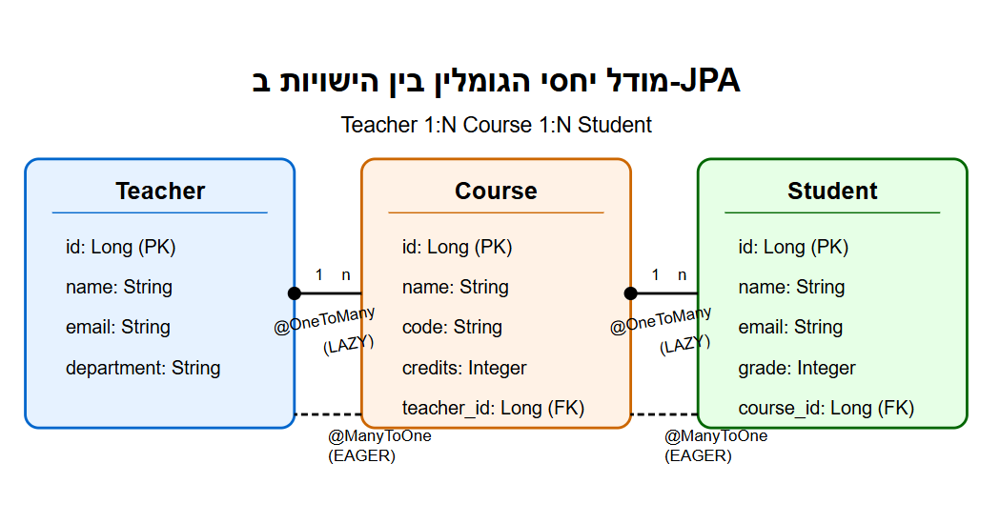

<div dir="rtl">

# הטעינה העצלה (Lazy Loading) ובעיית ה-DTO ב-JPA


## בעיית N+1 שאילתות ואיך ה-DTO קשור אליה

אחת הבעיות הנפוצות בעת עבודה עם JPA היא בעיית N+1 שאילתות, שבה נוצרות שאילתות נוספות בעת גישה ליחסים מסוג LAZY. כאשר משתמשים ב-DTOs (Data Transfer Objects), קיימת דינמיקה מעניינת: ה-DTO מאלץ טעינה של כל הנתונים שהוא מכיל, משום שהוא חייב לגשת אליהם בזמן ההמרה.

## דוגמה מפורטת - מערכת ניהול בית ספר

## שרטוט יחסי גומלין בין הטבלאות





### 1. הגדרת הישויות (Entities)

</div>


```java
@Entity
public class Teacher {
    @Id
    @GeneratedValue(strategy = GenerationType.IDENTITY)
    private Long id;
    
    private String name;
    private String email;
    private String department;
    
    @OneToMany(mappedBy = "teacher", fetch = FetchType.LAZY) // One-to-Many relationship with lazy loading
    private List<Course> courses;
    
    // getters and setters
}

@Entity
public class Course {
    @Id
    @GeneratedValue(strategy = GenerationType.IDENTITY)
    private Long id;
    
    private String name;
    private String code;
    private Integer credits;
    
    @ManyToOne // Many-to-One relationship with teacher - default is EAGER
    private Teacher teacher;
    
    @OneToMany(mappedBy = "course", fetch = FetchType.LAZY) // One-to-Many relationship with lazy loading
    private List<Student> students;
    
    // getters and setters
}

@Entity
public class Student {
    @Id
    @GeneratedValue(strategy = GenerationType.IDENTITY)
    private Long id;
    
    private String name;
    private String email;
    private Integer grade;
    
    @ManyToOne // Many-to-One relationship with course - default is EAGER
    private Course course;
    
    // getters and setters
}
```

<div dir="rtl">

### 2. הגדרת ה-DTOs

</div>

```java
// Basic Teacher DTO - without courses
public class TeacherBasicDTO {
    private Long id;
    private String name;
    private String department;
    
    // constructor, getters, setters
}

// Full Teacher DTO - including courses and related data
public class TeacherFullDTO {
    private Long id;
    private String name;
    private String email;
    private String department;
    private List<CourseDTO> courses; // Contains list of courses that will force data loading
    
    // constructor, getters, setters
}

// Course DTO - includes student data
public class CourseDTO {
    private Long id;
    private String name;
    private String code;
    private Integer credits;
    private List<StudentDTO> students; // Contains list of students that will force data loading
    
    // constructor, getters, setters
}

// Student DTO - simple representation
public class StudentDTO {
    private Long id;
    private String name;
    private Integer grade;
    
    // constructor, getters, setters
}
```

<div dir="rtl">

### 3. המרה מישות ל-DTO - הדגמת ה"אילוץ"

</div>

```java
@Service
public class TeacherService {
    
    @Autowired
    private TeacherRepository teacherRepository;
    
    // Method that returns basic DTO - no need to load courses
    public TeacherBasicDTO getBasicTeacherInfo(Long teacherId) {
        Teacher teacher = teacherRepository.findById(teacherId).orElseThrow();
        
        // Simple conversion - not accessing courses at all
        return new TeacherBasicDTO(
            teacher.getId(),
            teacher.getName(),
            teacher.getDepartment()
        );
        // Courses were not loaded because we didn't access them
    }
    
    // Method that returns full DTO - forces loading of courses and students
    @Transactional // Transaction needed because we access LAZY relationships
    public TeacherFullDTO getFullTeacherInfo(Long teacherId) {
        Teacher teacher = teacherRepository.findById(teacherId).orElseThrow();
        
        // Converting to full DTO - includes courses and students
        List<CourseDTO> courseDTOs = new ArrayList<>();
        
        // ⚠️ Constraint happens here! 
        // Accessing getCourses() triggers SQL query to load the courses
        for (Course course : teacher.getCourses()) {
            
            List<StudentDTO> studentDTOs = new ArrayList<>();
            
            // ⚠️ Additional constraint! 
            // Accessing getStudents() triggers additional SQL query for each course
            for (Student student : course.getStudents()) {
                // Converting each student to DTO
                studentDTOs.add(new StudentDTO(
                    student.getId(),
                    student.getName(),
                    student.getGrade()
                ));
            }
            
            // Converting each course to DTO
            courseDTOs.add(new CourseDTO(
                course.getId(),
                course.getName(),
                course.getCode(),
                course.getCredits(),
                studentDTOs
            ));
        }
        
        // Creating the full Teacher DTO
        return new TeacherFullDTO(
            teacher.getId(),
            teacher.getName(),
            teacher.getEmail(),
            teacher.getDepartment(),
            courseDTOs
        );
    }
    
    // Optimized version - using custom query to prevent N+1
    @Transactional
    public TeacherFullDTO getOptimizedTeacherInfo(Long teacherId) {
        // Using custom query that loads everything at once
        Teacher teacher = teacherRepository.findTeacherWithCoursesAndStudents(teacherId);
        
        // Same conversion code as above, but now everything is already loaded
        // No additional queries will be executed when iterating through courses and students
        // ...
    }
}

@Repository
public interface TeacherRepository extends JpaRepository<Teacher, Long> {
    
    // Custom query that loads all related data in a single query
    @Query("SELECT DISTINCT t FROM Teacher t " +
           "LEFT JOIN FETCH t.courses c " +
           "LEFT JOIN FETCH c.students s " +
           "WHERE t.id = :id")
    Teacher findTeacherWithCoursesAndStudents(@Param("id") Long id);
}
```

<div dir="rtl">

### 4. מה קורה בבסיס הנתונים במהלך הקריאות?

#### בקריאה לשיטה `getBasicTeacherInfo`:

</div>

```sql
-- Single query only
SELECT * FROM teacher WHERE id = 1;
```

<div dir="rtl">

#### בקריאה לשיטה `getFullTeacherInfo`:

</div>

```sql
-- First query to get the teacher
SELECT * FROM teacher WHERE id = 1;

-- Second query to get teacher's courses (when accessing getCourses())
SELECT * FROM course WHERE teacher_id = 1;

-- Additional query for students in the first course (when accessing getStudents())
SELECT * FROM student WHERE course_id = 101;

-- Additional query for students in the second course
SELECT * FROM student WHERE course_id = 102;

-- And so on for each course...
```

<div dir="rtl">

#### בקריאה לשיטה `getOptimizedTeacherInfo`:

</div>

```sql
-- One complex query that fetches everything
SELECT DISTINCT t.*, c.*, s.*
FROM teacher t
        LEFT JOIN course c ON t.id = c.teacher_id
        LEFT JOIN student s ON c.id = s.course_id
WHERE t.id = 1;
```

<div dir="rtl">

## סיכום התהליך ומשמעות ה"אילוץ"

1. **DTO בסיסי** (`TeacherBasicDTO`):
   - לא מאלץ טעינת נתונים נוספים
   - דורש רק שאילתא אחת

2. **DTO מלא** (`TeacherFullDTO`):
   - מאלץ טעינת כל הנתונים המקושרים
   - בגישה נאיבית יגרום ל-N+1 שאילתות
   - הסיבה לאילוץ: **אנחנו חייבים לגשת פיזית לכל הנתונים כדי להכניס אותם ל-DTO**

3. **הפתרון האופטימלי**:
   - שימוש ב-DTO עם הנתונים שבאמת נדרשים
   - שאילתות מותאמות שטוענות את כל הנתונים בבת אחת

## למה DTO "מאלץ" טעינת נתונים?

ה-DTO עצמו הוא רק מבנה נתונים רגיל (POJO), ואין לו "ידע" על JPA או מסד הנתונים. האילוץ מתרחש בגלל שבזמן יצירת ה-DTO:

1. אנחנו חייבים **לגשת פיזית** לכל שדה שנרצה להכניס ל-DTO
2. הגישה לשדות מסוג LAZY מפעילה את מנגנון הטעינה העצלה
3. ברגע שהמידע הועבר ל-DTO, הוא מנותק ממסד הנתונים ולא יכול לבצע עוד שאילתות

לכן, פתרונות כמו Join Fetch או EntityGraph חיוניים כאשר רוצים להחזיר DTO עשיר בנתונים, כדי לבצע את כל הטעינה ביעילות בשאילתא אחת או במספר מינימלי של שאילתות.

</div>