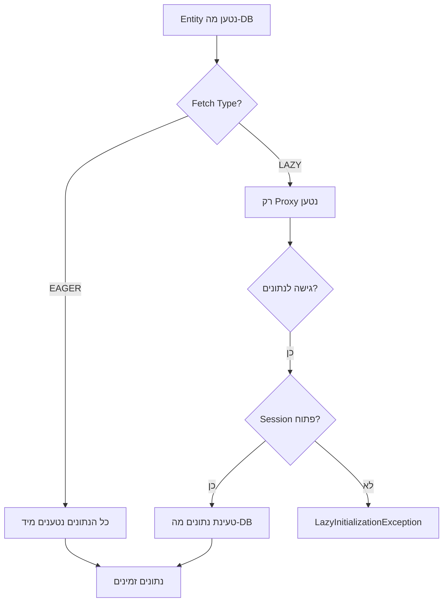
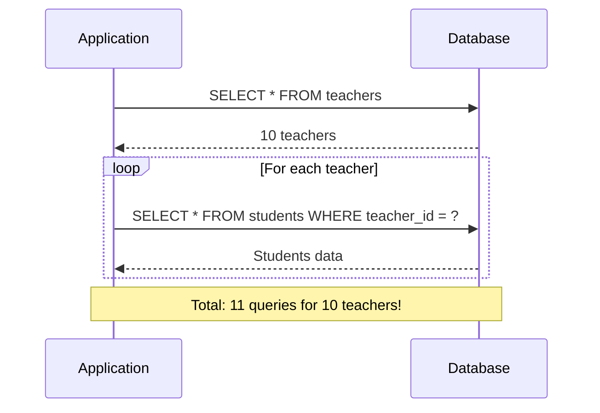
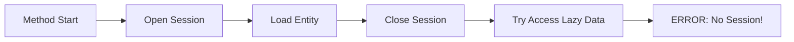
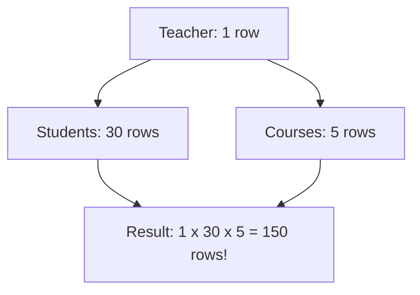
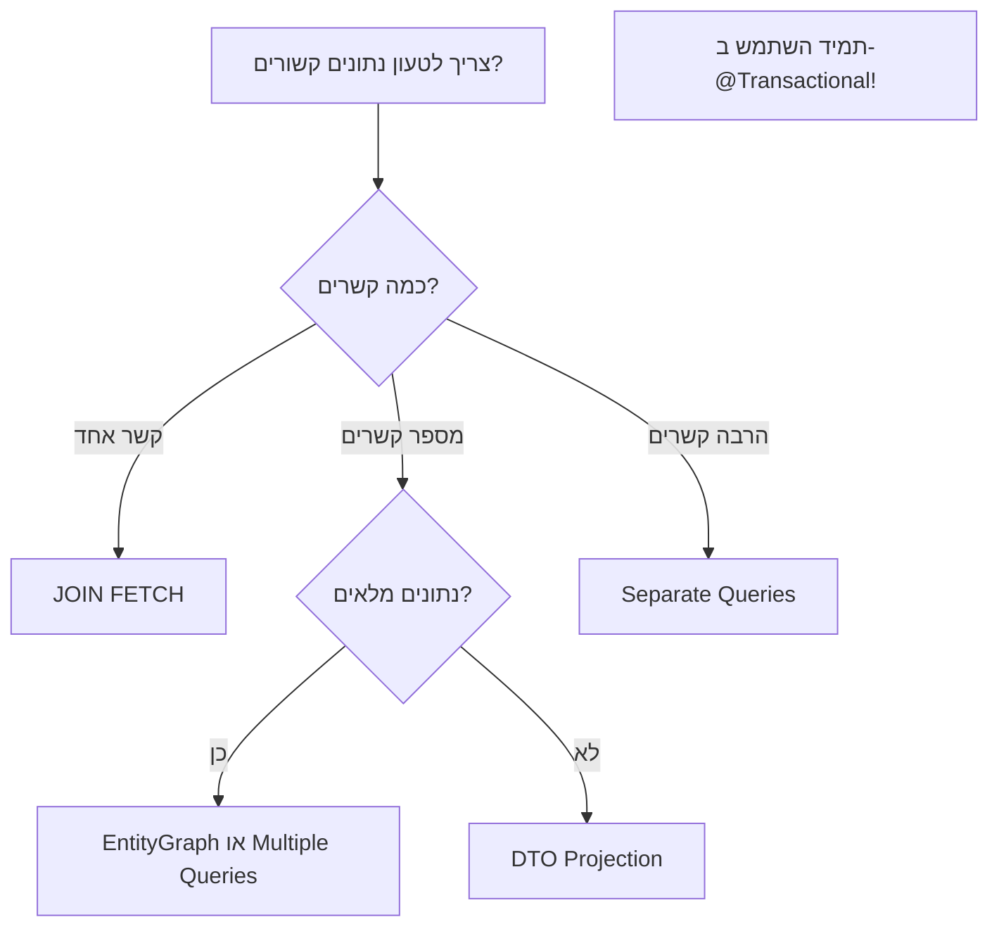

<div dir="rtl">

# הקשר בין Transactional, Lazy/Eager Loading ובעיית N+1

## תוכן עניינים
1. מושגי יסוד
2. בעיית N+1 - מה זה ולמה זה קורה
3. הקשר בין Lazy Loading ל-@Transactional
4. למה לא משתמשים תמיד ב-EntityGraph
5. פתרונות מעשיים

## 1. מושגי יסוד

### Lazy Loading
טעינה עצלה - נתונים קשורים נטענים רק כשניגשים אליהם בפועל.

### Eager Loading
טעינה מיידית - נתונים קשורים נטענים יחד עם הישות הראשית.

### @Transactional
מנהל את מחזור החיים של ה-Session מול מסד הנתונים.

</div>



<div dir="rtl">

## 2. בעיית N+1 - מה זה ולמה זה קורה

### הגדרה
בעיית N+1 מתרחשת כאשר טוענים רשימה של N ישויות, ולכל ישות יש קשר שדורש שאילתה נוספת.
סה"כ: 1 שאילתה ראשונית + N שאילתות נוספות = N+1 שאילתות.

### דוגמה קלאסית

</div>

```java
// Entity definitions
@Entity
public class Teacher {
    @Id
    private Long id;
    private String name;
    
    @OneToMany(fetch = FetchType.LAZY)
    private List<Student> students;
}

// The problem scenario
List<Teacher> teachers = teacherRepository.findAll(); // Query 1
for (Teacher teacher : teachers) {
    // Each iteration triggers a new query!
    System.out.println(teacher.getStudents().size()); // Query 2, 3, 4...N+1
}
```

<div dir="rtl">

### מה קורה בפועל ב-SQL

</div>

```sql
-- Query 1: Get all teachers
SELECT * FROM teachers;

-- Query 2: Get students for teacher 1
SELECT * FROM students WHERE teacher_id = 1;

-- Query 3: Get students for teacher 2  
SELECT * FROM students WHERE teacher_id = 2;

-- Query N+1: Get students for teacher N
SELECT * FROM students WHERE teacher_id = N;
```



<div dir="rtl">

## 3. הקשר בין Lazy Loading ל-@Transactional

### הבעיה: Session Lifecycle

</div>



<div dir="rtl">

### הפתרון: @Transactional

</div>

```mermaid
graph LR
    A[@Transactional Start] --> B[Open Session]
    B --> C[Load Entity]
    C --> D[Access Lazy Data]
    D --> E[Load from DB]
    E --> F[Return Data]
    F --> G[Close Session]
    G --> H[@Transactional End]
    
%%    style A fill:#9f6,stroke:#333,stroke-width:2px
%%    style H fill:#9f6,stroke:#333,stroke-width:2px
```

<div dir="rtl">

### קוד להמחשה

</div>

```java
// Without @Transactional - FAILS
public TeacherDto getTeacherDetails(Long id) {
    Teacher teacher = teacherRepository.findById(id);
    // Session closed here!
    
    TeacherDto dto = new TeacherDto();
    dto.setStudentCount(teacher.getStudents().size()); // LazyInitializationException!
    return dto;
}

// With @Transactional - WORKS
@Transactional
public TeacherDto getTeacherDetails(Long id) {
    Teacher teacher = teacherRepository.findById(id);
    // Session still open
    
    TeacherDto dto = new TeacherDto();
    dto.setStudentCount(teacher.getStudents().size()); // Works fine
    return dto;
    // Session closes here
}
```

<div dir="rtl">

## 4. למה לא משתמשים תמיד ב-EntityGraph

### מה זה EntityGraph
EntityGraph מאפשר להגדיר אילו קשרים לטעון בשאילתה אחת, ובכך למנוע N+1.

</div>

```java
@EntityGraph(attributePaths = {"students", "courses"})
@Query("SELECT t FROM Teacher t WHERE t.department = :dept")
List<Teacher> findByDepartmentWithGraph(@Param("dept") String dept);
```

<div dir="rtl">

### הסיבות שלא תמיד משתמשים בו

#### 1. בעיית Cartesian Product

</div>



<div dir="rtl">

#### 2. מורכבות וגמישות

</div>

```java
// EntityGraph - Static definition
@EntityGraph(attributePaths = {"students", "courses"})

// What if we need different combinations?
// Sometimes only students?
// Sometimes only courses?
// Sometimes both?
// Sometimes with conditions?
```

<div dir="rtl">

#### 3. ביצועים לא תמיד אופטימליים

</div>

```sql
-- EntityGraph might generate:
SELECT t.*, s.*, c.*
FROM teachers t
LEFT JOIN students s ON t.id = s.teacher_id
LEFT JOIN courses c ON t.id = c.teacher_id
WHERE t.id = 1
-- Result: Huge dataset with duplications

-- Sometimes separate queries are better:
SELECT * FROM teachers WHERE id = 1;
SELECT * FROM students WHERE teacher_id = 1;
SELECT * FROM courses WHERE teacher_id = 1;
-- Result: Clean, separate datasets
```

<div dir="rtl">

## 5. פתרונות מעשיים

### פתרון 1: JOIN FETCH

</div>

```java
@Query("SELECT DISTINCT t FROM Teacher t " +
       "LEFT JOIN FETCH t.students " +
       "WHERE t.id = :id")
Teacher findTeacherWithStudents(@Param("id") Long id);
```

<div dir="rtl">

### פתרון 2: DTO Projections

</div>

```java
@Query("SELECT new com.example.TeacherSummaryDto(" +
       "t.id, t.name, SIZE(t.students)) " +
       "FROM Teacher t WHERE t.department = :dept")
List<TeacherSummaryDto> findTeacherSummaries(@Param("dept") String dept);
```

<div dir="rtl">

### פתרון 3: Batch Size

</div>

```java
@Entity
public class Teacher {
    @OneToMany
    @BatchSize(size = 10) // Load students in batches of 10
    private List<Student> students;
}
```

<div dir="rtl">

### אסטרטגיית בחירה

</div>



<div dir="rtl">

## סיכום

1. **Lazy Loading** חוסך משאבים אבל דורש Session פתוח
2. **@Transactional** שומר על Session פתוח למשך כל המתודה
3. **בעיית N+1** נגרמת מטעינת קשרים בלולאה
4. **EntityGraph** לא תמיד הפתרון האופטימלי בגלל:
    - Cartesian Product
    - חוסר גמישות
    - ביצועים משתנים
5. **הפתרון הטוב** תלוי בסיטואציה הספציפית

### כלל אצבע
- נתונים בסיסיים: Lazy Loading + @Transactional
- נתון בודד עם קשרים: JOIN FETCH
- רשימות גדולות: DTO Projections
- מערכות מורכבות: שילוב של פתרונות

</div>