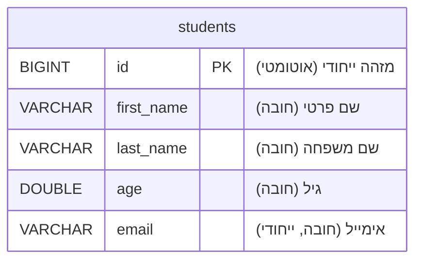
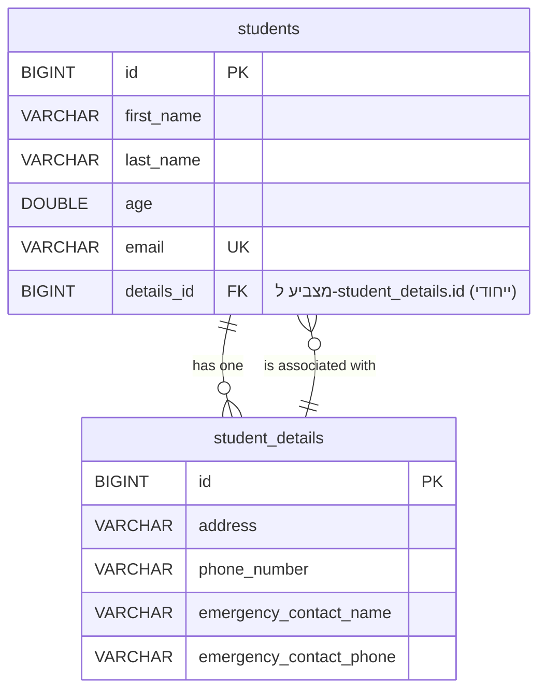
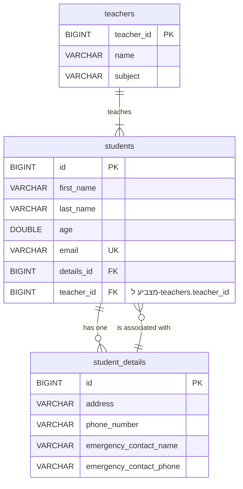
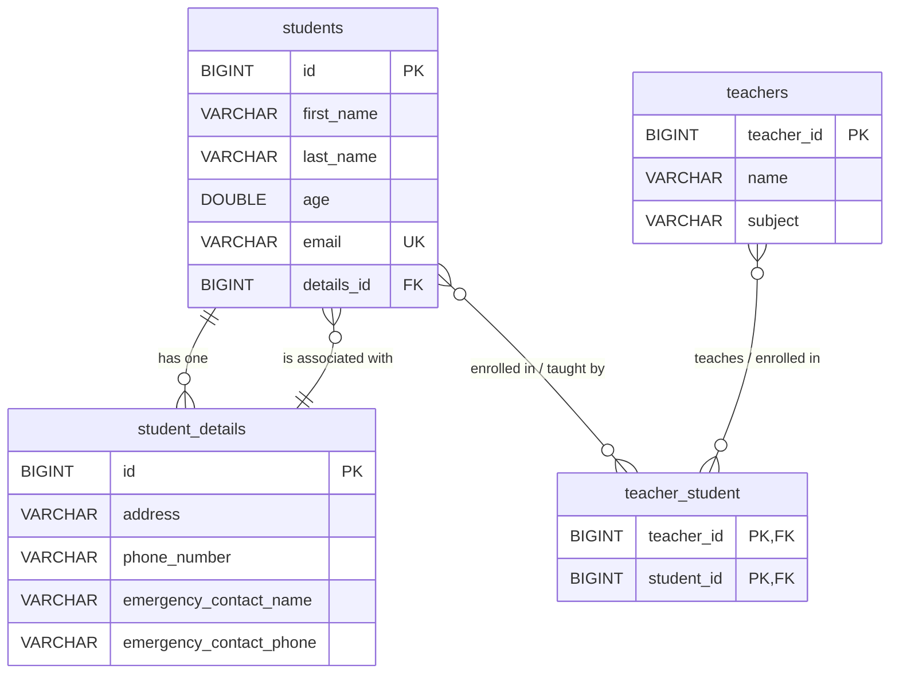

# התפתחות מודל בסיס הנתונים והקשרים בפרויקט (Stages 1-4)

## מבוא

הפרויקט מדגים התפתחות הדרגתית של מודל נתונים בבסיס נתונים יחסי (ככל הנראה MySQL, לפי קבצי ה-`application.properties`),
תוך שימוש ב-JPA למיפוי אובייקטים לטבלאות וניהול קשרים. הסיכום יתמקד בשינויים המבניים בבסיס הנתונים ובאופן מימוש הקשרים
בכל שלב. ההנחה היא שבכל שלב, `spring.jpa.hibernate.ddl-auto` מוגדר ל-`update`, מה שמאפשר ל-Hibernate לעדכן את סכמת בסיס
הנתונים בהתאם לשינויים בישויות.

---

## Stage1: ישות בודדת - סטודנטים

### מבנה בסיס הנתונים:

בשלב זה, בסיס הנתונים יכיל טבלה אחת עיקרית:

* **`students`**:
    * `id` (BIGINT, Primary Key, Auto Increment): מזהה ייחודי לכל סטודנט.
    * `first_name` (VARCHAR(50), Not Null): שם פרטי של הסטודנט.
    * `last_name` (VARCHAR(50), Not Null): שם משפחה של הסטודנט.
    * `age` (DOUBLE, Not Null): גיל הסטודנט.
    * `email` (VARCHAR(100), Not Null, Unique): כתובת אימייל ייחודית לכל סטודנט.

### קשרים ותרשים ERD:

* אין קשרים בין-טבלאיים בשלב זה.

### קשרים:

* אין קשרים בין-טבלאיים בשלב זה, מכיוון שיש רק ישות אחת.

### נקודות מפתח מבחינת בסיס הנתונים:

* **יצירת טבלה ראשונה:** Hibernate ייצור את טבלת `students` על סמך האנוטציות בישות `Student`.
* **אילוצים:** אילוץ `NOT NULL` על השדות הנדרשים ואילוץ `UNIQUE` על עמודת ה-`email` נאכפים ברמת בסיס הנתונים.
* **מפתח ראשי:** עמודת `id` משמשת כמפתח ראשי עם יצירת ערכים אוטומטית.

---

## Stage2: הוספת פרטי סטודנט - קשר One-to-One

### מבנה בסיס הנתונים:

בשלב זה, נוספת טבלה חדשה וישנו קשר בין הטבלאות:

* **`students`** (טבלה קיימת, עם שינוי אפשרי):
    * ... (כל העמודות מ-Stage1)
    * `details_id` (BIGINT, Foreign Key, Unique): מפתח זר המצביע על הרשומה המתאימה בטבלת `student_details`. אילוץ
      `UNIQUE` על עמודה זו מבטיח את יחס ה-One-to-One מצד בסיס הנתונים.

* **`student_details`** (טבלה חדשה):
    * `id` (BIGINT, Primary Key, Auto Increment): מזהה ייחודי לפרטי הסטודנט.
    * `address` (VARCHAR(255)): כתובת הסטודנט.
    * `phone_number` (VARCHAR(20)): מספר טלפון.
    * `emergency_contact_name` (VARCHAR(100)): שם איש קשר לשעת חירום.
    * `emergency_contact_phone` (VARCHAR(20)): טלפון איש קשר לשעת חירום.
    * ייתכן שנוספה עמודת `student_id` (עם אילוץ `UNIQUE`) בטבלת `student_details` אם הישות `StudentDetails` הייתה מוגדרת
      כבעלים של הקשר, אך לפי הקוד שסופק (`@JoinColumn` בישות `Student`), ה-Foreign Key נמצא בטבלת `students`. ההערה בקוד
      `StudentDetails` על `uniqueConstraints = @UniqueConstraint(columnNames = {"student_id"})` מרמזת על אכיפת ייחודיות
      מצד הישות `StudentDetails` אם הייתה שם עמודת `student_id` המצביעה חזרה. בפועל, ה-`@JoinColumn` בישות `Student` הוא
      זה שמגדיר את העמודה בטבלת `students`.

### קשרים:

* **`students` ↔ `student_details` (One-to-One):**
    * **בעלים של הקשר:** הישות `Student` (ולכן טבלת `students`) מחזיקה את המפתח הזר (`details_id`).
    * **אכיפת יחס 1:1:** מובטחת על ידי אילוץ `UNIQUE` על עמודת המפתח הזר (`details_id`) בטבלת `students`.
    * **`orphanRemoval=true`:** אם סטודנט נמחק או שהקשר שלו לפרטים מנותק (למשל, `student.setDetails(null)`), הרשומה
      המתאימה ב-`student_details` תימחק אוטומטית, מה שמונע רשומות "יתומות".
    * **`CascadeType.ALL`:** פעולות שמירה, עדכון ומחיקה על ישות `Student` ישפיעו גם על ישות `StudentDetails` המקושרת.

### נקודות מפתח מבחינת בסיס הנתונים:

* **יצירת טבלה שנייה:** Hibernate יוצר את טבלת `student_details`.
* **הוספת עמודת מפתח זר:** עמודת `details_id` נוספת לטבלת `students`.
* **אילוצי מפתח זר וייחודיות:** מוגדרים כדי לאכוף את הקשר והייחודיות של יחס ה-One-to-One.

---

## Stage3: הוספת מורים - קשר One-to-Many

### מבנה בסיס הנתונים:

בשלב זה, נוספת טבלת מורים והקשר בין סטודנטים למורים הוא של "אחד-לרבים":

* **`students`** (טבלה קיימת, עם שינוי):
    * ... (כל העמודות מ-Stage2, פרט אולי לשינוי ב-`details_id` אם המיפוי השתנה)
    * `teacher_id` (BIGINT, Foreign Key): מפתח זר המצביע על הרשומה המתאימה בטבלת `teachers`. עמודה זו נוספת כדי לייצג את
      הקשר שבו סטודント משויך למורה אחד.

* **`student_details`** (טבלה קיימת):
    * ללא שינוי מהותי במבנה שלה בהקשר זה.

* **`teachers`** (טבלה חדשה):
    * `teacher_id` (BIGINT, Primary Key, Auto Increment): מזהה ייחודי למורה.
    * `name` (VARCHAR(50), Not Null): שם המורה.
    * `subject` (VARCHAR(50), Not Null): המקצוע שהמורה מלמד.

### קשרים:

* **`students` ↔ `student_details` (One-to-One):** נשאר כפי שהיה ב-Stage2.

* **`teachers` → `students` (One-to-Many):**
    * **בעלים של הקשר (במימוש ManyToOne):** הישות `Student` היא הבעלים של הקשר מצד ה-"רבים" (Many) ומחזיקה את המפתח הזר
      `teacher_id` בטבלת `students`.
    * **מיפוי בצד ה-"אחד" (Teacher):** הישות `Teacher` משתמשת ב-`@OneToMany(mappedBy = "teacher")` כדי לציין שהקשר מנוהל
      על ידי השדה `teacher` בישות `Student`. אין עמודה נוספת בטבלת `teachers` עבור קשר זה.

### נקודות מפתח מבחינת בסיס הנתונים:

* **יצירת טבלת מורים:** Hibernate יוצר את טבלת `teachers`.
* **הוספת עמודת מפתח זר לסטודנטים:** עמודת `teacher_id` נוספת לטבלת `students` כדי לקשר כל סטודנט למורה שלו.
* **מימוש קשר אחד-לרבים:** באמצעות מפתח זר בטבלת ה"רבים" (`students`) המצביע לטבלת ה"אחד" (`teachers`).

---

## Stage4: קשרי מורים-סטודנטים גמישים - קשר Many-to-Many

### מבנה בסיס הנתונים:

השינוי המשמעותי ביותר הוא במודל הקשר בין סטודנטים למורים, המצריך טבלת קישור:

* **`students`** (טבלה קיימת, עם שינוי):
    * ... (עמודות `id`, `first_name`, `last_name`, `age`, `email`, `details_id` נשארות).
    * **הסרת `teacher_id`:** עמודת המפתח הזר `teacher_id` מוסרת מטבלת `students`, מכיוון שסטודנט יכול להיות מקושר למספר
      מורים.

* **`student_details`** (טבלה קיימת):
    * ללא שינוי מהותי במבנה שלה.

* **`teachers`** (טבלה קיימת):
    * ללא שינוי מהותי במבנה שלה (עמודות `teacher_id`, `name`, `subject`).

* **`teacher_student`** (טבלת חיבור חדשה - Join Table):
    * `teacher_id` (BIGINT, Primary Key, Foreign Key to `teachers`): מזהה המורה.
    * `student_id` (BIGINT, Primary Key, Foreign Key to `students`): מזהה הסטודנט.
    * השילוב של `teacher_id` ו-`student_id` מהווה את המפתח הראשי של טבלת החיבור, מה שמבטיח שכל זוג (מורה, סטודנט) הוא
      ייחודי.

### קשרים:

* **`students` ↔ `student_details` (One-to-One):** נשאר כפי שהיה בשלבים קודמים.

* **`teachers` ↔ `students` (Many-to-Many):**
    * **טבלת חיבור:** הקשר ממומש באמצעות טבלת החיבור `teacher_student`.
    * **בעלים של הקשר:** על פי הקוד (`@JoinTable` בישות `Teacher`), הישות `Teacher` היא הבעלים של הקשר. היא מגדירה את
      מבנה טבלת החיבור.
    * **מיפוי בצד ההפוך (Student):** הישות `Student` משתמשת ב-`@ManyToMany(mappedBy = "students")` כדי לציין שהקשר מנוהל
      על ידי השדה `students` בישות `Teacher`.

### נקודות מפתח מבחינת בסיס הנתונים:

* **יצירת טבלת חיבור:** Hibernate יוצר את טבלת `teacher_student` עם מפתחות זרים לשתי הטבלאות (`teachers` ו-`students`).
* **מפתחות ראשיים מורכבים בטבלת החיבור:** זוג העמודות `(teacher_id, student_id)` משמש כמפתח ראשי.
* **הסרת עמודת מפתח זר:** עמודת `teacher_id` הוסרה מטבלת `students`.
* **מימוש קשר רבים-לרבים:** מתאפשר על ידי כך שכל רשומה בטבלת החיבור מייצגת קשר בין מורה ספציפי לסטודנט ספציפי.

---

## סיכום כולל מנקודת מבט של בסיס הנתונים:

הפרויקט מדגים בצורה טובה את ההתפתחות ההדרגתית של סכמת בסיס נתונים ואת האופן שבו JPA (דרך Hibernate) מנהל את יצירת
הטבלאות, העמודות, המפתחות הזרים ואילוצי הייחודיות בהתאם להגדרות הישויות והקשרים ביניהן בקוד ה-Java.

1. **התחלה פשוטה (Stage1):** טבלה בודדת ללא קשרים חיצוניים.
2. **הוספת קשר אחד-לאחד (Stage2):** הוספת טבלה שנייה ומפתח זר (עם אילוץ UNIQUE) בטבלה הראשונה כדי לקשר ביניהן, תוך
   ניהול "יתומים".
3. **הוספת קשר אחד-לרבים (Stage3):** הוספת טבלה שלישית ומפתח זר בטבלת ה"רבים" המצביע לטבלת ה"אחד".
4. **מעבר לקשר רבים-לרבים (Stage4):** הסרת המפתח הזר מהשלב הקודם ויצירת טבלת חיבור ייעודית עם מפתחות זרים לשתי הטבלאות
   המקוריות, המאפשרת קשרים מרובים לכל כיוון.

בכל שלב, Hibernate מתרגם את האנוטציות של JPA לפקודות DDL (Data Definition Language) שיוצרות או מעדכנות את מבנה בסיס
הנתונים.

