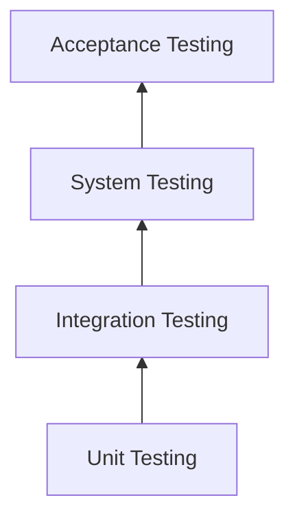
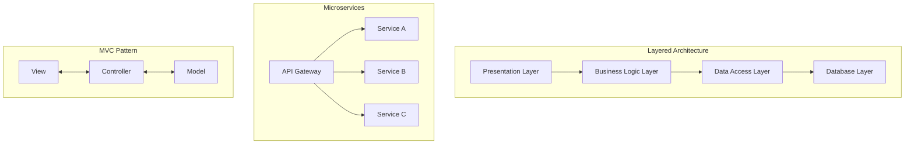
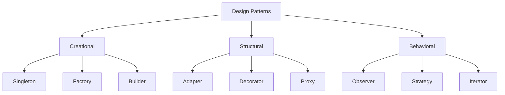
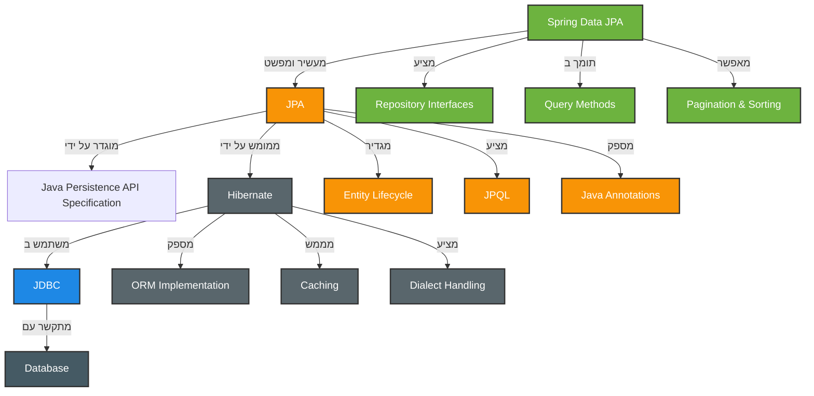
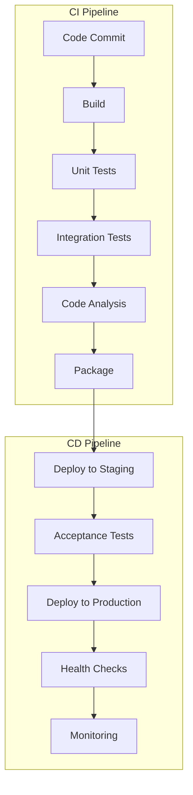
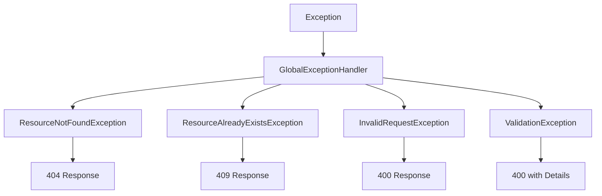
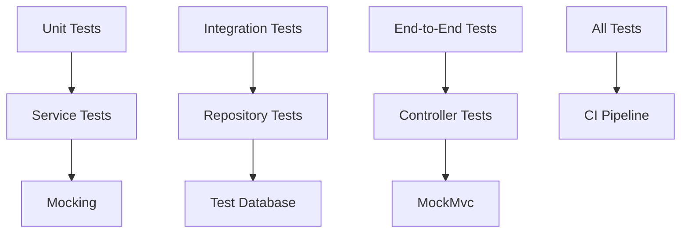
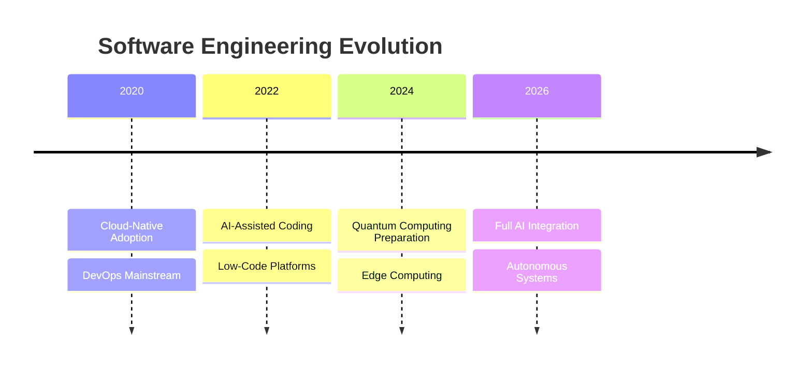

# מדריך מאוחד - הנדסת תוכנה ו-Spring Boot

<div dir="rtl">

## תוכן עניינים

1. [מבוא להנדסת תוכנה](#מבוא-להנדסת-תוכנה)
2. [עקרונות יסוד](#עקרונות-יסוד)
3. [מחזור חיי פיתוח תוכנה (SDLC)](#מחזור-חיי-פיתוח-תוכנה-sdlc)
4. [ארכיטקטורת תוכנה](#ארכיטקטורת-תוכנה)
5. [עקרונות SOLID](#עקרונות-solid)
6. [Design Patterns](#design-patterns)
7. [Spring Boot ו-JPA](#spring-boot-ו-jpa)
8. [יחסי גומלין ב-JPA](#יחסי-גומלין-ב-jpa)
9. [אופטימיזציה וביצועים](#אופטימיזציה-וביצועים)
10. [CI/CD ו-DevOps](#cicd-ו-devops)
11. [טיפול בשגיאות](#טיפול-בשגיאות)
12. [מגמות עתידיות](#מגמות-עתידיות)
13. [SWOT לבחירת טכנולוגיות ואלגוריתמים](#swot-לבחירת-טכנולוגיות-ואלגוריתמים)

---

## מבוא להנדסת תוכנה

הנדסת תוכנה היא תחום רב-תחומי המשלב בין מדעי המחשב, ניהול פרויקטים, ועקרונות הנדסיים. המטרה המרכזית היא יצירת תוכנה איכותית, אמינה וברת-תחזוקה תוך עמידה באילוצי זמן ותקציב.

### הגדרה פורמלית
הנדסת תוכנה היא היישום השיטתי, הממושמע והניתן לכימות של גישות לפיתוח, תפעול ותחזוקה של תוכנה.

## עקרונות יסוד

### עקרונות מנחים
1. **מודולריות** - חלוקה ליחידות עצמאיות
2. **הפשטה** - הסתרת פרטי מימוש
3. **אנקפסולציה** - הגנה על נתונים פנימיים
4. **שימוש חוזר** - כתיבת קוד גנרי
5. **תחזוקתיות** - קוד קריא ומתועד

### שלוש רמות אנקפסולציה

#### רמה 1: עטיפה (Wrapping)
- איחוד נתונים ופונקציות במבנה אחד
- יצירת יחידה לוגית מאורגנת
- קיבוץ המידע והפעולות הקשורות

#### רמה 2: הגנה על נתונים (Information Hiding)
- בקרת גישה לנתונים פנימיים
- רמות נראות:
    - `private` - נגיש רק בתוך המחלקה
    - `protected` - נגיש למחלקות יורשות
    - `public` - נגיש לכולם
- מניעת שינוי ישיר בנתונים הפנימיים

#### רמה 3: עקרון Open-Close
- פתוח להרחבה - ניתן להוסיף פונקציונליות חדשה
- סגור לשינוי - לא משנים את הקוד הקיים
- הגשמה דרך ירושה, פולימורפיזם וממשקים

### הקשרים בין העקרונות

#### מודולריות ← → אנקפסולציה
- **מודולריות** יוצרת יחידות עצמאיות
- **אנקפסולציה** מגינה על כל יחידה מבפנים
- תוצאה: רכיבים בטוחים ועצמאיים

#### הפשטה ← → אנקפסולציה
- **הפשטה** מציגה ממשק פשוט לחוץ
- **אנקפסולציה** מסתירה את המורכבות מבפנים
- תוצאה: "קופסה שחורה" נוחה לשימוש

#### אנקפסולציה → שימוש חוזר
- רכיב מוגן = רכיב **יציב** וניתן להעברה
- ממשק ברור = קל להשתמש במקומות שונים
- תוצאה: פחות קוד כפול

#### שימוש חוזר → תחזוקתיות
- פחות קוד כפול = פחות מקומות לתקן באגים
- רכיבים גנריים = שינוי במקום אחד משפיע על הכל
- תוצאה: תחזוקה יעילה יותר

#### הכל ← → תחזוקתיות
- **מודולריות**: קל לאתר בעיות
- **הפשטה**: קל להבין מה קורה
- **אנקפסולציה**: בטוח לשנות מימוש פנימי
- **שימוש חוזר**: פחות קוד לתחזק

#### התוצאה הסופית
תוכנה **עמידה, גמישה וקלה לפיתוח** - כל עקרון מחזק את השאר ויוצרים מערכת אקולוגית של הנדסת תוכנה איכותית!

**המטרה**: יצירת רכיבי תוכנה יציבים, גמישים וקלים לתחזוקה

## מחזור חיי פיתוח תוכנה (SDLC)

```mermaid
graph TD
    A[Requirements Analysis] --> B[System Design]
    B --> C[Implementation]
    C --> D[Testing]
    D --> E[Deployment]
    E --> F[Maintenance]
    F --> A
    
    style A fill:#222,stroke:#333,stroke-width:2px
    style B fill:#222,stroke:#333,stroke-width:2px
    style C fill:#222,stroke:#333,stroke-width:2px
    style D fill:#222,stroke:#333,stroke-width:2px
    style E fill:#333,stroke:#333,stroke-width:2px
    style F fill:#232,stroke:#333,stroke-width:2px
```



### שלבי פיתוח מפורטים

#### 1. ניתוח דרישות (Requirements Analysis)
- איסוף דרישות מהלקוח
- הגדרת דרישות פונקציונליות ולא-פונקציונליות
- יצירת מסמך SRS (Software Requirements Specification)
- אישור דרישות עם בעלי העניין

##### שיטות איסוף דרישות
- ראיונות עם משתמשים ובעלי עניין
- סקרים ושאלונים לקהל רחב
- סדנאות עבודה קבוצתיות
- צפייה ומחקר שדה

##### ניתוחי סביבה
- **SWOT Analysis**: Strengths, Weaknesses, Opportunities, Threats
- **PEST Analysis**: Political, Economic, Social, Technological
- ניתוח מתחרים ומשתמשים

##### סוגי דרישות
- פונקציונליות - מה המערכת צריכה לעשות
- ביצועים - זמני תגובה, נפח משתמשים
- אבטחה - הגנות ובקרות גישה
- ממשק משתמש - חוויית שימוש

#### 2. תכנון מערכת (System Design)
- ארכיטקטורת מערכת
- תכנון מסד נתונים
- תכנון ממשקי משתמש
- בחירת טכנולוגיות

##### ארכיטקטורה
- High-Level Design - רכיבים עיקריים וקשרים
- Low-Level Design - פרטי מימוש של כל רכיב
- דיאגרמות UML - מחלקות, רצפים, use cases

##### תכנון טכני
- מסד נתונים - ERD, נורמליזציה, אינדקסים
- ממשקי API - RESTful services, GraphQL
- אבטחה - הצפנה, אימות, הרשאות
- הבלעת עומסים - Load balancing, caching

##### תכנון חווית משתמש
- Wireframes - מבנה דפים בסיסי
- Mockups - עיצוב ויזואלי מפורט
- Prototypes - דוגמאות אינטראקטיביות
- User Flow - מסלולי ניווט

#### 3. מימוש (Implementation)
- כתיבת קוד לפי התכנון
- שימוש בעקרונות תכנות מונחה עצמים
- ניהול גרסאות עם Git
- Code Reviews

##### שיטות פיתוח
- **Agile** - ספרינטים קצרים, שיתוף פעולה
- **Waterfall** - שלבים רציפים לפרויקטים יציבים
- **DevOps** - אינטגרציה בין פיתוח ותפעול

##### תקני קוד
- Coding Standards - מוסכמות כתיבה
- Code Reviews - ביקורת קוד עמיתים
- Pair Programming - תכנות בזוגות
- Version Control - Git, branching strategies

#### 4. בדיקות (Testing)



##### סוגי בדיקות
- **Unit Testing** - בדיקת רכיבים בודדים
- **Integration Testing** - בדיקת קשרים בין רכיבים
- **System Testing** - בדיקת המערכת כולה
- **User Acceptance Testing (UAT)** - אישור משתמשי קצה

##### שיטות בדיקה
- Black Box - בדיקה לפי תוצאות צפויות
- White Box - בדיקה עם הכרת הקוד
- Automated Testing - בדיקות אוטומטיות
- Manual Testing - בדיקות ידניות

#### 5. פריסה (Deployment)

##### אסטרטגיות פריסה
- **Blue-Green Deployment** - שני סביבות זהות
- **Rolling Deployment** - עדכון הדרגתי
- **Canary Deployment** - פריסה לקבוצה קטנה תחילה
- **A/B Testing** - השוואת גרסאות

##### סביבות
- Development - פיתוח וניסויים
- Testing - בדיקות איכות
- Staging - סימולציה של ייצור
- Production - סביבת ייצור אמיתית

#### 6. תחזוקה (Maintenance)

##### סוגי תחזוקה
- **תיקוני** - תיקון באגים ובעיות
- **מסתגלת** - התאמה לשינויים בסביבה
- **שכלולית** - שיפור ביצועים ופונקציונליות
- **מונעת** - מניעת בעיות עתידיות

##### פעילויות תחזוקה
- Monitoring - מעקב אחר ביצועים
- Logging - רישום אירועים לאבחון
- Backup & Recovery - גיבוי ושחזור נתונים
- Updates & Patches - עדכוני אבטחה ותיקונים

## ארכיטקטורת תוכנה

### Software Architecture Patterns



## עקרונות SOLID

### S - Single Responsibility Principle
כל מחלקה צריכה להיות אחראית על דבר אחד בלבד

</div>

```java
// UserController - responsible only for HTTP handling
@RestController
@RequestMapping("/api/users")
public class UserController {
    // Only handles HTTP requests/responses
    // Does not contain business logic
}

// UserService - responsible only for business logic
public interface UserService {
    UserDto createUser(UserDto userDto);
    UserDto updateUser(Long id, UserDto userDto);
    // Only business logic, no HTTP or DB concerns
}

// UserRepository - responsible only for data access
@Repository
public interface UserRepository extends JpaRepository<User, Long> {
    // Only DB queries
}
```

<div dir="rtl">

### O - Open/Closed Principle
פתוח להרחבה, סגור לשינוי

</div>

```java
// JpaRepository allows extension without modifying existing code
public interface UserRepository extends JpaRepository<User, Long> {
    // Can add new queries without changing JpaRepository
    Optional<User> findByUsername(String username);
    List<User> findByActive(boolean active);
    
    // Custom queries - extension without modification
    @Query("SELECT u FROM User u WHERE LOWER(u.username) LIKE %:name%")
    List<User> searchByName(@Param("name") String name);
}
```

<div dir="rtl">

### L - Liskov Substitution Principle
תת-מחלקות חייבות להיות תחליף הולם למחלקת-על

</div>

```java
// UserController uses interface, not implementation
public class UserController {
    private final UserService userService; // interface
    
    @Autowired
    public UserController(UserService userService) {
        // Can replace UserServiceImpl with another implementation
        this.userService = userService;
    }
}
```

<div dir="rtl">

### I - Interface Segregation Principle
ממשקים ספציפיים עדיפים על ממשק כללי אחד

</div>

```java
// Instead of one giant interface, there's separation into focused interfaces:

// UserService - only user operations
public interface UserService {
    List<UserDto> getAllUsers();
    UserDto createUser(UserDto userDto);
    UserDto assignRoleToUser(Long userId, Long roleId);
}

// RoleService - only role operations
public interface RoleService {
    List<RoleBasicDto> getAllRoles();
    RoleDto createRole(RoleDto roleDto);
    boolean hasUsers(Long roleId);
}
```

<div dir="rtl">

### D - Dependency Inversion Principle
תלות בהפשטות, לא במימושים קונקרטיים

</div>

```java
// UserServiceImpl depends on interfaces, not implementations
@Service
public class UserServiceImpl implements UserService {
    // Dependencies on interfaces
    private final UserRepository userRepository;
    private final RoleRepository roleRepository;
    private final UserMapper userMapper;
    
    @Autowired
    public UserServiceImpl(UserRepository userRepository,  // interface
                          RoleRepository roleRepository,   // interface
                          UserMapper userMapper) {         // concrete but @Component
        this.userRepository = userRepository;
        this.roleRepository = roleRepository;
        this.userMapper = userMapper;
    }
}
```

<div dir="rtl">

## Design Patterns



### Design Patterns בקוד

#### DTO Pattern
הפרדה בין Domain Objects לבין Transfer Objects:

</div>

```java
// Entity - database representation
@Entity
public class User {
    private String password; // sensitive
    private Set<Role> roles; // complex relationships
}

// DTO - communication representation
public class UserDto {
    // No password
    private Set<Long> roleIds; // Only IDs
}
```

<div dir="rtl">

#### Repository Pattern
הפשטה של גישה לנתונים:

</div>

```java
@Repository
public interface UserRepository extends JpaRepository<User, Long> {
    Optional<User> findByUsername(String username);
    
    @Query("SELECT u FROM User u WHERE u.active = :active")
    List<User> findByActive(@Param("active") boolean active);
}
```

<div dir="rtl">

#### Builder Pattern

</div>

```java
@Builder
public class UserDto {
    // Enables clean object creation
    UserDto user = UserDto.builder()
        .username("john")
        .email("john@example.com")
        .active(true)
        .build();
}
```

<div dir="rtl">

## Spring Boot ו-JPA

### מהו ORM?

ORM (Object-Relational Mapping) הוא פרדיגמת תכנות המאפשרת המרה בין מערכות שונות של ייצוג נתונים - בעיקר בין מודלים אובייקטיביים בשפת התכנות (כמו Java) למודל טבלאי של בסיס נתונים יחסי.

### יתרונות ORM:

1. **הפשטה מעל דיאלקטים שונים של SQL**
2. **אבטחה מובנית** - הגנה אוטומטית מפני SQL Injection
3. **ניהול מטמון (Caching)**
4. **ניהול קשרים (Relationships)**
5. **ניהול סכמה וגרסאות**
6. **ולידציה ברמת האובייקט**
7. **ניהול טרנזקציות**
8. **טעינה עצלה לעומת להוטה**

### היררכיית הטכנולוגיות



### Spring Data JPA - השכבה העליונה

**Spring Data JPA** היא הרמה הגבוהה ביותר - ספריית Spring שמפשטת עוד יותר את העבודה עם JPA:

#### 1. Repository Interfaces

</div>

```java
// Instead of writing SQL or JPQL code, just define interface
public interface UserRepository extends JpaRepository<User, Long> {
    // Spring Data JPA creates implementation automatically!
    Optional<User> findByUsername(String username);
    List<User> findByActiveTrue();
}
```

<div dir="rtl">

#### 2. Query Methods

</div>

```java
// Query methods - method names become queries
List<User> findByEmailContaining(String email);
List<User> findByAgeBetween(int min, int max);
List<User> findTop10ByOrderByCreatedAtDesc();

// Or custom queries
@Query("SELECT u FROM User u WHERE u.roles.size > :count")
List<User> findUsersWithManyRoles(@Param("count") int count);
```

<div dir="rtl">

#### 3. Pagination & Sorting

</div>

```java
// Built-in support for pagination and sorting
Page<User> findByActive(boolean active, Pageable pageable);

// Usage:
PageRequest pageRequest = PageRequest.of(0, 20, Sort.by("username"));
Page<User> users = userRepository.findByActive(true, pageRequest);
```

<div dir="rtl">

### קונפיגורציה של Spring Boot

</div>

```properties
# MySQL Configuration
spring.datasource.url=jdbc:mysql://localhost:3306/school_db?useSSL=false&serverTimezone=UTC
spring.datasource.username=school_user
spring.datasource.password=school_password
spring.datasource.driver-class-name=com.mysql.cj.jdbc.Driver

# JPA Configuration
spring.jpa.hibernate.ddl-auto=update
spring.jpa.show-sql=true
spring.jpa.properties.hibernate.format_sql=true
spring.jpa.properties.hibernate.dialect=org.hibernate.dialect.MySQL8Dialect

# Connection Pool Configuration
spring.datasource.hikari.connection-timeout=20000
spring.datasource.hikari.maximum-pool-size=5
```

<div dir="rtl">

## יחסי גומלין ב-JPA

### יחסי One-to-One

יחסי One-to-One מתקיימים כאשר לכל ישות מצד אחד של היחס יש בדיוק ישות אחת מהצד השני.

#### דו-כיווני (Bidirectional)

</div>

```java
@Entity
public class Teacher {
    @Id
    @GeneratedValue(strategy = GenerationType.IDENTITY)
    private Long id;
    
    private String name;
    private String department;
    
    @OneToOne
    @JoinColumn(name = "details_id")
    private TeacherDetails details;
}

@Entity
public class TeacherDetails {
    @Id
    @GeneratedValue(strategy = GenerationType.IDENTITY)
    private Long id;
    
    private String email;
    private String phone;
    
    @OneToOne(mappedBy = "details")
    private Teacher teacher;
}
```

<div dir="rtl">

### יחסי One-to-Many

יחסים אלה מתקיימים כאשר ישות אחת קשורה למספר ישויות מהצד השני.

#### דו-כיווני

</div>

```java
@Entity
public class Teacher {
    @Id
    @GeneratedValue(strategy = GenerationType.IDENTITY)
    private Long id;
    
    private String name;
    
    @OneToMany(mappedBy = "teacher", cascade = CascadeType.ALL)
    private List<Course> courses = new ArrayList<>();
    
    // Helper methods for managing relationships
    public void addCourse(Course course) {
        courses.add(course);
        course.setTeacher(this);
    }
}

@Entity
public class Course {
    @Id
    @GeneratedValue(strategy = GenerationType.IDENTITY)
    private Long id;
    
    private String title;
    private String code;
    
    @ManyToOne
    @JoinColumn(name = "teacher_id")
    private Teacher teacher;
}
```

<div dir="rtl">

### יחסי Many-to-Many

יחסי Many-to-Many מתקיימים כאשר ישויות מצד אחד יכולות להיות קשורות למספר ישויות מהצד השני, ולהיפך.

#### דו-כיווני

</div>

```java
@Entity
public class Student {
    @Id
    @GeneratedValue(strategy = GenerationType.IDENTITY)
    private Long id;
    
    private String firstName;
    private String lastName;
    
    @ManyToMany
    @JoinTable(
        name = "student_course",
        joinColumns = @JoinColumn(name = "student_id"),
        inverseJoinColumns = @JoinColumn(name = "course_id")
    )
    private Set<Course> courses = new HashSet<>();
    
    // Helper methods
    public void enrollInCourse(Course course) {
        courses.add(course);
        course.getStudents().add(this);
    }
}

@Entity
public class Course {
    @Id
    @GeneratedValue(strategy = GenerationType.IDENTITY)
    private Long id;
    
    private String title;
    
    @ManyToMany(mappedBy = "courses")
    private Set<Student> students = new HashSet<>();
}
```

<div dir="rtl">

#### Many-to-Many עם ישות קשר

</div>

```java
@Entity
public class Enrollment {
    @Id
    @GeneratedValue(strategy = GenerationType.IDENTITY)
    private Long id;
    
    @ManyToOne
    @JoinColumn(name = "student_id")
    private Student student;
    
    @ManyToOne
    @JoinColumn(name = "course_id")
    private Course course;
    
    private LocalDate enrollmentDate;
    private Double grade;
    
    @Enumerated(EnumType.STRING)
    private EnrollmentStatus status;
}
```

<div dir="rtl">

## אופטימיזציה וביצועים

### בעיית N+1

בעיית N+1 היא בעיית ביצועים נפוצה בתחום מיפוי אובייקטים בבסיסי נתונים (ORM). הבעיה מתרחשת כאשר אפליקציה מבצעת שאילתת בסיס נתונים אחת כדי לאחזר רשימה של N פריטים, ואז מבצעת שאילתה נוספת עבור כל פריט.

#### פתרונות לבעיית N+1

##### 1. שימוש ב-JOIN FETCH

</div>

```java
@Repository
public interface TeacherRepository extends JpaRepository<Teacher, Long> {
    @Query("SELECT t FROM Teacher t LEFT JOIN FETCH t.students")
    List<Teacher> findAllWithStudents();
    
    @Query("SELECT t FROM Teacher t LEFT JOIN FETCH t.students s LEFT JOIN FETCH s.details")
    List<Teacher> findAllWithStudentsAndDetails();
}
```

<div dir="rtl">

##### 2. שימוש ב-EntityGraph

</div>

```java
@Repository
public interface TeacherRepository extends JpaRepository<Teacher, Long> {
    @EntityGraph(attributePaths = {"students", "students.details"})
    List<Teacher> findAll();
}
```

<div dir="rtl">

##### 3. שימוש ב-Batch Fetching

</div>

```java
@Entity
public class Teacher {
    @OneToMany(mappedBy = "teacher")
    @BatchSize(size = 30) // Load 30 students at once
    private List<Student> students;
}
```

<div dir="rtl">

### Lazy לעומת Eager Loading

JPA מציע שני מצבי טעינה עבור יחסים בין ישויות:

#### ברירות המחדל של JPA:
- `@ManyToOne, @OneToOne`: `FetchType.EAGER` (טעינה להוטה)
- `@OneToMany, @ManyToMany`: `FetchType.LAZY` (טעינה עצלה)

</div>

```java
@Entity
public class Student {
    @ManyToOne(fetch = FetchType.LAZY)
    @JoinColumn(name = "teacher_id")
    private Teacher teacher;
    
    @OneToOne(fetch = FetchType.LAZY)
    @JoinColumn(name = "details_id")
    private StudentDetails details;
}
```

<div dir="rtl">

## ניהול עסקאות ב-JPA

### עקרונות ACID

עסקאות בבסיסי נתונים נדרשות לעמוד בארבע תכונות בסיסיות:

1. **אטומיות (Atomicity)** - עסקה מתבצעת במלואה או לא מתבצעת כלל
2. **עקביות (Consistency)** - עסקה מעבירה את בסיס הנתונים ממצב תקין למצב תקין
3. **בידוד (Isolation)** - עסקאות מבודדות זו מזו
4. **עמידות (Durability)** - תוצאות העסקה נשמרות לתמיד

### שימוש ב-@Transactional

</div>

```java
@Service
public class UserService {
    @Transactional(
        propagation = Propagation.REQUIRED,
        isolation = Isolation.READ_COMMITTED,
        timeout = 30,
        readOnly = false,
        rollbackFor = {ResourceNotFoundException.class}
    )
    public UserDto createUser(UserDto userDto) {
        // All operations within a single transaction
        // If something fails - everything rolls back
        return userRepository.save(user);
    }
}
```

<div dir="rtl">

## CI/CD ו-DevOps

### מהו CI/CD?

CI/CD הוא תהליך אוטומטי המאפשר לצוותי פיתוח לשחרר קוד באופן מהיר ואמין:
- **CI (Continuous Integration)** - אינטגרציה רציפה של קוד
- **CD (Continuous Delivery/Deployment)** - אספקה/פריסה רציפה

### Pipeline Stages



### GitHub Actions Example

</div>

```yaml
name: CI/CD Pipeline

on:
  push:
    branches: [ main, develop ]
  pull_request:
    branches: [ main ]

jobs:
  test:
    runs-on: ubuntu-latest
    
    steps:
    - uses: actions/checkout@v3
    
    - name: Set up JDK 17
      uses: actions/setup-java@v3
      with:
        java-version: '17'
        
    - name: Run tests
      run: ./mvnw test
      
    - name: Generate coverage report
      run: ./mvnw jacoco:report
      
  build:
    needs: test
    runs-on: ubuntu-latest
    
    steps:
    - uses: actions/checkout@v3
    
    - name: Build application
      run: ./mvnw clean package
      
    - name: Build Docker image
      run: docker build -t myapp:${{ github.sha }} .
```

<div dir="rtl">

### Dockerfile לאפליקציית Spring Boot

</div>

```dockerfile
# Multi-stage build
FROM maven:3.8-openjdk-17 AS builder
WORKDIR /app
COPY pom.xml .
RUN mvn dependency:go-offline
COPY src ./src
RUN mvn clean package -DskipTests

# Runtime stage
FROM openjdk:17-jdk-slim
WORKDIR /app
COPY --from=builder /app/target/*.jar app.jar
EXPOSE 8080
HEALTHCHECK --interval=30s --timeout=3s --start-period=40s \
  CMD curl -f http://localhost:8080/actuator/health || exit 1
ENTRYPOINT ["java", "-jar", "app.jar"]
```

<div dir="rtl">

## טיפול בשגיאות

### Exception Handling Pattern



### GlobalExceptionHandler

</div>

```java
@RestControllerAdvice
public class GlobalExceptionHandler {
    @ExceptionHandler(ResourceNotFoundException.class)
    public ResponseEntity<StandardResponse> handleNotFound(
            ResourceNotFoundException ex) {
        return ResponseEntity
            .status(HttpStatus.NOT_FOUND)
            .body(new StandardResponse("error", null, error));
    }
}
```

<div dir="rtl">

### תגובה אחידה (Consistent Response)

</div>

```java
public class StandardResponse {
    private String status;  // success/error
    private Object data;    // התוצאה
    private Object error;   // פרטי שגיאה
    private LocalDateTime timestamp;
}
```

<div dir="rtl">

### תיקוף נתונים (Validation)

</div>

```java
public class UserDto {
    @NotBlank(message = "Username is required")
    @Size(min = 3, max = 30)
    private String username;
    
    @Email(message = "Email should be valid")
    private String email;
    
    @Pattern(regexp = "^\\+?(972|0)([23459]\\d{7}|5\\d{8})$")
    private String phoneNumber;
}
```

<div dir="rtl">

## עקרונות Clean Code

### שמות ברורים ומשמעותיים

</div>

```java
// Instead of: getUsersByRId(Long r)
public List<UserDto> getUsersByRoleId(Long roleId)

// Instead of: check(Long id)
public boolean hasUsers(Long roleId)
```

<div dir="rtl">

### מתודות קטנות וממוקדות

</div>

```java
@Transactional
public UserDto assignRoleToUser(Long userId, Long roleId) {
    User user = findUserOrThrow(userId);
    Role role = findRoleOrThrow(roleId);
    validateRoleNotAssigned(user, role);
    user.addRole(role);
    return userMapper.toDto(userRepository.save(user));
}
```

<div dir="rtl">

### Defensive Programming

</div>

```java
public void updateEntityFromDto(User user, UserDto userDto) {
    if (userDto == null) {
        return; // Protection against null
    }
    
    if (userDto.getUsername() != null) {
        user.setUsername(userDto.getUsername());
    }
    // Check before every update
}
```

<div dir="rtl">

### Separation of Concerns

</div>

```java
// Controller - only HTTP concerns
@GetMapping("/{id}")
public ResponseEntity<StandardResponse> getUserById(@PathVariable Long id) {
    UserDto user = userService.getUserById(id);
    return ResponseEntity.ok(new StandardResponse("success", user, null));
}

// Service - only business logic
public UserDto getUserById(Long id) {
    User user = userRepository.findById(id)
        .orElseThrow(() -> new ResourceNotFoundException("User not found"));
    return userMapper.toDto(user);
}
```

<div dir="rtl">

### Security Considerations

</div>

```java
// Hide sensitive information in DTO
public UserDto toDto(User user) {
    UserDto userDto = UserDto.builder()
        .id(user.getId())
        .username(user.getUsername())
        .email(user.getEmail())
        // No password! - Information security
        .build();
    return userDto;
}
```

<div dir="rtl">

## Testing Strategy



### דוגמה לבדיקת יחידה

</div>

```java
@Test
void testCreateUser_Success() {
    // Given
    UserDto inputDto = createValidUserDto();
    User savedUser = createUser();
    when(userRepository.save(any())).thenReturn(savedUser);
    
    // When
    UserDto result = userService.createUser(inputDto);
    
    // Then
    assertNotNull(result);
    assertEquals(inputDto.getUsername(), result.getUsername());
    verify(userRepository).save(any());
}
```

<div dir="rtl">

## Domain vs Application

### Domain (דומיין/תחום)
**Domain** מתייחס ל**תחום העסקי** או **הבעיה העסקית** שהתוכנה באה לפתור:

- **Entities של הדומיין**: User, Role, UserDetails
- **כללים עסקיים**: משתמש חייב email ייחודי, תפקיד לא ניתן למחיקה אם יש משתמשים

### Application (אפליקציה)
**Application** היא **המימוש הטכני** שפותר את בעיות הדומיין:

- קוד (Controllers, Services, Repositories)
- טכנולוגיות (Spring Boot, JPA, REST API)
- תשתיות (Database, Servers)

### Domain-Driven Design (DDD)

</div>

```java
// Domain Layer - pure business logic
@Entity
public class User {
    // Domain rules
    public void assignRole(Role role) {
        if (roles.contains(role)) {
            throw new BusinessException("Role already assigned");
        }
        roles.add(role);
    }
}

// Application Layer - coordination between layers
@Service
public class UserService {
    // Application logic - uses domain entities
    public UserDto assignRoleToUser(Long userId, Long roleId) {
        User user = repository.findById(userId);
        Role role = roleRepository.findById(roleId);
        user.assignRole(role); // Domain logic
        return mapper.toDto(repository.save(user));
    }
}
```

<div dir="rtl">

## SWOT לבחירת טכנולוגיות ואלגוריתמים

### מתי להשתמש ב-SWOT טכנולוגי
- בחירת Framework חדש
- בחירת מסד נתונים
- בחירת אלגוריתם לבעיה ספציפית
- החלטה על ארכיטקטורה
- בחירת Cloud Provider

### דוגמה: React vs Angular

#### React
**חוזקות:**
- Learning curve נמוך
- קהילה ענקית
- גמישות גבוהה
- Virtual DOM מהיר

**חולשות:**
- רק view layer
- צריך libraries נוספים
- החלטות רבות מדי
- JSX syntax מוזר

**הזדמנויות:**
- Next.js אקוסיסטם
- React Native לנייד
- ביקוש גבוה בשוק

**איומים:**
- שינויים תכופים
- פרגמנטציה בספריות
- תלות ב-Meta

#### Angular
**חוזקות:**
- Framework מלא
- TypeScript built-in
- Enterprise ready
- יציב ואמין

**חולשות:**
- Learning curve תלול
- Bundle size גדול
- קשיח יותר
- קהילה קטנה יותר

### אלגוריתמי מיון - השוואה

#### Quick Sort
**חוזקות:**
- מהיר בממוצע O(n log n)
- In-place sorting
- קל למימוש

**חולשות:**
- Worst case O(n²)
- לא יציב (unstable)
- Recursive - stack overflow

**הזדמנויות:**
- אופטימיזציות hybrid
- פרלליזציה

**איומים:**
- נתונים ממוינים = worst case
- רגיש לבחירת pivot

#### Merge Sort
**חוזקות:**
- יציב O(n log n) תמיד
- Stable sorting
- מתאים לנתונים גדולים

**חולשות:**
- דורש זיכרון נוסף
- יותר איטי בפועל
- מורכב יותר

### Microservices vs Monolith

#### Microservices
**חוזקות:**
- סקיילביליות עצמאית
- טכנולוגיות שונות
- פיתוח מקבילי
- Fault isolation

**חולשות:**
- מורכבות רשת
- Distributed debugging
- Data consistency
- Latency בין שירותים

**הזדמנויות:**
- DevOps ו-containers
- Cloud native
- אוטונומיה של צוותים

**איומים:**
- Over-engineering
- Network failures
- Monitoring complexity

### PostgreSQL vs MongoDB

#### PostgreSQL
**חוזקות:**
- ACID compliance
- Complex queries
- Mature ecosystem
- אמינות גבוהה

**חולשות:**
- JSON performance
- Horizontal scaling
- Learning curve
- Schema rigidity

#### MongoDB
**חוזקות:**
- Schema flexibility
- Scale out בקלות
- JSON native
- Development speed

**חולשות:**
- Memory consumption
- Complex transactions
- פחות mature
- Data duplication

### Cloud Providers

#### AWS
**חוזקות:**
- שירותים הכי רחבים
- מנהיג שוק
- Documentation מעולה

**חולשות:**
- מחירים גבוהים
- Vendor lock-in
- UI מסובכת

#### Azure
**חוזקות:**
- אינטגרציה עם Microsoft
- Enterprise focus
- Hybrid cloud

**חולשות:**
- פחות בוגר
- Performance issues
- שירותים פחות יציבים

### איך להשתמש ב-SWOT טכנולוגי

1. **הכן מטריקס לכל אפשרות**
2. **תן משקל לכל קריטריון:**
    - ביצועים: 40%
    - קהילה: 20%
    - עלות: 20%
    - למידה: 20%

3. **חשב ציון מוזן:**
   ```
   ציון = (Strengths - Weaknesses) + (Opportunities - Threats)
   ```

4. **בחר לפי הקונטקסט:**
    - Startup → גמישות ומהירות
    - Enterprise → יציבות ותמיכה
    - High-traffic → ביצועים וסקיילביליות

### מטריקס השוואה טכנולוגיות

| קריטריון | React | Angular | Vue |
|----------|-------|---------|-----|
| קלות למידה | גבוהה | נמוכה | גבוהה |
| ביצועים | טוב | טוב מאוד | טוב |
| קהילה | ענקית | גדולה | בינונית |
| אקוסיסטם | רחב | מלא | צומח |
| עלות פיתוח | נמוכה | גבוהה | נמוכה |

## מגמות עתידיות



### 1. AI ו-Machine Learning בפיתוח
- כלי פיתוח חכמים
- אוטומציה של משימות
- ניתוח קוד אוטומטי

### 2. Low-Code/No-Code
- פלטפורמות פיתוח ויזואליות
- האצת פיתוח
- דמוקרטיזציה של פיתוח תוכנה

### 3. Cloud-Native Development
- Serverless Architecture
- Containerization
- Microservices

### 4. DevSecOps
- אבטחה כחלק אינטגרלי מהפיתוח
- Shift-Left Testing
- Continuous Security

## סיכום

הנדסת תוכנה היא תחום דינמי ומתפתח המשלב בין טכנולוגיה, מתודולוגיה וניהול. ההצלחה בתחום דורשת:

1. **ידע טכני רחב** - שליטה בשפות תכנות, כלים וטכנולוגיות
2. **חשיבה מערכתית** - יכולת לראות את התמונה הרחבה
3. **כישורים רכים** - תקשורת, עבודת צוות, פתרון בעיות
4. **למידה מתמדת** - התעדכנות בטכנולוגיות ומתודולוגיות חדשות

עקרונות הנדסת התוכנה והבנת מחזור חיי הפיתוח מאפשרים יצירת מערכות איכותיות ובנות קיימא. השימוש ב-SWOT לבחירת טכנולוגיות מבטיח החלטות מבוססות נתונים במקום הרגשות בלבד.

המדריך המאוחד הזה מספק בסיס איתן להבנת עקרונות הנדסת תוכנה ויישומם המעשי ב-Spring Boot ו-JPA, עם דגש על:
- **ארכיטקטורה נקייה** עם הפרדת שכבות ברורה
- **SOLID principles** בכל רמה של המערכת
- **Design patterns** מתאימים לבעיות ספציפיות
- **קוד נקי ותחזוקתי** עם שמות ברורים ומתודות ממוקדות
- **טיפול מקיף בשגיאות** עם תגובות עקביות
- **אבטחה** בהסתרת מידע רגיש
- **תמיכה ב-CI/CD** עם מבנה פרויקט סטנדרטי

**המטרה הסופית:** תוכנה עמידה, גמישה וקלה לפיתוח שעונה על הצרכים העסקיים ומספקת חוויית משתמש מעולה.

התחום ימשיך להתפתח עם אתגרים חדשים והזדמנויות מרגשות, כאשר הדגש על איכות, יעילות וחדשנות נשאר קבוע.

</div>