<div dir="rtl">

# מדריך מקיף - תקשורת רשת, HTTP ו-JSON

## תוכן עניינים

### 1. [מבוא - מה באמת נשלח על הקו ברשת?](#מה-באמת-נשלח-על-הקו-ברשת)
### 2. [זרימת נתונים - דוגמה מעשית](#דוגמה-מהקוד---שליחת-נתונים)
### 3. [מבנה HTTP Request ברמת Bytes](#מבנה-http-request-מלא-ברמת-הbytes)
### 4. [HTTP Requests ו-Responses](#מה-באמת-נשלח-על-הקו)
- 4.1 [דוגמה - יצירת מוצר](#כשהדפדפן-שולח-בקשה-ליצירת-מוצר)
- 4.2 [תשובת השרת](#כשהשרת-מחזיר-תשובה)
### 5. [המרה לBytes - דוגמה מפורטת](#דוגמה-מעשית-שליחת-נתוני-מוצר-ברמת-bytes)
- 5.1 [HTTP Request כBytes](#1-http-request-ב-bytes)
- 5.2 [פירוק הודעה לBytes](#2-המרה-לbytes-utf-8)
### 6. [HTTP Response ברמת Bytes](#http-response-ברמת-הbytes)
### 7. [JSON Serialization](#json-serialization-ברמת-הbytes)
- 7.1 [מאובייקט Java לJSON](#1-java-object)
- 7.2 [המרה לטקסט](#2-jackson-serialization-ל-string)
- 7.3 [המרה לBytes](#3-json-string-כbytes-utf-8)
### 8. [Character Encoding](#character-encoding-ב-http---איך-הצד-המקבל-יודע-מה-הקידוד)
- 8.1 [הבעיה המרכזית](#השאלה-המרכזית)
- 8.2 [פתרון דרך HTTP Headers](#http-headers---המפתח-לפתרון)
- 8.3 [סוגי Encoding](#סוגי-encoding-עיקריים)
- 8.4 [UTF-8, UTF-16, ASCII](#utf-8-הנפוץ-ביותר)
### 9. [Character Encoding דוגמאות](#character-encoding-על-הקו)
- 9.1 [תווי ASCII ועברית](#utf-8-encoding-דוגמאות)
- 9.2 [Spring Boot ו-Encoding](#איך-spring-boot-מגדיר-את-הencoding)
### 10. [בעיות Encoding ופתרונות](#מה-קורה-אם-אין-charset-header)
- 10.1 [ניחוש הדפדפן](#browser-detection---איך-הדפדפן-מנחש)
- 10.2 [BOM (Byte Order Mark)](#bom-byte-order-mark)
- 10.3 [דוגמה - תו עברית](#דוגמה-מעשית---תו-עברית)
### 11. [זרימת תקשורת מלאה](#זרימת-תקשורת-מלאה---רמת-bytes)
### 12. [תהליך ההמרות](#תהליך-ההמרות-במערכת)
- 12.1 [צד הדפדפן (JavaScript)](#בצד-הדפדפן-javascript)
- 12.2 [צד השרת (Spring Boot)](#בצד-השרת-spring-boot)
### 13. [Jackson Framework](#jackson---המנוע-שמבצע-את-הקסם)
### 14. [דוגמה קונקרטית](#דוגמה-קונקרטית-מהקוד)
### 15. [HTTPS והצפנה](#תקשורת-https---הצפנה-ברמת-bytes)
### 16. [דוגמה מלאה - יצירת מוצר](#דוגמה-מלאה-יצירת-מוצר-חדש)
### 17. [פענוח Bytes בדפדפן](#פענוח-bytes-בדפדפן)
### 18. [Network Layer](#network-layer-פירוט)
- 18.1 [TCP/IP Stack](#tcpip-stack)
- 18.2 [HTTP Headers Analysis](#http-headers-analysis)
### 19. [Debugging ובעיות](#מה-קורה-כשיש-שגיאה-ברמת-bytes)
- 19.1 [בעיות Encoding](#תרחיש-בעיה-ב-encoding)
- 19.2 [הגדרות Spring](#איך-להגדיר-encoding-במפורש-ב-spring)
- 19.3 [Browser Detection](#browser-detection---איך-הדפדפן-מנחש)
- 19.4 [Debugging Tools](#debugging-encoding-problems)
### 20. [כלי Debugging](#דוגמאות-network-debugging)
- 20.1 [Browser DevTools](#בדיקה-עם-browser-devtools)
- 20.2 [Wireshark/tcpdump](#בדיקה-עם-wiresharktcpdump)
### 21. [טבלת Encodings](#רשימת-encodings-נפוצים)
### 22. [למה זה עובד ככה?](#למה-זה-עובד-ככה)
- 22.1 [יתרונות JSON](#יתרונות-של-json-כטקסט)
- 22.2 [תהליך ההמרה](#תהליך-ההמרה)
### 23. [Performance](#performance-והשפעה-על-הרשת)
### 24. [שגיאות נפוצות](#שגיאות-נפוצות-והבנה-מוטעית)
### 25. [Best Practices](#best-practices)
### 26. [סיכום](#סיכום---המסע-המלא)

---

## מה באמת נשלח על הקו ברשת?

כשאנחנו שולחים נתונים בין דפדפן לשרת, **הכל נשלח כטקסט** (סדרה של bytes שמייצגים תווים). JSON אינו פורמט בינארי - זה פשוט **מחרוזת טקסט מובנית** שנראית כמו אובייקט JavaScript.

בואו נבין בדיוק מה קורה כשמתקשרים בין דפדפן לשרת - **`הכל הופך ל-bytes`** - סדרה של מספרים בין 0-255 שעוברים דרך החוטים או האוויר.

## דוגמה מהקוד - שליחת נתונים

בואו נראה מה קורה כששולחים נתוני מוצר חדש:

</div>

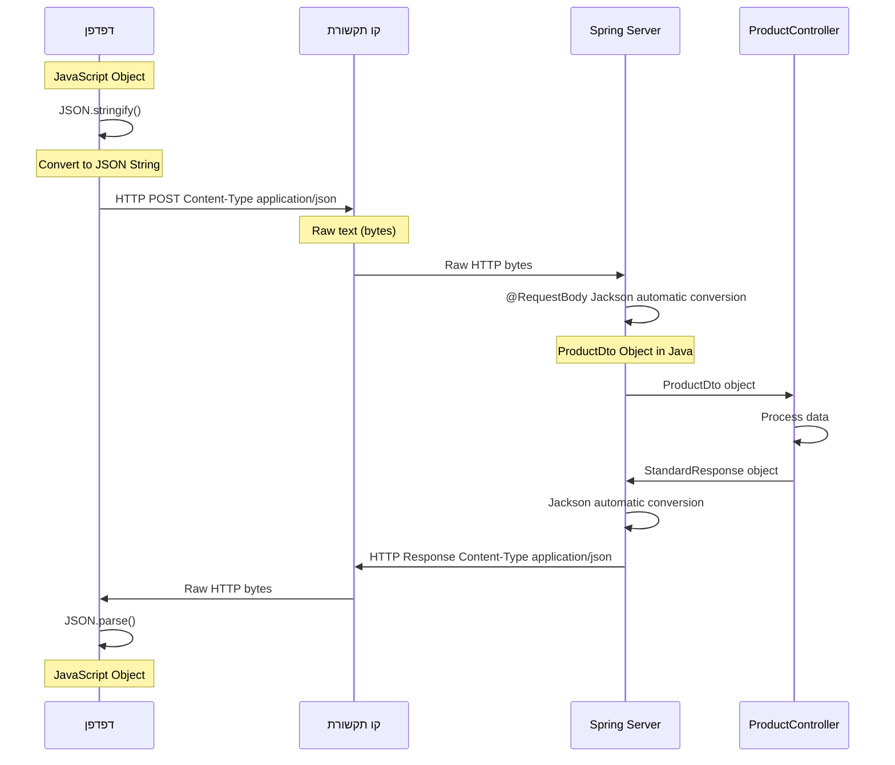

<div dir="rtl">

## מבנה HTTP Request מלא ברמת הBytes

כשמשתמש שולח נתוני מוצר חדש, זה מה שבאמת עובר על הקו:

</div>

```mermaid
graph TD
    A[Browser creates HTTP request] --> B[Convert to UTF-8 bytes]
    B --> C[Add HTTP headers as bytes]
    C --> D[Send byte stream over network]
    
    D --> E[Server receives byte stream]
    E --> F[Parse HTTP headers from bytes]
    F --> G[Decode body using charset]
    G --> H[Process request]
    
    style B fill:#012345
    style D fill:#012345
    style G fill:#012345
```

<div dir="rtl">

## מה באמת נשלח על הקו?

### כשהדפדפן שולח בקשה ליצירת מוצר:

</div>

```http
POST /api/products HTTP/1.1
Host: localhost:8080
Content-Type: application/json
Content-Length: 85

{"name":"מחשב נייד","price":2500.50,"category":"אלקטרוניקה","inStock":true}
```

<div dir="rtl">

**זה מה שבאמת עובר על הקו** - טקסט גולמי! כל תו נשלח כ-byte אחד או יותר (תלוי בקידוד UTF-8).

### כשהשרת מחזיר תשובה:

</div>

```http
HTTP/1.1 201 Created
Content-Type: application/json;charset=UTF-8
Content-Length: 142
Date: Sat, 14 Jun 2025 10:30:00 GMT

{"status":"success","data":{"id":123,"name":"מחשב נייד","price":2500.50,"category":"אלקטרוניקה"},"error":null}
```

<div dir="rtl">

## דוגמה מעשית: שליחת נתוני מוצר ברמת Bytes

כשמשתמש יוצר מוצר חדש, זה מה שבאמת עובר על הקו:

### 1. HTTP Request ב-Bytes:

</div>

```
POST /api/products HTTP/1.1
Host: localhost:8080
Content-Type: application/json
Content-Length: 85
Connection: keep-alive
User-Agent: Mozilla/5.0 (Windows NT 10.0; Win64; x64)

{"name":"laptop","price":2500.50,"category":"electronics","inStock":true}
```

<div dir="rtl">

### 2. המרה לBytes (UTF-8):

</div>

```
Bytes in hexadecimal:
50 4F 53 54 20 2F 61 70 69 2F 70 72 6F 64 75 63  // POST /api/produc
74 73 20 48 54 54 50 2F 31 2E 31 0D 0A           // ts HTTP/1.1\r\n
48 6F 73 74 3A 20 6C 6F 63 61 6C 68 6F 73 74 3A  // Host: localhost:
38 30 38 30 0D 0A                                 // 8080\r\n
43 6F 6E 74 65 6E 74 2D 54 79 70 65 3A 20 61 70  // Content-Type: ap
70 6C 69 63 61 74 69 6F 6E 2F 6A 73 6F 6E 0D 0A  // plication/json\r\n
43 6F 6E 74 65 6E 74 2D 4C 65 6E 67 74 68 3A 20  // Content-Length: 
38 35 0D 0A                                       // 85\r\n
0D 0A                                             // \r\n (empty line)
7B 22 6E 61 6D 65 22 3A 22 6C 61 70 74 6F 70 22  // {"name":"laptop"
2C 22 70 72 69 63 65 22 3A 32 35 30 30 2E 35 30  // ,"price":2500.50
2C 22 63 61 74 65 67 6F 72 79 22 3A 22 65 6C 65  // ,"category":"ele
63 74 72 6F 6E 69 63 73 22 2C 22 69 6E 53 74 6F  // ctronics","inSto
63 6B 22 3A 74 72 75 65 7D                       // ck":true}
```

<div dir="rtl">

## HTTP Response ברמת הBytes

כשהשרת מחזיר תשובה עם נתוני המוצר שנוצר:

### 1. HTTP Response כטקסט:

</div>

```
HTTP/1.1 201 Created
Location: /api/products/123
Content-Type: application/json;charset=UTF-8
Content-Length: 142
Date: Sat, 14 Jun 2025 10:30:00 GMT

{"status":"success","data":{"id":123,"name":"laptop","price":2500.50},"error":null}
```

<div dir="rtl">

### 2. Response כBytes:

</div>

```
Response header as bytes:
48 54 54 50 2F 31 2E 31 20 32 30 31 20 43 72 65  // HTTP/1.1 201 Cre
61 74 65 64 0D 0A                                 // ated\r\n
4C 6F 63 61 74 69 6F 6E 3A 20 2F 61 70 69 2F 70  // Location: /api/p
72 6F 64 75 63 74 73 2F 31 32 33 0D 0A           // roducts/123\r\n
43 6F 6E 74 65 6E 74 2D 54 79 70 65 3A 20 61 70  // Content-Type: ap
70 6C 69 63 61 74 69 6F 6E 2F 6A 73 6F 6E 3B 63  // plication/json;c
68 61 72 73 65 74 3D 55 54 46 2D 38 0D 0A        // harset=UTF-8\r\n
```

<div dir="rtl">

## JSON Serialization ברמת הBytes

כשהשרת מחזיר JSON (למשל רשימת מוצרים):

### 1. Java Object:

</div>

```java
StandardResponse response = new StandardResponse(
    "success", 
    Arrays.asList(
        new Product(1, "laptop", 2500.50),
        new Product(2, "mouse", 45.99)
    ), 
    null
);
```

<div dir="rtl">

### 2. Jackson Serialization ל-String:

</div>

```json
{
  "status": "success",
  "data": [
    {"id": 1, "name": "laptop", "price": 2500.50},
    {"id": 2, "name": "mouse", "price": 45.99}
  ],
  "error": null
}
```

<div dir="rtl">

### 3. JSON String כBytes (UTF-8):

</div>

```
JSON bytes in hexadecimal:
7B 0A 20 20 22 73 74 61 74 75 73 22 3A 20 22 73  // {\n  "status": "s
75 63 63 65 73 73 22 2C 0A 20 20 22 64 61 74 61  // uccess",\n  "data
22 3A 20 5B 0A 20 20 20 20 7B 22 69 64 22 3A 20  // ": [\n    {"id": 
31 2C 20 22 6E 61 6D 65 22 3A 20 22 6C 61 70 74  // 1, "name": "lapt
6F 70 22 2C 20 22 70 72 69 63 65 22 3A 20 32 35  // op", "price": 25
30 30 2E 35 30 7D 2C 0A 20 20 20 20 7B 22 69 64  // 00.50},\n    {"id
22 3A 20 32 2C 20 22 6E 61 6D 65 22 3A 20 22 6D  // ": 2, "name": "m
6F 75 73 65 22 2C 20 22 70 72 69 63 65 22 3A 20  // ouse", "price": 
34 35 2E 39 39 7D 0A 20 20 5D 2C 0A 20 20 22 65  // 45.99}\n  ],\n  "e
72 72 6F 72 22 3A 20 6E 75 6C 6C 0A 7D           // rror": null\n}
```

<div dir="rtl">

## Character Encoding ב-HTTP - איך הצד המקבל יודע מה הקידוד?

### השאלה המרכזית

כשהשרת שולח bytes ברשת, איך הדפדפן יודע אם זה UTF-8, UTF-16, ASCII או קידוד אחר?

**התשובה:** דרך **HTTP Headers** שמציינים את סוג הקידוד!

## HTTP Headers - המפתח לפתרון

</div>

```mermaid
graph TD
    A[Spring Boot Server] --> B[HTTP Response]
    B --> C[Headers]
    B --> D[Body - bytes]
    
    C --> E["Content-Type: application/json<br/>charset=UTF-8"]
    C --> F["Content-Length: 156"]
    C --> G["Other headers..."]
    
    D --> H["Actual JSON bytes<br/>[0x7B, 0x22, 0x73, 0x74...]"]
    
    I[Browser] --> J[Read Headers First]
    J --> K[Parse charset=UTF-8]
    K --> L[Decode bytes using UTF-8]
    L --> M[Get JSON string]
    
    style E fill:#012345
    style K fill:#012345
```

<div dir="rtl">

**שימו לב ל:** `Content-Type: application/json;charset=UTF-8`

זה אומר לדפדפן: "הbytes האלה הם JSON שמקודד ב-UTF-8"

## סוגי Encoding עיקריים

</div>

```mermaid
graph LR
    A[Character Encodings] --> B[ASCII - 7 bit]
    A --> C[UTF-8 - Variable length]
    A --> D[UTF-16 - 16 bit units]
    A --> E[ISO-8859-1 - Latin-1]
    A --> F[Windows-1252]
    
    C --> G[Most common today]
    D --> H[Used in Java internally]
    E --> I[Legacy European]
    
    style C fill:#012345
    style G fill:#012345
```

<div dir="rtl">

### UTF-8 (הנפוץ ביותר):
- **גודל:** 1-4 bytes לכל תו
- **תואם ASCII:** התווים הראשונים זהים ל-ASCII
- **תומך בכל השפות:** אנגלית, עברית, אמוג'י, וכו'
- **ברירת מחדל ב-Spring Boot**

### UTF-16:
- **גודל:** 2-4 bytes לכל תו
- **משתמש ב-Java:** String פנימי ב-Java
- **פחות נפוץ ב-HTTP**

### ASCII:
- **גודל:** 1 byte לכל תו
- **רק אנגלית:** A-Z, 0-9, סימנים בסיסיים
- **מוגבל מאוד**

## Character Encoding על הקו

### UTF-8 Encoding דוגמאות:

</div>

```
ASCII characters (1 byte each):
'a' = 0x61 = 97
'A' = 0x41 = 65
'1' = 0x31 = 49
' ' = 0x20 = 32

Hebrew characters (2-3 bytes each):
```

<div dir="rtl">

`'א' = 0xD7 0x90 = [215, 144]`

`'ב' = 0xD7 0x91 = [215, 145]`

`'ג' = 0xD7 0x92 = [215, 146]`

</div>

```

Special characters:
'\r' = 0x0D = 13 (carriage return)
'\n' = 0x0A = 10 (line feed)
'"' = 0x22 = 34 (double quote)
'{' = 0x7B = 123 (open brace)
'}' = 0x7D = 125 (close brace)
```

<div dir="rtl">

## איך Spring Boot מגדיר את הencoding?

במערכת, Spring Boot אוטומטית מגדיר UTF-8:

</div>

```java
// Spring Boot automatically adds this header:
// Content-Type: application/json;charset=UTF-8

@PostMapping("/api/products")
public ResponseEntity<StandardResponse> createProduct(@Valid @RequestBody ProductDto productDto) {
    // When you return this object...
    Product createdProduct = productService.createProduct(productDto);
    StandardResponse response = new StandardResponse("success", createdProduct, null);
    return ResponseEntity.created(location).body(response);
    
    // Spring adds UTF-8 charset automatically
}
```

<div dir="rtl">

## מה קורה אם אין charset header?

</div>

```mermaid
graph TD
    A[HTTP Response] --> B{charset specified?}
    B -->|Yes| C[Use specified charset]
    B -->|No| D[Browser guesses]
    
    D --> E[Check BOM]
    D --> F[Content analysis]
    D --> G[Default charset]
    
    E --> H{BOM found?}
    H -->|Yes| I[Use BOM charset]
    H -->|No| F
    
    F --> J[Analyze byte patterns]
    J --> K[Statistical guessing]
    
    G --> L[Usually UTF-8 or ISO-8859-1]
    
    style C fill:#012345
    style K fill:#012345
    style L fill:#012345
```

<div dir="rtl">

### BOM (Byte Order Mark):
סימן מיוחד בתחילת הקובץ שמציין encoding:

</div>

```
UTF-8 BOM:    EF BB BF
UTF-16 BE:    FE FF  
UTF-16 LE:    FF FE
UTF-32 BE:    00 00 FE FF
```

<div dir="rtl">

## דוגמה מעשית - תו עברית

בואו נראה מה קורה כשמשתמש שולח נתונים בעברית:

</div>

```java
// User creates product with Hebrew name
ProductDto productDto = new ProductDto();
productDto.setName("מחשב נייד");

// What happens in different encodings:
```

<div dir="rtl">

### אותו תו בencodings שונים:

</div>

```mermaid
graph TD
    A["תו: מ"] --> B[UTF-8]
    A --> C[UTF-16]
    A --> D[ISO-8859-8]
    
    B --> E["Bytes: D7 9E"]
    C --> F["Bytes: 05 DE"]  
    D --> G["Bytes: EE"]
    
    style B fill:#012345
    style E fill:#012345
```

<div dir="rtl">

**אם הדפדפן מנחש לא נכון:** התו יראה כמו שטויות!

## זרימת תקשורת מלאה - רמת Bytes

</div>

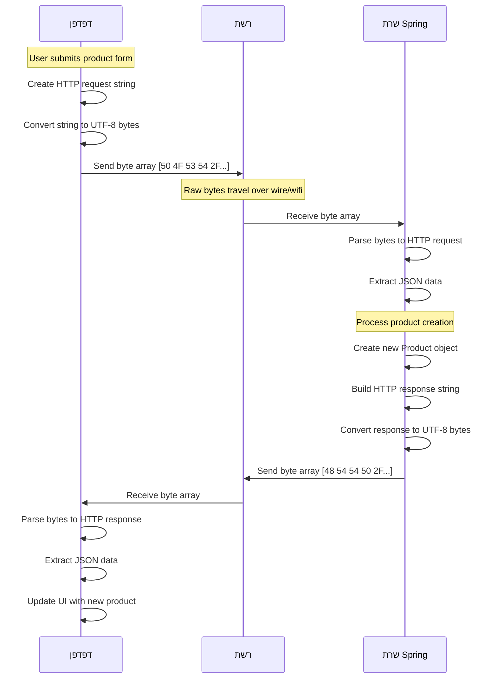

<div dir="rtl">

## HTTP Request ו-Response flow מלא

</div>

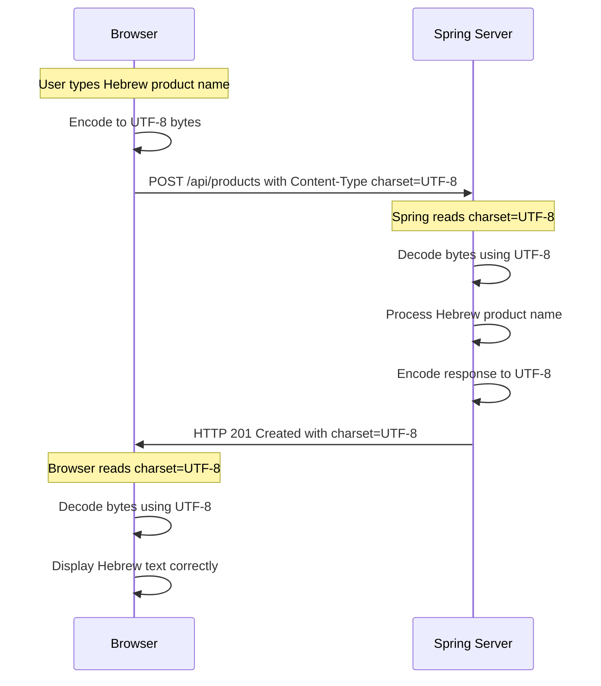

<div dir="rtl">

## מה קורה אם יש אי-התאמה?

### תרחיש 1: שליחה ב-UTF-8, קריאה ב-ISO-8859-1

</div>

```
Original: מחשב נייד
UTF-8 bytes: D7 9E D7 97 D7 A9 D7 91 20 D7 A0 D7 99 D7 99 D7 93
Interpreted as ISO-8859-1: ××××× × ×××
```

<div dir="rtl">

### תרחיש 2: שליחה ב-ISO-8859-8, קריאה ב-UTF-8

</div>

```
Original: מחשב נייד  
ISO-8859-8 bytes: EE E7 F9 E1 20 F0 E9 E9 E3
Interpreted as UTF-8: îçù? ð©©ã (or error)
```

<div dir="rtl">

## תהליך ההמרות במערכת

### בצד הדפדפן (JavaScript):

</div>

```javascript
// 1. JavaScript Object
const productData = {
    name: "מחשב נייד",
    price: 2500.50, 
    category: "אלקטרוניקה",
    inStock: true
};

// 2. Convert to JSON string for sending
const jsonString = JSON.stringify(productData);
// Result: '{"name":"מחשב נייד","price":2500.50,"category":"אלקטרוניקה","inStock":true}'

// 3. Send via HTTP request
fetch('/api/products', {
    method: 'POST',
    headers: {
        'Content-Type': 'application/json'
    },
    body: jsonString  // This is what's sent over the wire!
});

// 4. Receive response and convert back
response.json().then(data => {
    // Browser runs JSON.parse() on the received text
    console.log(data); // Now it's a JavaScript object again
});
```

<div dir="rtl">

### בצד השרת (Spring Boot):

</div>

```java
@PostMapping("/api/products")
public ResponseEntity<StandardResponse> createProduct(@Valid @RequestBody ProductDto productDto) {
    // Spring Jackson already converted the text to ProductDto object
    // productDto is now a complete Java object
    
    Product createdProduct = productService.createProduct(productDto);
    
    StandardResponse response = new StandardResponse("success", createdProduct, null);
    
    // When returning - Spring Jackson automatically converts the object to JSON string
    return ResponseEntity.created(location).body(response);
}
```

<div dir="rtl">

## Jackson - המנוע שמבצע את הקסם

Spring משתמש ב-Jackson library שמטפל בהמרות אוטומטית:

</div>

```mermaid
graph TD
    A["HTTP Request<br/>(טקסט JSON)"] --> B[Jackson ObjectMapper]
    B --> C["Java Object<br/>(ProductDto)"]
    
    D["Java Object<br/>(StandardResponse)"] --> E[Jackson ObjectMapper]
    E --> F["HTTP Response<br/>(טקסט JSON)"]
    
    style B fill:#012345
    style E fill:#012345
```

<div dir="rtl">

## דוגמה קונקרטית מהקוד

כשהדפדפן שולח בקשה ליצירת מוצר חדש:

### 1. מה הדפדפן שולח על הקו:

</div>

```http
POST /api/products HTTP/1.1
Content-Type: application/json

{"name":"מחשב נייד","price":2500.50,"category":"אלקטרוניקה"}
```

<div dir="rtl">

### 2. Spring מקבל וממיר:

</div>

```java
// ProductController.java
@PostMapping("/api/products")
public ResponseEntity<StandardResponse> createProduct(@Valid @RequestBody ProductDto productDto) {
    // productDto.getName() will return "מחשב נייד"
    Product createdProduct = productService.createProduct(productDto);
    // ...
}
```

<div dir="rtl">

### 3. השרת מחזיר על הקו:

</div>

```http
HTTP/1.1 201 Created
Content-Type: application/json

{"status":"success","data":{"id":123,"name":"מחשב נייד","price":2500.50},"error":null}
```

<div dir="rtl">

## תקשורת HTTPS - הצפנה ברמת Bytes

כשהמערכת רצה על HTTPS, כל הbytes מוצפנים:

</div>

```mermaid
graph LR
    A[Original HTTP bytes] --> B[TLS Encryption]
    B --> C[Encrypted bytes on wire]
    C --> D[TLS Decryption]
    D --> E[Original HTTP bytes]

    A --> A1["50 4F 53 54 2F 61 70 69..."]
    C --> C1["8F A2 C4 E1 9B 7D F3 5A..."]
    E --> E1["50 4F 53 54 2F 61 70 69..."]

    style C fill:#012345
```

<div dir="rtl">

## דוגמה מלאה: יצירת מוצר חדש

### 1. Browser POST Request:

</div>

```http
POST /api/products HTTP/1.1
Host: localhost:8080
Content-Type: application/json
Content-Length: 89

{
  "name": "מחשב נייד",
  "price": 2500.50,
  "category": "אלקטרוניקה",
  "inStock": true
}
```

<div dir="rtl">

### 2. Request כBytes (מקוצר):

</div>

```
Header bytes:
50 4F 53 54 20 2F 61 70 69 2F 70 72 6F 64 75 63  // POST /api/produc
74 73 20 48 54 54 50 2F 31 2E 31 0D 0A           // ts HTTP/1.1\r\n
48 6F 73 74 3A 20 6C 6F 63 61 6C 68 6F 73 74 3A  // Host: localhost:
38 30 38 30 0D 0A                                // 8080\r\n
43 6F 6E 74 65 6E 74 2D 54 79 70 65 3A 20 61 70  // Content-Type: ap
70 6C 69 63 61 74 69 6F 6E 2F 6A 73 6F 6E 0D 0A  // plication/json\r\n

Body bytes (JSON):
7B 0A 20 20 22 6E 61 6D 65 22 3A 20 22 D7 9E D7  // {\n  "name": "מ
97 D7 A9 D7 91 20 D7 A0 D7 99 D7 99 D7 93 22 2C  // חשב נייד",
0A 20 20 22 70 72 69 63 65 22 3A 20 32 35 30 30  // \n  "price": 2500
2E 35 30 2C 0A 20 20 22 63 61 74 65 67 6F 72 79  // .50,\n  "category
22 3A 20 22 D7 90 D7 9C D7 A7 D7 98 D7 A8 D7 95  // ": "אלקטרונ
D7 A0 D7 99 D7 A7 D7 94 22 0A 7D                 // יקה"\n}
```

<div dir="rtl">

### 3. Server Response:

</div>

```http
HTTP/1.1 201 Created
Content-Type: application/json;charset=UTF-8
Content-Length: 156
Date: Sat, 14 Jun 2025 10:30:00 GMT

{
  "status": "success",
  "data": {
    "id": 123,
    "name": "מחשב נייד",
    "price": 2500.50,
    "category": "אלקטרוניקה"
  },
  "error": null
}
```

<div dir="rtl">

## פענוח Bytes בדפדפן

כשהדפדפן מקבל bytes, זה התהליך:

</div>

```mermaid
graph TD
    A[Receive byte stream] --> B[Parse HTTP status line]
    B --> C[Parse headers line by line]
    C --> D[Extract Content-Type charset]
    D --> E[Read Content-Length bytes]
    E --> F[Decode body using charset]
    F --> G[Parse JSON to JavaScript object]

    D --> D1["charset=UTF-8"]
    F --> F1[JSON string]
    G --> G1[JavaScript object]

    style D1 fill:#012345
    style F1 fill:#012345
    style G1 fill:#012345
```

<div dir="rtl">

## Network Layer פירוט

### TCP/IP Stack:

</div>

```mermaid
graph TD
    A[Application Layer - HTTP] --> B[Transport Layer - TCP]
    B --> C[Network Layer - IP]
    C --> D[Data Link Layer - Ethernet/WiFi]
    D --> E[Physical Layer - Electrical signals]

    A --> A1[HTTP headers + JSON body]
    B --> B1[Add TCP headers, port numbers]
    C --> C1[Add IP headers, routing info]
    D --> D1[Add frame headers, MAC addresses]
    E --> E1[Convert to electrical/radio signals]

    style A1 fill:#012345
    style E1 fill:#012345
```

<div dir="rtl">

## HTTP Headers Analysis

### Headers:

</div>

```
Content-Type: application/json;charset=UTF-8
├── Media Type: application/json (tells receiver it's JSON)
├── Parameter: charset=UTF-8 (tells receiver how to decode bytes)
└── Total bytes: [43 6F 6E 74 65 6E 74 2D 54 79 70 65...]

Content-Length: 156
├── Purpose: Tell receiver how many body bytes to read
├── Value: 156 (decimal)
└── Bytes: [43 6F 6E 74 65 6E 74 2D 4C 65 6E 67 74 68...]

Location: /api/products/123
├── Purpose: Tell client where the new resource was created
├── Value: /api/products/123
└── Bytes: [4C 6F 63 61 74 69 6F 6E 3A 20 2F 61 70 69...]
```

<div dir="rtl">

## מה קורה כשיש שגיאה ברמת Bytes?

### תרחיש: בעיה ב-encoding

</div>

```mermaid
graph TD
    A[Server sends JSON with UTF-8] --> B[Network transmits bytes]
    B --> C[Browser assumes wrong encoding]
    C --> D[Garbled text display]

    A --> A1["JSON with Hebrew product name"]
    A1 --> A2["UTF-8 bytes: 7B 22 6E 61 6D 65 22 3A 22 D7 9E D7 97 D7 A9 D7 91 22 7D"]

    C --> C1[Browser decodes as ISO-8859-1]
    C1 --> D1["Display: product name shows as gibberish"]

    style D1 fill:#012345
```

<div dir="rtl">

## איך להגדיר encoding במפורש ב-Spring?

אם רוצים לשלוט בencoding:

</div>

```java
// Option 1: In application.properties
// server.servlet.encoding.charset=UTF-8
// server.servlet.encoding.enabled=true
// server.servlet.encoding.force=true

// Option 2: Programmatically
@PostMapping(value = "/api/products", produces = "application/json;charset=UTF-8")
public ResponseEntity<StandardResponse> createProduct(@Valid @RequestBody ProductDto productDto) {
    // Explicitly specify UTF-8 in response
    return ResponseEntity.created(location)
            .contentType(MediaType.APPLICATION_JSON_UTF8) // Deprecated but explicit
            .body(response);
}

// Option 3: Global configuration
@Configuration
public class WebConfig implements WebMvcConfigurer {
    @Override
    public void configureMessageConverters(List<HttpMessageConverter<?>> converters) {
        converters.add(new MappingJackson2HttpMessageConverter());
    }
}
```

<div dir="rtl">

## Browser Detection - איך הדפדפן מנחש?

כשאין charset header, הדפדפן משתמש באלגוריתמים:

</div>

```mermaid
graph TD
    A[Received bytes] --> B[Check BOM]
    B --> C{BOM found?}
    C -->|Yes| D[Use BOM charset]
    C -->|No| E[Analyze byte patterns]

    E --> F[Statistical analysis]
    F --> G[High ASCII bytes?]
    G -->|Yes| H[Probably UTF-8]
    G -->|No| I[Probably ASCII/Latin-1]

    E --> J[Meta tags in HTML]
    J --> K[<meta charset= UTF-8>]

    style D fill:#012345
    style H fill:#012345
    style I fill:#012345
```

<div dir="rtl">

## debugging encoding problems

אם יש בעיות עם תווים מוזרים:

</div>

```java
// Debug: Print actual bytes being sent
@PostMapping("/api/products")
public ResponseEntity<StandardResponse> createProduct(@Valid @RequestBody ProductDto productDto) {
    String productName = productDto.getName();

    // Debug: Print bytes
    byte[] utf8Bytes = productName.getBytes(StandardCharsets.UTF_8);
    System.out.println("UTF-8 bytes: " + Arrays.toString(utf8Bytes));

    byte[] isoBytes = productName.getBytes(StandardCharsets.ISO_8859_1);
    System.out.println("ISO bytes: " + Arrays.toString(isoBytes));

    // Continue with normal processing...
}
```

<div dir="rtl">

## דוגמאות Network Debugging

### בדיקה עם Browser DevTools:

</div>

```javascript
// In browser console, you can inspect actual bytes:
fetch('/api/products')
    .then(response => response.text())
    .then(text => {
        console.log('Response text:', text);
        // Convert to bytes for inspection:
        const bytes = new TextEncoder().encode(text);
        console.log('Response bytes:', Array.from(bytes));
    });

// Example output:
// Response text: {"status":"success","data":[{"name":"laptop"}]}
// Response bytes: [123, 34, 115, 116, 97, 116, 117, 115, 34, 58, 34, 115, 117, 99, 99, 101, 115, 115, 34, ...]
```

<div dir="rtl">

### בדיקה עם Wireshark/tcpdump:

</div>

```
# Raw packet capture showing HTTP over TCP:
0000: 45 00 00 3c 1c 46 40 00 40 06 b1 e6 c0 a8 01 64  E..<.F@.@......d
0010: c0 a8 01 65 13 88 1f 90 38 af c2 3a 38 af c2 3b  ...e....8..:8..;
0020: 80 18 00 e5 a4 f4 00 00 01 01 08 0a 23 ab 48 d6  ............#.H.
0030: 23 ab 48 d6 47 45 54 20 2f 61 70 69 2f 70 72 6f  #.H.GET /api/pro
0040: 64 75 63 74 73 20 48 54 54 50 2f 31 2e 31 0d 0a  ducts HTTP/1.1..
```

<div dir="rtl">

## רשימת encodings נפוצים

| Encoding | תיאור | גודל לתו | שפות נתמכות |
|----------|--------|----------|--------------|
| ASCII | בסיסי | 1 byte | אנגלית בלבד |
| UTF-8 | נפוץ ביותר | 1-4 bytes | כל השפות |
| UTF-16 | Java פנימי | 2-4 bytes | כל השפות |  
| ISO-8859-1 | Latin-1 | 1 byte | מערב אירופה |
| ISO-8859-8 | עברית | 1 byte | עברית + לטינית |
| Windows-1255 | עברית Windows | 1 byte | עברית + לטינית |
| Windows-1252 | מערב אירופה | 1 byte | מערב אירופה |

## למה זה עובד ככה?

### יתרונות של JSON כטקסט:
1. **קריא לבני אדם** - אפשר לקרוא ולהבין
2. **עובר דרך firewalls וproxies** - זה סתם טקסט
3. **תואם לכל השפות** - כל שפה יודעת לעבד טקסט
4. **קל לdebugging** - אפשר לראות בדיוק מה נשלח

### תהליך ההמרה:

</div>

```mermaid
graph LR
    A[JavaScript Object] -->|JSON.stringify| B[JSON String]
    B -->|HTTP| C[Network Bytes]
    C -->|HTTP| D[JSON String]
    D -->|Jackson Parse| E[Java Object]

    E -->|Jackson Serialize| F[JSON String]
    F -->|HTTP| G[Network Bytes]
    G -->|HTTP| H[JSON String]
    H -->|JSON.parse| I[JavaScript Object]

    style B fill:#012345
    style D fill:#012345
    style F fill:#012345
    style H fill:#012345
```

<div dir="rtl">

## Performance והשפעה על הרשת

### גודל הודעות טיפוסיות:

</div>

```
Typical request sizes in a web application:

GET request: ~200-400 bytes
├── Headers: ~150-300 bytes
└── Body: ~0 bytes (no body in GET)

POST request (small data): ~300-800 bytes  
├── Headers: ~200-300 bytes
└── Body: ~100-500 bytes (JSON data)

JSON API response (list): ~1000-5000 bytes
├── Headers: ~200-300 bytes
└── Body: ~800-4700 bytes (JSON array)

HTML page response: ~5000-50000 bytes
├── Headers: ~200-500 bytes  
└── Body: ~4800-49500 bytes (HTML content)

Static resource (JS/CSS): ~10000-200000 bytes
├── Headers: ~150-300 bytes
└── Body: ~9850-199700 bytes (file content)
```

<div dir="rtl">

## שגיאות נפוצות והבנה מוטעית

### מה שלא נכון:
- "JSON הוא פורמט בינארי מיוחד"
- "הדפדפן שולח אובייקטים ישירות"
- "השרת מבין JavaScript objects"

### מה שנכון:
- JSON הוא **פורמט טקסט** בלבד
- כל העברת נתונים היא **טקסט/bytes**
- הדפדפן והשרת **ממירים** לפורמטים הפנימיים שלהם

## Best Practices

### תמיד כדאי:
1. **לציין charset בheaders** - `Content-Type: application/json;charset=UTF-8`
2. **להשתמש ב-UTF-8** - תומך בכל השפות
3. **לוודא consistency** - אותו encoding בשליחה ובקבלה
4. **לבדוק בbrowser dev tools** - מה באמת נשלח

### במערכת Spring Boot:
Spring Boot כבר עושה את כל זה אוטומטית! הוא מגדיר UTF-8 כברירת מחדל ומוסיף את הheaders הנכונים.

### אם יש בעיות עם תווים:
1. בדקו את הheaders ב-Network tab
2. וודאו שהמסד נתונים תומך ב-UTF-8
3. בדקו שהfront-end שולח UTF-8
4. השתמשו בtools לdebug הbytes הממשיים

## סיכום - המסע המלא

כל אינטראקציה במערכת עוברת את המחזור הזה:

1. **יצירה** - אובייקטים בJava/JavaScript הופכים למחרוזות
2. **Serialization** - מחרוזות הופכות לbytes עם encoding מסוים
3. **שליחה** - bytes עוברים על הרשת דרך TCP/IP
4. **קבלה** - bytes מתקבלים בצד השני
5. **Parsing** - bytes הופכים בחזרה למחרוזות עם הdecoding הנכון
6. **Deserialization** - מחרוזות הופכים בחזרה לאובייקטים

**סיכום עבודה עם מערכות Spring Boot:**

1. **הדפדפן** - עובד עם אובייקטי JavaScript, ממיר ל-JSON string לשליחה
2. **הקו** - עובר טקסט גולמי בפורמט JSON
3. **Spring** - מקבל טקסט, Jackson ממיר לאובייקטי Java
4. **התשובה** - Java objects → JSON string → דרך הקו → JavaScript objects

זה למה אנחנו צריכים הערות כמו `@RequestBody` ו-`@ResponseBody` ב-Spring - הן אומרות ל-framework לבצע המרות אוטומטיות בין אובייקטים לטקסט JSON.

הבנת התהליך הזה חיונית לdebug בעיות רשת, אופטימיזציה של ביצועים, ופתרון בעיות encoding. במערכות מודרניות, זה קורה אלפי פעמים ביום - כל לחיצה, כל בקשה, כל תשובה.

</div>