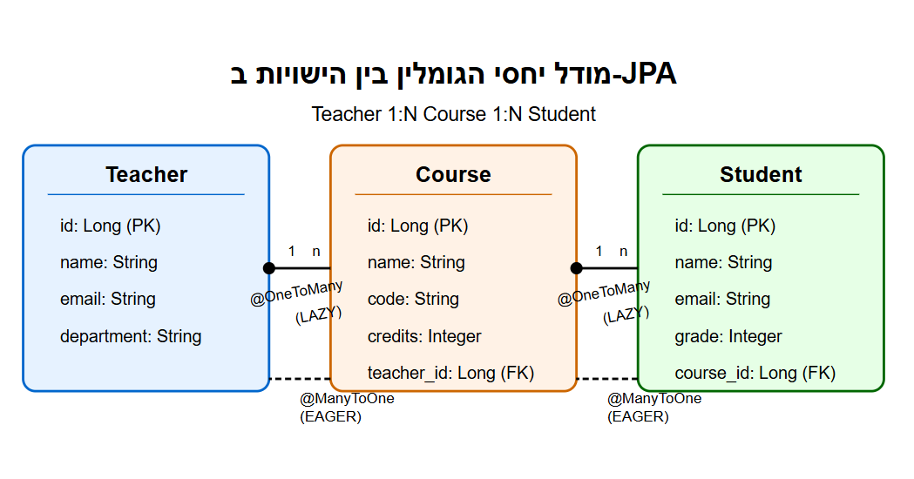

<div dir="rtl">


# הטעינה העצלה (Lazy Loading) ובעיית ה-DTO ב-JPA

## בעיית N+1 שאילתות
- בעיה נפוצה בעבודה עם JPA
- נוצרות שאילתות נוספות בגישה ליחסים מסוג LAZY
- DTOs מאלצים טעינת כל הנתונים בזמן ההמרה

## שרטוט יחסי גומלין בין הטבלאות



## הגדרת הישויות (Entities)
- Teacher: OneToMany עם Courses (LAZY)
- Course: ManyToOne עם Teacher, OneToMany עם Students (LAZY)
- Student: ManyToOne עם Course

## הגדרת ה-DTOs
### TeacherBasicDTO
- מכיל רק נתונים בסיסיים
- לא כולל courses

### TeacherFullDTO
- כולל רשימת courses
- מאלץ טעינת נתונים מקושרים

### CourseDTO ו-StudentDTO
- מבני נתונים להעברת מידע
- מנותקים ממסד הנתונים

## המרה מישות ל-DTO - הדגמת ה"אילוץ"

### getBasicTeacherInfo()
- לא גורמת לטעינת courses
- שאילתא יחידה בלבד

### getFullTeacherInfo()
- גורמת לטעינת courses ו-students
- בעיית N+1 שאילתות
- דורשת @Transactional

### getOptimizedTeacherInfo()
- משתמשת ב-JOIN FETCH
- טוענת הכל בשאילתא אחת

## מה קורה בבסיס הנתונים?

### שאילתות בגישה בסיסית
```sql
SELECT * FROM teacher WHERE id = 1;
```

### שאילתות בגישה מלאה (N+1)
```sql
-- Teacher query
SELECT * FROM teacher WHERE id = 1;
-- Courses query
SELECT * FROM course WHERE teacher_id = 1;
-- Students queries (לכל קורס)
SELECT * FROM student WHERE course_id = ?;
```

### שאילתות בגישה Optimal 
```sql
SELECT DISTINCT t.*, c.*, s.*
FROM teacher t
LEFT JOIN course c ON t.id = c.teacher_id
LEFT JOIN student s ON c.id = s.course_id
WHERE t.id = 1;
```

## למה DTO "מאלץ" טעינת נתונים?

1. **גישה פיזית לנתונים**
   - חייבים לגשת לכל שדה להכנסה ל-DTO
   - הגישה מפעילה את הטעינה העצלה

2. **ניתוק ממסד הנתונים**
   - אחרי ההמרה, ה-DTO מנותק
   - לא ניתן לבצע שאילתות נוספות

3. **החשיבות של תכנון מראש**
   - בחירת הנתונים הנדרשים
   - שימוש ב-JOIN FETCH או EntityGraph

## פתרונות מומלצים
- DTOs ממוקדים לפי צורך
- שאילתות מותאמות אישית
- EntityGraph לטעינה יעילה
- Projection במקום DTO מלא

</div>