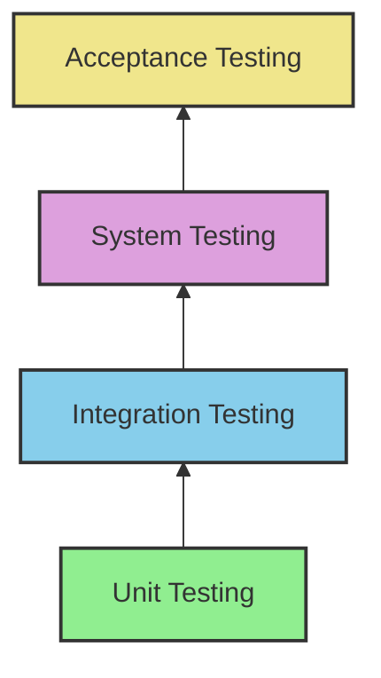
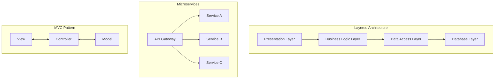
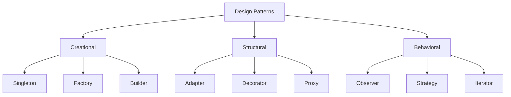
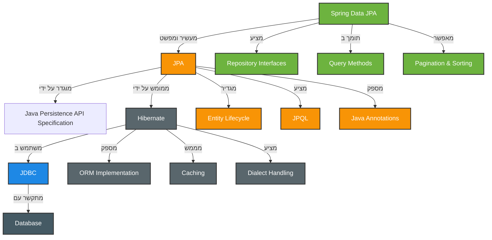
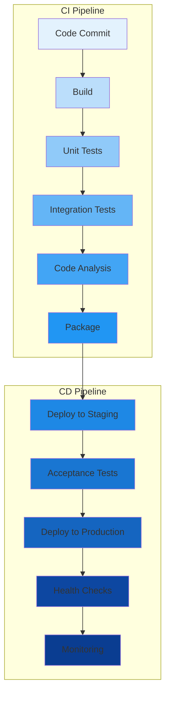
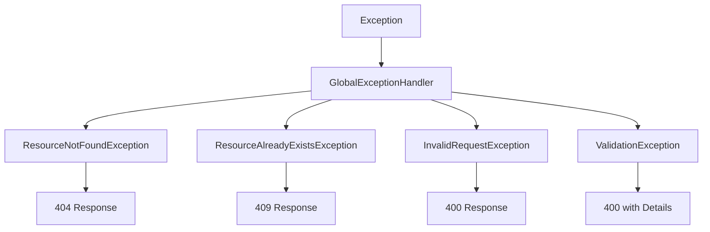
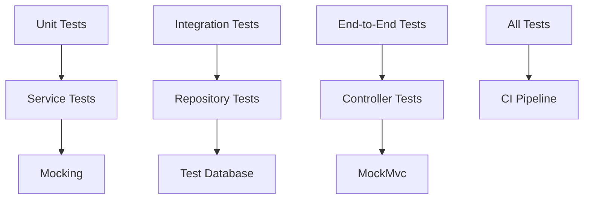
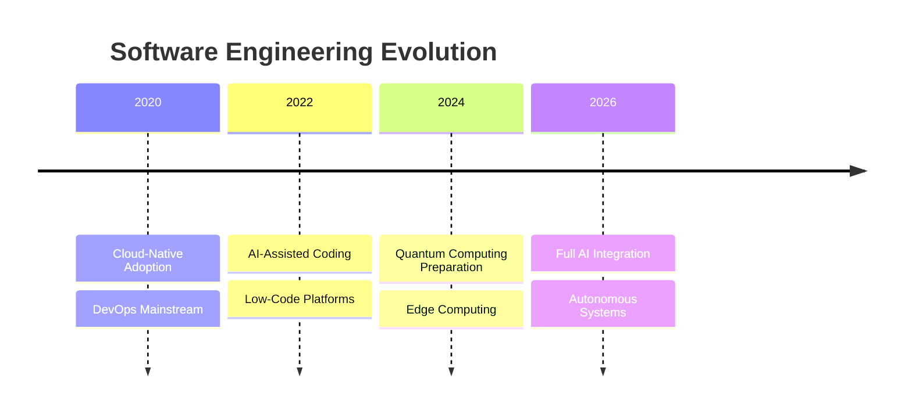

# מצגת הנדסת תוכנה ו-Spring Boot

## תוכן עניינים

- מבוא להנדסת תוכנה
- עקרונות יסוד
- מחזור חיי פיתוח תוכנה (SDLC)
- ארכיטקטורת תוכנה
- עקרונות SOLID
- Design Patterns
- Spring Boot ו-JPA
- יחסי גומלין ב-JPA
- אופטימיזציה וביצועים
- ניהול עסקאות
- CI/CD ו-DevOps
- טיפול בשגיאות
- עקרונות Clean Code
- Testing Strategy
- Domain vs Application
- מגמות עתידיות

---

## מבוא להנדסת תוכנה

### הגדרה
היישום השיטתי, הממושמע והניתן לכימות של גישות לפיתוח, תפעול ותחזוקה של תוכנה

### מטרות
- תוכנה איכותית
- אמינה וברת-תחזוקה
- עמידה באילוצי זמן ותקציב

---

## עקרונות יסוד

- **מודולריות** - חלוקה ליחידות עצמאיות
- **הפשטה** - הסתרת פרטי מימוש
- **אנקפסולציה** - הגנה על נתונים פנימיים
- **שימוש חוזר** - כתיבת קוד גנרי
- **תחזוקתיות** - קוד קריא ומתועד

---

## מחזור חיי פיתוח תוכנה (SDLC)

```mermaid
graph TD
    A[Requirements Analysis] --> B[System Design]
    B --> C[Implementation]
    C --> D[Testing]
    D --> E[Deployment]
    E --> F[Maintenance]
    F --> A
    
    style A fill:#222,stroke:#333,stroke-width:2px
    style B fill:#222,stroke:#333,stroke-width:2px
    style C fill:#222,stroke:#333,stroke-width:2px
    style D fill:#222,stroke:#333,stroke-width:2px
    style E fill:#333,stroke:#333,stroke-width:2px
    style F fill:#232,stroke:#333,stroke-width:2px
```

---

## שלבי SDLC

### 1. ניתוח דרישות
- איסוף דרישות מהלקוח
- דרישות פונקציונליות ולא-פונקציונליות
- מסמך SRS
- אישור עם בעלי עניין

### 2. תכנון מערכת
- ארכיטקטורת מערכת
- תכנון מסד נתונים
- ממשקי משתמש
- בחירת טכנולוגיות

---

## שלבי SDLC (המשך)

### 3. מימוש
- כתיבת קוד
- עקרונות OOP
- ניהול גרסאות
- Code Reviews

### 4. בדיקות
- Unit Testing
- Integration Testing
- System Testing
- Acceptance Testing

---

## היררכיית בדיקות

---

## ארכיטקטורת תוכנה

---

## עקרונות SOLID

### S - Single Responsibility Principle
כל מחלקה אחראית על דבר אחד בלבד

### O - Open/Closed Principle
פתוח להרחבה, סגור לשינוי

### L - Liskov Substitution Principle
תת-מחלקות כתחליף למחלקת-על

### I - Interface Segregation Principle
ממשקים ממוקדים וספציפיים

### D - Dependency Inversion Principle
תלות בהפשטות, לא במימושים

---

## Design Patterns

---

## Design Patterns בפרויקט

### DTO Pattern
- הפרדה בין Entity ל-Transfer Object
- אבטחת מידע רגיש
- גמישות בתקשורת

### Repository Pattern
- הפשטה של גישה לנתונים
- CRUD operations
- Custom queries

### Builder Pattern
- יצירת אובייקטים מורכבים
- קוד קריא
- Immutability

---

## Spring Boot ו-JPA

### מהו ORM?
Object-Relational Mapping - המרה בין אובייקטים לטבלאות

### יתרונות ORM
- הפשטה מעל SQL
- אבטחה מובנית
- ניהול מטמון
- ניהול קשרים
- ניהול טרנזקציות

---

## היררכיית הטכנולוגיות

---

## Spring Data JPA - היכולות

### Repository Interfaces
- פעולות CRUD אוטומטיות
- מימוש אוטומטי בזמן runtime

### Query Methods
- שמות מתודות שהופכות לשאילתות
- תמיכה בפעולות מורכבות

### Pagination & Sorting
- עימוד אוטומטי
- מיון גמיש

---

## קונפיגורציה של Spring Boot

### חיבור למסד נתונים
- URL חיבור
- משתמש וסיסמה
- Driver class

### הגדרות JPA
- ddl-auto: update/create/validate
- show-sql: הצגת שאילתות
- dialect: סוג מסד הנתונים

### Connection Pool
- connection-timeout
- maximum-pool-size

---

## יחסי גומלין ב-JPA

### One-to-One
- מורה ↔ פרטי מורה
- יחס 1:1 בין ישויות

### One-to-Many
- מורה → קורסים
- יחס 1:N בין ישויות

### Many-to-Many
- סטודנטים ↔ קורסים
- יחס M:N בין ישויות

---

## מאפייני יחסים

### בעלות על היחס
- Owning side vs Inverse side
- JoinColumn vs mappedBy

### אופציות Cascade
- ALL, PERSIST, MERGE, REMOVE

### אסטרטגיות טעינה
- LAZY vs EAGER
- ברירות מחדל לפי סוג היחס

---

## אופטימיזציה - בעיית N+1

### הבעיה
- שאילתה אחת לרשימה
- N שאילתות נוספות לפרטים
- ביצועים גרועים

### פתרונות
- JOIN FETCH
- EntityGraph
- Batch Fetching
- הגדרת Lazy Loading נכונה

---

## JOIN FETCH

### יתרונות
- שאילתה אחת במקום N+1
- שליטה מלאה בטעינה
- ביצועים משופרים

### מגבלות
- אוסף אחד בלבד ב-JOIN FETCH
- Cartesian Product
- שימוש ב-DISTINCT

---

## Lazy vs Eager Loading

### Lazy Loading
- טעינה רק בעת הצורך
- חיסכון בזיכרון
- ברירת מחדל ל-Collections

### Eager Loading
- טעינה מיידית
- מניעת LazyInitializationException
- ברירת מחדל ל-@ManyToOne

---

## ניהול עסקאות

### עקרונות ACID
- **Atomicity** - הכל או כלום
- **Consistency** - שמירת תקינות
- **Isolation** - בידוד בין עסקאות
- **Durability** - קביעות השינויים

### @Transactional
- ניהול אוטומטי
- Rollback בשגיאות
- הגדרות גמישות

---

## רמות בידוד

- **READ_UNCOMMITTED** - הנמוכה ביותר
- **READ_COMMITTED** - מונעת Dirty Read
- **REPEATABLE_READ** - מונעת Non-repeatable Read
- **SERIALIZABLE** - הגבוהה ביותר

---

## CI/CD Pipeline

---

## יתרונות CI/CD

### Continuous Integration
- גילוי מוקדם של בעיות
- אינטגרציה תכופה
- פידבק מהיר

### Continuous Deployment
- פריסה אוטומטית
- זמן קצר לשוק
- Rollback מהיר

---

## כלי CI/CD

- Jenkins
- GitHub Actions
- GitLab CI
- CircleCI
- Azure DevOps
- TeamCity

---

## Docker

### יתרונות
- סביבה אחידה
- Portability
- Isolation
- Scalability

### Multi-stage build
- שלב build נפרד
- Image קטן יותר
- אבטחה משופרת

---

## טיפול בשגיאות

---

## GlobalExceptionHandler

### יתרונות
- טיפול מרכזי בחריגות
- תגובות אחידות
- קודי HTTP מתאימים

### StandardResponse
- מבנה אחיד לתגובות
- status: success/error
- data/error
- timestamp

---

## Validation

### Bean Validation
- @NotBlank
- @Size
- @Email
- @Pattern

### יתרונות
- תיקוף אוטומטי
- הודעות שגיאה ברורות
- שימוש חוזר

---

## עקרונות Clean Code

### שמות משמעותיים
- שמות המסבירים את המטרה
- הימנעות מקיצורים לא ברורים

### פונקציות קטנות
- פונקציה עושה דבר אחד
- רמת הפשטה אחידה

### DRY
- Don't Repeat Yourself
- שימוש חוזר בקוד

---

## נוספים עקרונות

### Defensive Programming
- בדיקת null
- ולידציה של קלט
- טיפול בשגיאות

### Separation of Concerns
- הפרדת אחריויות
- כל שכבה במקומה

### Security Considerations
- הסתרת מידע רגיש
- הצפנת סיסמאות
- תיקוף קלט

---

## Testing Strategy

---

## סוגי בדיקות

### Unit Tests
- בדיקת יחידות קוד
- Mocking
- מהירות גבוהה

### Integration Tests
- בדיקת אינטגרציה
- Test Database
- בדיקת flows

### E2E Tests
- בדיקה מקצה לקצה
- סימולציית משתמש
- בדיקה מלאה

---

## Domain vs Application

### Domain
- הבעיה העסקית
- מושגים עסקיים
- כללים עסקיים
- "מה המערכת עושה"

### Application
- הפתרון הטכני
- קוד ותשתיות
- טכנולוגיות
- "איך המערכת עושה"

---

## Domain-Driven Design (DDD)

### Domain Layer
- לוגיקה עסקית טהורה
- Entities
- Value Objects
- Domain Services

### Application Layer
- תיאום בין שכבות
- Use Cases
- Application Services

---

## מגמות עתידיות

---

## נושאים חמים

### AI ו-Machine Learning
- כלי פיתוח חכמים
- אוטומציה של משימות
- ניתוח קוד אוטומטי

### Low-Code/No-Code
- פלטפורמות ויזואליות
- האצת פיתוח
- דמוקרטיזציה

---

## נושאים חמים (המשך)

### Cloud-Native
- Serverless Architecture
- Containerization
- Microservices

### DevSecOps
- אבטחה מובנית
- Shift-Left Testing
- Continuous Security

---

## סיכום

### הנדסת תוכנה דורשת:
- ידע טכני רחב
- חשיבה מערכתית
- כישורים רכים
- למידה מתמדת

### Spring Boot ו-JPA מספקים:
- פיתוח מהיר
- קוד נקי
- ביצועים טובים
- תחזוקה קלה

---

## תודה על ההקשבה!

### שאלות?

