<div dir="rtl">

# ניתוח הנדסת תוכנה - Software Engineering Analysis


## מבוא

הנדסת תוכנה היא תחום רב-תחומי המשלב בין מדעי המחשב, ניהול פרויקטים, ועקרונות הנדסיים. המטרה המרכזית היא יצירת תוכנה איכותית, אמינה וברת-תחזוקה תוך עמידה באילוצי זמן ותקציב.

## הגדרות ועקרונות יסוד

### הגדרה פורמלית
הנדסת תוכנה היא היישום השיטתי, הממושמע והניתן לכימות של גישות לפיתוח, תפעול ותחזוקה של תוכנה.

### עקרונות מנחים
1. **מודולריות** - חלוקה ליחידות עצמאיות
2. **הפשטה** - הסתרת פרטי מימוש
3. **אנקפסולציה** - הגנה על נתונים פנימיים
4. **שימוש חוזר** - כתיבת קוד גנרי
5. **תחזוקתיות** - קוד קריא ומתועד

</div>

## Software Development Life Cycle (SDLC)

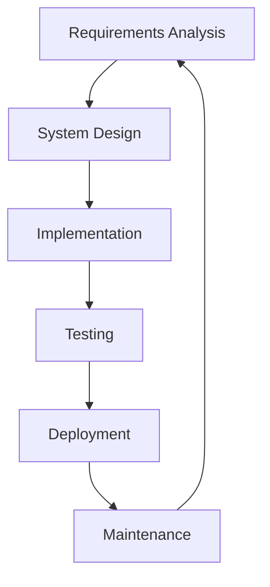

<div dir="rtl">

## שלבי פיתוח מפורטים

### 1. ניתוח דרישות (Requirements Analysis)
- איסוף דרישות מהלקוח
- הגדרת דרישות פונקציונליות ולא-פונקציונליות
- יצירת מסמך SRS (Software Requirements Specification)
- אישור דרישות עם בעלי העניין

### 2. תכנון מערכת (System Design)
- ארכיטקטורת מערכת
- תכנון מסד נתונים
- תכנון ממשקי משתמש
- בחירת טכנולוגיות

</div>

## Software Architecture Patterns

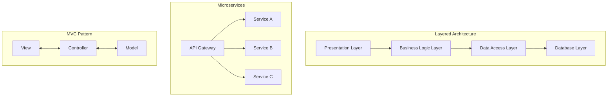

<div dir="rtl">

### 3. מימוש (Implementation)
- כתיבת קוד לפי התכנון
- שימוש בעקרונות תכנות מונחה עצמים
- ניהול גרסאות עם Git
- Code Reviews

### 4. בדיקות (Testing)

</div>

## Testing Hierarchy

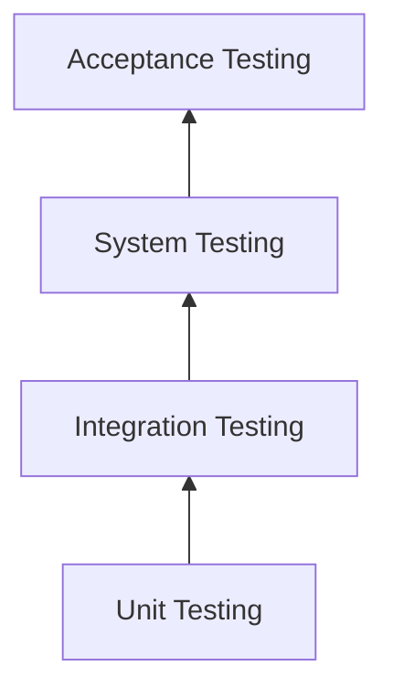

<div dir="rtl">

## מתודולוגיות פיתוח

### Waterfall
- תהליך ליניארי וסדרתי
- מתאים לפרויקטים עם דרישות ברורות
- קשה לבצע שינויים

### Agile
- פיתוח איטרטיבי
- גמישות לשינויים
- שיתוף פעולה עם הלקוח

</div>

## Agile vs Waterfall Comparison

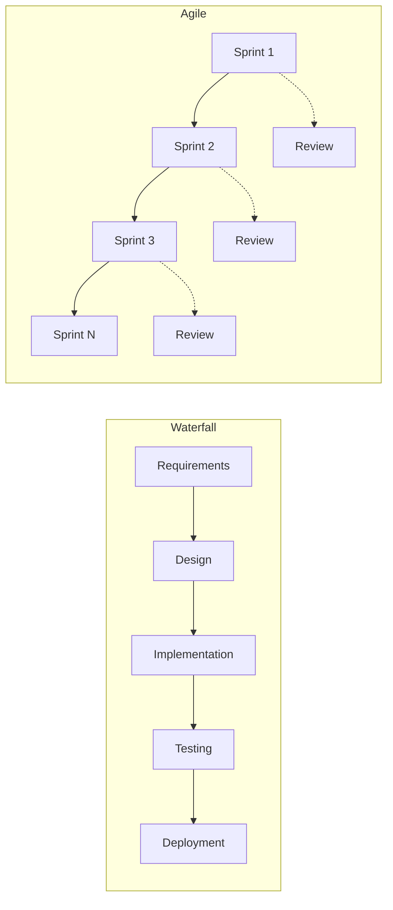

<div dir="rtl">

## עקרונות SOLID

### S - Single Responsibility Principle
כל מחלקה צריכה להיות אחראית על דבר אחד בלבד

### O - Open/Closed Principle
פתוח להרחבה, סגור לשינוי

### L - Liskov Substitution Principle
תת-מחלקות חייבות להיות תחליף הולם למחלקת-על

### I - Interface Segregation Principle
ממשקים ספציפיים עדיפים על ממשק כללי אחד

### D - Dependency Inversion Principle
תלות בהפשטות, לא במימושים קונקרטיים


# עקרונות SOLID במימוש - דוגמאות מהקוד

## S - Single Responsibility Principle
כל מחלקה בקוד אחראית על דבר אחד בלבד:

</div>

```java
// UserController - אחראי רק על HTTP handling
@RestController
@RequestMapping("/api/users")
public class UserController {
    // רק מטפל ב-HTTP requests/responses
    // לא מכיל business logic
}

// UserService - אחראי רק על business logic
public interface UserService {
    UserDto createUser(UserDto userDto);
    UserDto updateUser(Long id, UserDto userDto);
    // רק לוגיקה עסקית, לא HTTP או DB
}

// UserRepository - אחראי רק על גישה לנתונים
@Repository
public interface UserRepository extends JpaRepository<User, Long> {
    // רק queries ל-DB
}

// UserMapper - אחראי רק על המרות
@Component
public class UserMapper {
    public UserDto toDto(User user) { }
    public User toEntity(UserDto userDto) { }
    // רק המרות, לא לוגיקה אחרת
}

// GlobalExceptionHandler - אחראי רק על טיפול בשגיאות
@RestControllerAdvice
public class GlobalExceptionHandler {
    // רק exception handling
}
```

<div dir="rtl">

## O - Open/Closed Principle
המערכת פתוחה להרחבה אך סגורה לשינוי:

</div>

```java
// JpaRepository מאפשר הרחבה ללא שינוי הקוד הקיים
public interface UserRepository extends JpaRepository<User, Long> {
    // אפשר להוסיף queries חדשות בלי לשנות את JpaRepository
    Optional<User> findByUsername(String username);
    List<User> findByActive(boolean active);
    
    // Custom queries - הרחבה ללא שינוי
    @Query("SELECT u FROM User u WHERE LOWER(u.username) LIKE %:name%")
    List<User> searchByName(@Param("name") String name);
}

// GlobalExceptionHandler - אפשר להוסיף handlers חדשים
@RestControllerAdvice
public class GlobalExceptionHandler {
    // קל להוסיף exception handler חדש בלי לשנות הקיימים
    @ExceptionHandler(NewCustomException.class)
    public ResponseEntity<?> handleNewException() { }
}
```

<div dir="rtl">

## L - Liskov Substitution Principle
ניתן להחליף implementation בלי לשבור את המערכת:

</div>

```java
// UserController משתמש ב-interface, לא ב-implementation
public class UserController {
    private final UserService userService; // interface
    
    @Autowired
    public UserController(UserService userService) {
        // אפשר להחליף את UserServiceImpl באימפלמנטציה אחרת
        this.userService = userService;
    }
}

// אפשר ליצור MockUserService לבדיקות
public class MockUserService implements UserService {
    // אותה התנהגות, מימוש שונה
}
```

<div dir="rtl">

## I - Interface Segregation Principle
ממשקים ממוקדים וספציפיים:

</div>

```java
// במקום ממשק ענק אחד, יש הפרדה לממשקים ממוקדים:

// UserService - רק פעולות משתמשים
public interface UserService {
    List<UserDto> getAllUsers();
    UserDto createUser(UserDto userDto);
    UserDto assignRoleToUser(Long userId, Long roleId);
}

// RoleService - רק פעולות תפקידים
public interface RoleService {
    List<RoleBasicDto> getAllRoles();
    RoleDto createRole(RoleDto roleDto);
    boolean hasUsers(Long roleId);
}

// לא ממשק אחד ענק עם כל הפעולות
// כל client משתמש רק בממשק שהוא צריך
```

<div dir="rtl">

## D - Dependency Inversion Principle
תלות בהפשטות (interfaces) ולא במימושים קונקרטיים:

</div>

```java
// UserServiceImpl תלוי ב-interfaces, לא ב-implementations
@Service
public class UserServiceImpl implements UserService {
    // תלות ב-interfaces
    private final UserRepository userRepository;
    private final RoleRepository roleRepository;
    private final UserMapper userMapper;
    
    @Autowired
    public UserServiceImpl(UserRepository userRepository,  // interface
                          RoleRepository roleRepository,   // interface
                          UserMapper userMapper) {         // concrete אבל @Component
        this.userRepository = userRepository;
        this.roleRepository = roleRepository;
        this.userMapper = userMapper;
    }
}

// UserController תלוי ב-Service interface
@RestController
public class UserController {
    private final UserService userService;  // interface, לא UserServiceImpl
    private final RoleService roleService;  // interface, לא RoleServiceImpl
    
    @Autowired
    public UserController(UserService userService, RoleService roleService) {
        // Spring מזריק את ה-implementation
        // אבל ה-Controller לא מכיר אותו ישירות
        this.userService = userService;
        this.roleService = roleService;
    }
}
```

<div dir="rtl">

## סיכום SOLID בקוד
הקוד מדגים יישום מלא של כל חמשת עקרונות SOLID:
- **הפרדת אחריויות ברורה** - כל מחלקה עושה דבר אחד
- **גמישות להרחבה** - קל להוסיף features חדשים
- **יכולת החלפה** - אפשר להחליף implementations
- **ממשקים ממוקדים** - כל ממשק משרת מטרה ספציפית
- **תלות בהפשטות** - dependency injection עם interfaces

</div>


## Design Patterns Categories

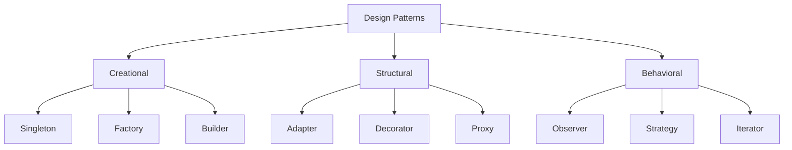

<div dir="rtl">

## כלים וטכנולוגיות

### כלי פיתוח
- **IDE**: Visual Studio, IntelliJ IDEA, VS Code
- **Version Control**: Git, SVN
- **Build Tools**: Maven, Gradle, npm

### כלי בדיקות
- **Unit Testing**: JUnit, NUnit, Jest
- **Integration Testing**: Postman, SoapUI
- **Performance Testing**: JMeter, LoadRunner

### כלי DevOps
- **CI/CD**: Jenkins, GitLab CI, GitHub Actions
- **Containers**: Docker, Kubernetes
- **Monitoring**: Prometheus, Grafana

</div>

## DevOps Pipeline

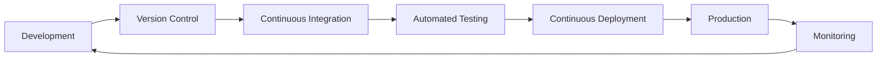

<div dir="rtl">

## מדדי איכות תוכנה

### מדדים טכניים
- **Code Coverage** - כיסוי בדיקות
- **Cyclomatic Complexity** - מורכבות קוד
- **Technical Debt** - חוב טכני
- **Performance Metrics** - זמני תגובה

### מדדים עסקיים
- **Time to Market** - זמן יציאה לשוק
- **Customer Satisfaction** - שביעות רצון לקוחות
- **ROI** - החזר השקעה
- **Defect Rate** - שיעור תקלות

</div>

## Software Quality Metrics

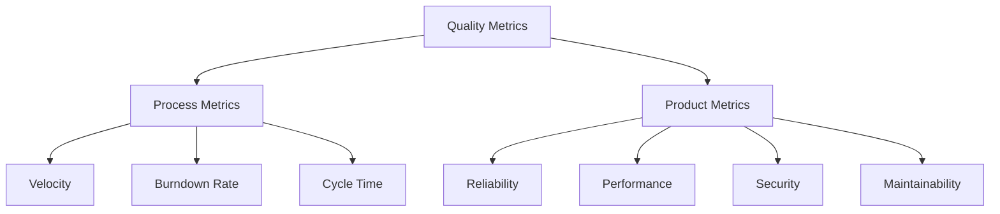

<div dir="rtl">

## אתגרים בהנדסת תוכנה

### אתגרים טכניים
- סיבוכיות גוברת של מערכות
- אינטגרציה בין מערכות שונות
- אבטחת מידע וסייבר
- ביצועים וסקיילביליות

### אתגרים ארגוניים
- ניהול צוותים מבוזרים
- תקשורת עם בעלי עניין
- ניהול שינויים בדרישות
- עמידה בלוחות זמנים

## מגמות עתידיות

### 1. AI ו-Machine Learning בפיתוח
- כלי פיתוח חכמים
- אוטומציה של משימות
- ניתוח קוד אוטומטי

### 2. Low-Code/No-Code
- פלטפורמות פיתוח ויזואליות
- האצת פיתוח
- דמוקרטיזציה של פיתוח תוכנה

### 3. Cloud-Native Development
- Serverless Architecture
- Containerization
- Microservices

### 4. DevSecOps
- אבטחה כחלק אינטגרלי מהפיתוח
- Shift-Left Testing
- Continuous Security

</div>

## Future Trends Timeline

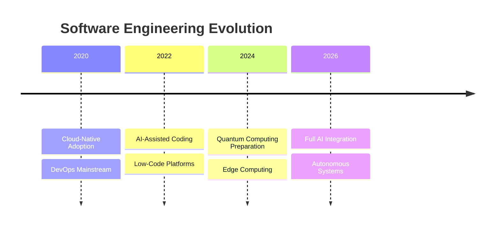

<div dir="rtl">

## דוגמה מעשית - ניתוח קוד Spring Boot

הקוד המצורף מדגים יישום מעשי של עקרונות הנדסת תוכנה במערכת ניהול משתמשים ותפקידים:

### 1. ארכיטקטורת שכבות (Layered Architecture)

</div>

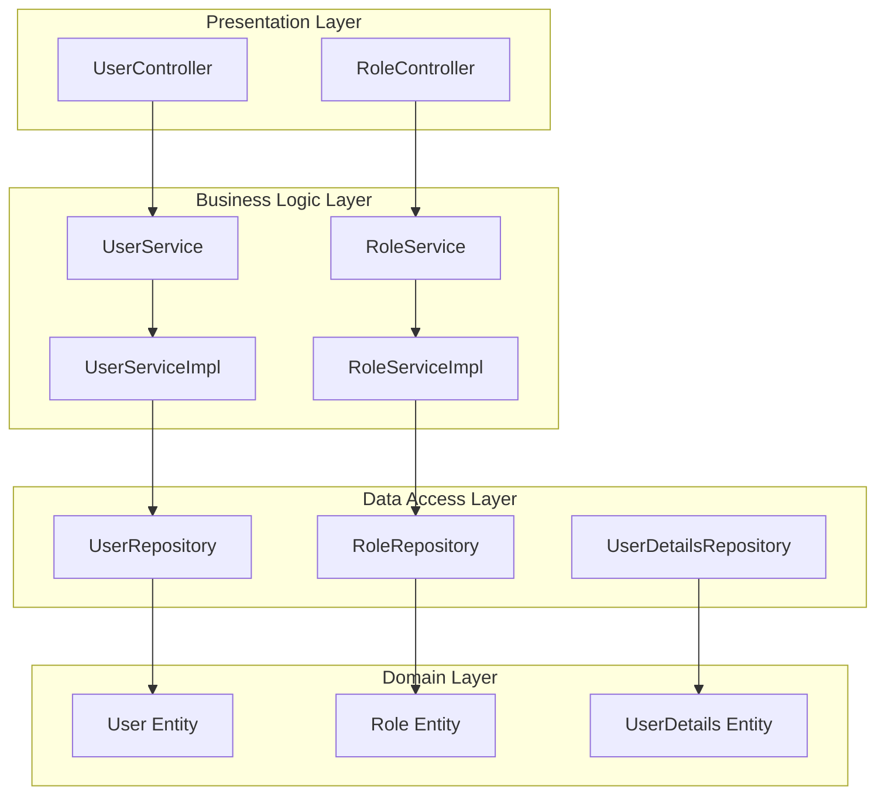


## Domain (דומיין/תחום)
<div dir="rtl">

**Domain** מתייחס ל**תחום העסקי** או **הבעיה העסקית** שהתוכנה באה לפתור:

### דוגמאות לדומיינים:
- **בנקאות** - חשבונות, העברות, הלוואות
- **רפואה** - מטופלים, תרופות, אבחונים
- **מסחר אלקטרוני** - מוצרים, עגלת קניות, תשלומים
- **חינוך** - תלמידים, קורסים, ציונים

### בקוד :
הדומיין הוא **ניהול משתמשים ותפקידים** (User Management Domain):
- **Entities של הדומיין**: User, Role, UserDetails
- **כללים עסקיים**: משתמש חייב email ייחודי, תפקיד לא ניתן למחיקה אם יש משתמשים

</div>

## Application (אפליקציה)
<div dir="rtl">

**Application** היא **המימוש הטכני** שפותר את בעיות הדומיין:

### האפליקציה כוללת:
- קוד (Controllers, Services, Repositories)
- טכנולוגיות (Spring Boot, JPA, REST API)
- תשתיות (Database, Servers)
- ממשק משתמש

</div>

## Domain-Driven Design (DDD)
<div dir="rtl">

בגישת DDD יש הפרדה ברורה:

</div>

```java
// Domain Layer - הלוגיקה העסקית הטהורה
@Entity
public class User {
    // Domain rules
    public void assignRole(Role role) {
        if (roles.contains(role)) {
            throw new BusinessException("Role already assigned");
        }
        roles.add(role);
    }
}

// Application Layer - תיאום בין שכבות
@Service
public class UserService {
    // Application logic - משתמש ב-domain entities
    public UserDto assignRoleToUser(Long userId, Long roleId) {
        User user = repository.findById(userId);
        Role role = roleRepository.findById(roleId);
        user.assignRole(role); // Domain logic
        return mapper.toDto(repository.save(user));
    }
}
```

<div dir="rtl">

### סיכום ההבדלים:

| Domain | Application |
|--------|-------------|
| הבעיה העסקית | הפתרון הטכני |
| מושגים עסקיים | קוד ותשתיות |
| User, Role, Permission | Spring Boot, REST API |
| כללים עסקיים | Controllers, Services |
| "מה המערכת עושה" | "איך המערכת עושה" |

**לדוגמה**:
- **Domain**: "משתמש יכול להיות בעל מספר תפקידים"
- **Application**: "REST API endpoint שמחזיר JSON עם Spring Boot"

</div>

<div dir="rtl">

### 2. עקרונות SOLID במימוש

#### Single Responsibility Principle
כל מחלקה אחראית על תפקיד אחד:
- **UserController** - טיפול ב-HTTP requests בלבד
- **UserService** - לוגיקה עסקית של משתמשים
- **UserRepository** - גישה לנתונים
- **UserMapper** - המרות בין Entity ל-DTO

#### Dependency Inversion Principle

</div>

```java
public class UserServiceImpl implements UserService {
    private final UserRepository userRepository;
    private final RoleRepository roleRepository;
    private final UserMapper userMapper;
    
    @Autowired
    public UserServiceImpl(UserRepository userRepository, 
                          RoleRepository roleRepository, 
                          UserMapper userMapper) {
        // תלות בממשקים, לא במימושים
    }
}
```

<div dir="rtl">

### 3. Design Patterns

#### DTO Pattern
הפרדה בין Domain Objects לבין Transfer Objects:


</div>

```java
// Entity - ייצוג במסד הנתונים
@Entity
public class User {
    private String password; // רגיש
    private Set<Role> roles; // יחסים מורכבים
}

// DTO - ייצוג לתקשורת
public class UserDto {
    // ללא password
    private Set<Long> roleIds; // רק IDs
}
```

<div dir="rtl">

#### Repository Pattern
הפשטה של גישה לנתונים:

</div>

```java
@Repository
public interface UserRepository extends JpaRepository<User, Long> {
    Optional<User> findByUsername(String username);
    
    @Query("SELECT u FROM User u WHERE u.active = :active")
    List<User> findByActive(@Param("active") boolean active);
}
```

<div dir="rtl">

### 4. טיפול בשגיאות (Exception Handling)

</div>

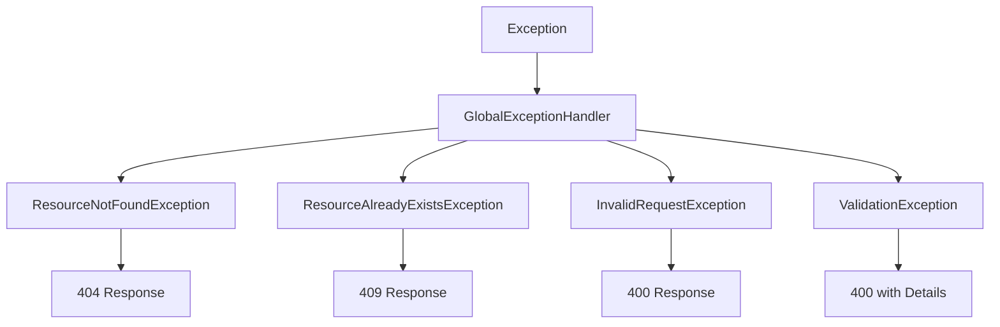


```java
@RestControllerAdvice
public class GlobalExceptionHandler {
    @ExceptionHandler(ResourceNotFoundException.class)
    public ResponseEntity<StandardResponse> handleNotFound(
            ResourceNotFoundException ex) {
        return ResponseEntity
            .status(HttpStatus.NOT_FOUND)
            .body(new StandardResponse("error", null, error));
    }
}
```

<div dir="rtl">

### 5. תיקוף נתונים (Validation)

</div>

```java
public class UserDto {
    @NotBlank(message = "Username is required")
    @Size(min = 3, max = 30)
    private String username;
    
    @Email(message = "Email should be valid")
    private String email;
    
    @Pattern(regexp = "^\\+?(972|0)([23459]\\d{7}|5\\d{8})$")
    private String phoneNumber;
}
```

<div dir="rtl">

### 6. עקרונות Clean Code

#### שמות ברורים ומשמעותיים
</div>

```java
// במקום: getUsersByRId(Long r)
public List<UserDto> getUsersByRoleId(Long roleId)

// במקום: check(Long id)
public boolean hasUsers(Long roleId)
```

<div dir="rtl">

#### מתודות קטנות וממוקדות

</div>

```java
@Transactional
public UserDto assignRoleToUser(Long userId, Long roleId) {
    User user = findUserOrThrow(userId);
    Role role = findRoleOrThrow(roleId);
    validateRoleNotAssigned(user, role);
    user.addRole(role);
    return userMapper.toDto(userRepository.save(user));
}
```

<div dir="rtl">

### 7. תמיכה ב-RESTful API

</div>

```java
@RestController
@RequestMapping("/api/users")
public class UserController {
    @GetMapping           // GET /api/users
    @GetMapping("/{id}")  // GET /api/users/123
    @PostMapping          // POST /api/users
    @PutMapping("/{id}")  // PUT /api/users/123
    @DeleteMapping("/{id}") // DELETE /api/users/123
}
```

<div dir="rtl">

### 8. תגובה אחידה (Consistent Response)

</div>

```java
public class StandardResponse {
    private String status;  // success/error
    private Object data;    // התוצאה
    private Object error;   // פרטי שגיאה
    private LocalDateTime timestamp;
}
```

<div dir="rtl">

### 9. עקרונות נוספים מהקוד

#### Transactional Integrity

</div>

```java
@Transactional
public UserDto createUser(UserDto userDto) {
    // כל הפעולות בתוך טרנזקציה אחת
    // אם משהו נכשל - הכל חוזר אחורה
}
```

#### Builder Pattern
```java
@Builder
public class UserDto {
    // מאפשר יצירת אובייקטים בצורה נקייה
    UserDto user = UserDto.builder()
        .username("john")
        .email("john@example.com")
        .active(true)
        .build();
}
```

#### Defensive Programming
```java
public void updateEntityFromDto(User user, UserDto userDto) {
    if (userDto == null) {
        return; // הגנה מפני null
    }
    
    if (userDto.getUsername() != null) {
        user.setUsername(userDto.getUsername());
    }
    // בדיקה לפני כל עדכון
}
```

#### Separation of Concerns
```java
// Controller - רק HTTP concerns
@GetMapping("/{id}")
public ResponseEntity<StandardResponse> getUserById(@PathVariable Long id) {
    UserDto user = userService.getUserById(id);
    return ResponseEntity.ok(new StandardResponse("success", user, null));
}

// Service - רק business logic
public UserDto getUserById(Long id) {
    User user = userRepository.findById(id)
        .orElseThrow(() -> new ResourceNotFoundException("User not found"));
    return userMapper.toDto(user);
}
```

### 10. Security Considerations

```java
// הסתרת מידע רגיש ב-DTO
public UserDto toDto(User user) {
    UserDto userDto = UserDto.builder()
        .id(user.getId())
        .username(user.getUsername())
        .email(user.getEmail())
        // ללא password! - אבטחת מידע
        .build();
    return userDto;
}
```

### 11. Testing Strategy


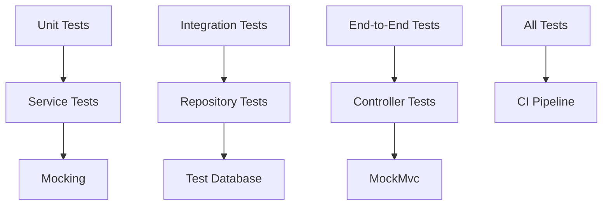

<div dir="rtl">

דוגמה לבדיקת יחידה:

</div>

```java
@Test
void testCreateUser_Success() {
    // Given
    UserDto inputDto = createValidUserDto();
    User savedUser = createUser();
    when(userRepository.save(any())).thenReturn(savedUser);
    
    // When
    UserDto result = userService.createUser(inputDto);
    
    // Then
    assertNotNull(result);
    assertEquals(inputDto.getUsername(), result.getUsername());
    verify(userRepository).save(any());
}
```

<div dir="rtl">


הקוד המוצג מדגים יישום מעשי של עקרונות הנדסת תוכנה:
- **ארכיטקטורה נקייה** עם הפרדת שכבות ברורה
- **SOLID principles** בכל רמה של המערכת
- **Design patterns** מתאימים לבעיות ספציפיות
- **קוד נקי ותחזוקתי** עם שמות ברורים ומתודות ממוקדות
- **טיפול מקיף בשגיאות** עם תגובות עקביות
- **אבטחה** בהסתרת מידע רגיש
- **תמיכה ב-CI/CD** עם מבנה פרויקט סטנדרטי

הנדסת תוכנה היא תחום דינמי ומתפתח המשלב בין טכנולוגיה, מתודולוגיה וניהול. ההצלחה בתחום דורשת:

1. **ידע טכני רחב** - שליטה בשפות תכנות, כלים וטכנולוגיות
2. **חשיבה מערכתית** - יכולת לראות את התמונה הרחבה
3. **כישורים רכים** - תקשורת, עבודת צוות, פתרון בעיות
4. **למידה מתמדת** - התעדכנות בטכנולוגיות ומתודולוגיות חדשות

התחום ימשיך להתפתח עם אתגרים חדשים והזדמנויות מרגשות, כאשר הדגש על איכות, יעילות וחדשנות נשאר קבוע.

</div>